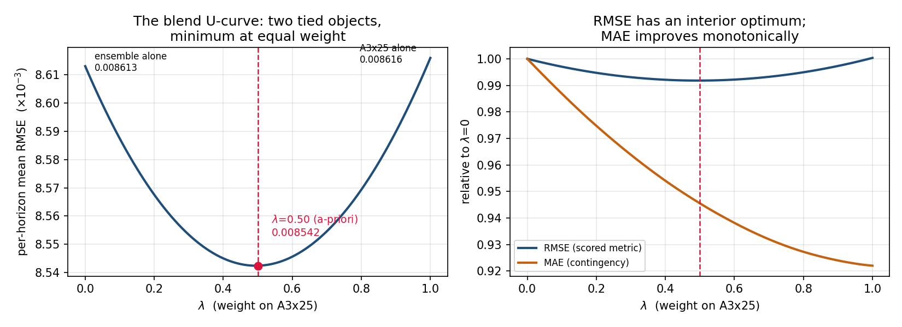

# INFORMS 2026 DM Data Challenge — Experimental Report

**Task:** Forecast the hourly Outage Severity Index (OSI) at t+1h/6h/24h/48h for 63
held-out counties during March 14–19, 2026, given only their first 72 hours of outage
observations (March 11–13) plus weather for the full 216-hour window. Training data:
239 fully observed counties. Two successive wind storms (waves March 13–14 and 16–17)
across IN/OH/PA/WV. Deadline September 25, 2026 (AOE).

This report logs **everything we tried and its measured result**, including negative
results. All numbers are 5-fold **county-holdout** cross-validation under the exact
test protocol (see §3) — every score is on counties the model never saw, with their
outage data masked after hour 71.

---

## 1. Key data findings (full detail: `eda/FINDINGS.md`, figures: `eda/figs/`)

1. **The observed window ends at the wave-1 peak** (mean OSI peaks at h67; test
   counties observe h0–71). The prediction window is wave-1 decay, a much smaller
   wave-2 hump (h≈112, ~4× lower), and a near-zero tail after March 18.
2. **Persistence is a trap by design:** freezing the last observed value scores ~3×
   worse than predicting all zeros.
3. **Damage response is weaker in wave 2, but the mechanism is not what it first
   looked like.** At identical 40–50 mph gusts, wave 2 produces ~6× less new damage
   *pooled across counties* — however, restricting to the 144 counties that reached
   40–50 mph in **both** waves gives a within-county ratio of **3.0×**, so roughly half
   the apparent collapse is compositional (different counties experience that gust band
   in each wave). Moreover, *between* counties prior damage predicts **more** subsequent
   damage, not less: at matched gust the damage rate rises monotonically with prior
   cumulative damage (0.00384 → 0.01605 → 0.05213 across terciles at 50–80 mph), and
   corr(wave-1 rate, wave-2 rate) = +0.151. So the dominant cross-county signal is
   persistent **frailty**, with a genuine but smaller within-county wave-2 reduction on
   top. An earlier version of this report attributed the full 6× to susceptible-pool
   depletion; that was an over-reading and is corrected here.
4. **Zero-inflated, tail-driven target:** 44% exact zeros, median 0.0001, p99 0.125,
   max 0.65. RMSE is decided by a few severe county-hours.
5. **The four horizon columns collapse to one trajectory:** since outage data stops at
   h71 for every test origin, `osi_target_tXXh` at origin t is just OSI(t+XX) —
   the task is one 143-hour trajectory forecast per county.
6. **OSI component structure:** `D_t` is exactly the trailing 6h rolling mean of
   `P_t`; `N_t`/`R_t` are **centered 3-hour rolling means** of the county gross flows
   (corr 0.99884 / 1.00000), not the per-hour deltas the documentation describes — see
   §5h, which also corrects an earlier claim here that they were unreconstructible.
7. **Wind direction is circular** (sin/cos encoded); `severity_tier`, `peak_pct`,
   `peak_customers`, `time_to_restore_h` are train-only leakage columns, excluded
   from features (tier used for CV stratification only, as documented).

## 2. Rules interpretation

Two documents phrase the temporal-causality rule differently. The Problem Description
table ("at origin t: any outage feature value at timestamp ≤ t is allowed") is the
operative formulation; it permits training counties' live outage values during
March 14–19 as covariates at timestamps ≤ t (operationally realistic — the platform
observes all counties in real time). We tested that reading empirically (§5, "origin +
regional"); it did not improve scores, so **the submitted model uses only pre-h72
outage inputs and is compliant under either reading**.

## 3. Validation protocol (built before any model)

- 5 folds; whole counties held out, stratified by state × severity tier
  (mirrors the official 80/20-per-state split). Each county is held out exactly once.
- Held-out counties have all outage columns set to NaN after h71 **before** feature
  construction — causality violations are structurally impossible (same code path
  consumes the real test file).
- Forecasters output the OSI trajectory for hours 73–215; scoring maps it into the
  four submission columns exactly as the organizers will score them. Metrics: RMSE
  and MAE per horizon (official metric TBA; 2025 precedent is per-horizon RMSE with
  average rank). Every headline number in this report is convention #1 of the
  seven-way aggregation table in §5v ("one model, seven honest CV RMSE numbers");
  the same model reads 0.00358–0.00890 under other defensible conventions, so no
  cross-team or cross-paper comparison is valid without fixing the convention first.
- **Noise bar:** fold means range ~0.0066–0.0147, so pooled differences < ~0.0005 are
  treated as noise; changes are adopted only on consistent multi-horizon wins.

## 4. Complete results ladder

Pooled county-holdout RMSE (per horizon and mean), MAE mean. Bold = adopted.

| # | Model | t+1h | t+6h | t+24h | t+48h | mean RMSE | mean MAE | Verdict |
|---|-------|------|------|-------|-------|-----------|----------|---------|
| 0a | All zeros | .02349 | .01982 | .01209 | .00987 | .01632 | .00399 | strong naive floor |
| 0b | Persistence (h71) | .06326 | .06419 | .06715 | .06921 | .06595 | .03153 | trap, as designed |
| 0c | Decayed persistence (τ fit) | .01279 | .01192 | .01019 | .00949 | .01110 | .00307 | shockingly strong |
| 0d | Hourly climatology | .02165 | .01836 | .01137 | .00940 | .01520 | .00535 | weak |
| 0e | Scaled climatology | .02117 | .01822 | .01218 | .01050 | .01552 | .00447 | weak |
| 1 | GBM direct trajectory | .01296 | .01177 | .00988 | .00917 | .01094 | .00340 | first learner |
| 2 | Blend decay→GBM (sigmoid h≈100) | .01237 | .01148 | .00973 | .00910 | .01067 | .00335 | diagnostic-driven |
| 3 | GBM origin + regional (permissive rule) | .01269 | .01155 | .00983 | .00941 | .01087 | .00340 | no net gain |
| 3b | Blend decay→origin-GBM | .01234 | .01146 | .00978 | .00932 | .01073 | .00336 | no net gain |
| 4 | Hurdle 2-part (P(OSI>.01)×regimes) | .01282 | .01158 | .00960 | .00878 | .01069 | .00285 | tail structure works |
| 4b | Blend decay→hurdle | .01222 | .01131 | .00949 | .00876 | **.01045** | .00285 | best GBM-family |
| 5 | MLP (same features) | .01164 | .01109 | .00984 | .00944 | .01050 | .00340 | ties GBM — control |
| 5b | Blend decay→MLP | .01218 | .01131 | .00973 | .00938 | .01065 | .00336 | blend not needed |
| 6 | GRU seq2seq (raw sequences) | .01173 | .01057 | .00885 | .00796 | **.00978** | .00325 | breakthrough |
| 6b | Blend decay→GRU | .01169 | .01074 | .00879 | .00794 | .00979 | .00324 | blend not needed |
| 7 | Component GRU (P/N/R heads → OSI) | .01162 | .01051 | .00863 | .00773 | **.00962** | .00305 | best single model |
| 8 | Ensemble .5·(6)+.25·(4b)+.25·(5) | .01103 | .01016 | .00862 | .00795 | .00944 | .00295 | first ensemble |
| 9 | Ensemble .3·(6)+.3·(7)+.2·(4b)+.2·(5) | .01103 | .01012 | .00853 | .00781 | .00937 | .00291 | superseded (v4) |
| 10 | (9) + per-county residual calibration | .01311 | .01228 | .01008 | .00847 | .01099 | .00297 | NEGATIVE — reverted |
| 11 | Strict 2025-form hurdle (isotonic p×E) | .01300 | .01175 | .00973 | .00900 | .01087 | .00293 | our soft form better |
| 11b | Blend decay→strict hurdle | .01233 | .01142 | .00963 | .00899 | .01059 | .00289 | loses to (4b) |
| 12 | Transformer (full attention, 216h) | .01201 | .01077 | .00877 | .00818 | .00993 | **.00272** | best MAE of any model |
| 13 | Per-state GBM (4 separate models) | .01205 | .01099 | .00967 | .00855 | .01031 | .00336 | beats pooled GBM (1) |
| 13b | Per-state hurdle blend | .01215 | .01124 | .00951 | .00870 | .01040 | .00284 | takes tabular seat |
| 14 | Severity-MoE, predicted gate | .01363 | .01209 | .00963 | .00891 | .01106 | .00339 | NEGATIVE — gate fails |
| 14b | Severity-MoE, ORACLE routing | .01186 | .01070 | .00862 | .00745 | .00966 | .00309 | ceiling diagnostic |
| 15 | **Ensemble .25·(6)+.25·(7)+.2·(12)+.15·(13b)+.15·(5)** | **.01096** | **.01004** | **.00845** | **.00777** | **.00930** | **.00281** | **submitted (v5)** |

Cumulative: −43% vs the zero baseline, −16% vs decayed persistence, −10% vs the best
gradient-boosting model. (2025-edition context: the best team beat all-zeros by ~8%.)

## 5. What each rung was and why

**Baselines (0a–0e).** Decayed persistence `osi(71)·exp(−Δt/τ)`, τ grid-fit per fold
(~12–16h), is the baseline to beat: the scored window is dominated by wave-1
restoration decay. Required honesty check for every later model.

**GBM direct trajectory (1).** One HistGradientBoosting model over (county, target
hour) rows. ~50 features: decay basis of the last observed state (τ = 8/16/32/64),
observed-window summaries (peak, slope, restored fraction, fragility = damage per unit
wind exposure), weather at/around the target hour (gust rolling max/mean, precip,
pressure trend, humidity, soil moisture), depletion features (cumulative gust-excess
exposure, novel-wind exceedance over the running max), circular wind encoding,
time-of-day harmonics, state one-hots. Trained under simulated test conditions
(features frozen at h71 for its own history) so train and test distributions match.

**Time blend (2).** Hour-band diagnostics showed plain decay beating the GBM during
h73–96 (fresh-state regime) while the GBM wins after the lull. Blend
`w(H)=σ((H−100)/10)`: decay-dominant early, model-dominant late.

**Origin + regional under the permissive rule (3).** Origin-indexed rows (county,
origin, horizon) with leave-one-out regional aggregates at time t (state mean, overall
mean) and a storm-cell kNN: each county's 10 most gust-correlated training counties,
their current OSI/N_t. Result: `knn_osi` ranked 4th in permutation importance yet net
CV gain ≈ 0 — **with full future weather provided, live regional outage state is
almost entirely redundant** (weather already carries the storm front). Documented
negative; also means the submission is compliant under the strict rule reading.

**Hurdle (4, 4b).** Two-part model for the zero-inflated tail: classifier
P(OSI > 0.01) × regime-conditional regressors (echoes the 2025 winners' hurdle,
adapted from counts to a continuous bounded index). Biggest MAE improvement of any
tabular change (−15%); with the time blend it was the best pre-DL model.

**MLP control (5).** Same features, same information → same score as the GBM
(.01050 vs .01045). Establishes that model class was not the binding constraint for
per-row models; "neural" alone buys nothing.

**GRU seq2seq (6).** Encoder GRU over the raw observed 72h (OSI, P, N, R + weather);
decoder GRU over hours 73–215 conditioned on the future weather sequence, static
county features, and a decay-basis input; hidden 48, dropout 0.15, 3-seed average,
early stopping on an inner county split. **0.00978 — beats everything, and the margin
grows with horizon (−9% at t+48h).** Why: the decoder propagates coherent state along
the trajectory and reads future weather as a sequence — structurally impossible for
per-row models. This inverts the 2025 lesson ("deep models overfit") for an
identifiable reason: 2025 had no future weather; 2026 supplies exactly the input a
seq2seq exploits.

**Component-structured GRU (7).** Same encoder/decoder, but three softplus heads
predict the physical components P_t/N_t/R_t; OSI is composed inside the network via
its exact definition (D = differentiable rolling-6 mean of predicted P, seeded with
observed P at h66–71). Loss = MSE(OSI) + 0.3·aux losses on components; early stop on
OSI. **0.00962, better than the plain GRU at all four horizons, −6% MAE.** Caveat: it
did **not** improve the severe tail (tier-4 RMSE 0.0232 vs 0.0228) — the gain came
from mid-severity counties; the physics head works as inductive bias, not a tail fix.

**Ensembles (8, 9, 15).** OOF correlations: the two GRUs 0.979; transformer↔others
0.90–0.95; seq2seq↔tabular 0.91–0.94. Weighted averages sit on broad flat optima
(NNLS-exact 0.00931 vs round-weight 0.00930–0.00934), so round weights were chosen
instead of the grid argmax. The final 5-way (v5): 0.25 GRU + 0.25 component-GRU +
0.2 Transformer + 0.15 per-state hurdle blend + 0.15 MLP — wins 4/5 folds vs the
4-way and improves both pooled metrics; point gains between ensemble variants are
within fold noise and are claimed as robustness, not improvement.

**Per-county residual calibration (10) — negative.** Second-stage Ridge predicting
each county's log(true/pred) trajectory-sum ratio from observed-window features,
fit strictly out-of-fold, scale clipped to [0.5, 2]. RMSE degraded 0.00937 → 0.01099
and tier-4 0.0218 → 0.0266. County-level residuals are not predictable from the
observed window; global bias was already negligible (|bias| ≤ 0.0006 per hour band).

**Strict 2025-winner form (11).** Faithful reproduction of the 2025 first-place recipe
(isotonic-calibrated P(active) × E[y|active], implicit zero otherwise): 0.01087/0.01059
blended — loses to our soft two-regime mixture (0.01069/0.01045), which also models
the sub-threshold regime instead of forcing it to zero. Their Stage-A weather
forecaster was not reproduced: 2026 supplies future weather, making it dead weight.

**Transformer (12).** Single full-attention encoder over the entire 216h sequence
(outage channels zeroed after h71 + observed-flag, weather all hours, learned
positional embeddings; d=64, 2 layers, 4 heads, ~90k params, dropout 0.2, 3 seeds).
0.00993 — behind both GRUs on RMSE but **best MAE of any model (0.00272)** and the
best fold-1/2 scores ever; sufficiently decorrelated (0.90–0.95) to earn an ensemble
seat. The 2025 "transformers overfit" caution did not reproduce here, with the same
explanation as the GRU: 2026's provided future-weather sequence is exactly what
attention exploits.

**Stage-wise models (13, 14).** Two variants of "different models for different
regimes": (a) **Per-state models work** — four state-specific GBMs beat the pooled GBM
0.01031 vs 0.01094 (4/5 folds), and the per-state hurdle blend (0.01040) took the
tabular seat in the final ensemble. State one-hot conditioning in a pooled model is
weaker than full specialization here, plausibly because damage physics (terrain,
vegetation, grid topology) differ by state in ways worth separate trees.
(b) **Severity-gated mixture of experts fails on the gate, not the experts**: with
predicted county-severity classes it scores 0.01106 (worse than pooled), but with
oracle (true) classes the same GBM experts hit 0.00966 — nearly matching the best
deep model. The ~0.0014 gap is entirely gate error: county-level severity realization
is not predictable from the observed window, consistent with negative result (10).

## 5b. The 20-idea sweep (all under the identical county-holdout CV)

Every candidate idea was implemented in `src/ideas.py` and evaluated with the same
5-fold county-holdout protocol, same folds, same seeds (`run_all_ideas.py`).
Reference points: all-zeros 0.01632, decayed persistence 0.01110, pooled GBM 0.01094,
best pre-sweep single model (component-GRU) 0.00962, pre-sweep ensemble 0.00930.

| Idea | RMSE | MAE | Verdict |
|------|------|-----|---------|
| **I07 cross-county attention** | **0.00931** | 0.00306 | **best single model** — matches the whole pre-sweep ensemble |
| **I20 GRU with 8 seeds** | **0.00948** | 0.00306 | **cheapest win** — pure variance reduction vs 3 seeds (0.00978) |
| **I11 storm augmentation** | **0.00955** | 0.00295 | **works** — time-shift/amplitude jitter fights single-event overfit |
| I12 TFT-lite | 0.00982 | 0.00333 | ties plain GRU; value is interpretability only |
| I08 transductive weather pretraining | 0.00984 | 0.00322 | no gain (legal, uses test-county weather) |
| I05 archetype gate (shape) | 0.01022 | 0.00327 | **best tabular stage-wise**; near its own oracle |
| I09 Tweedie emission head | 0.01022 | 0.00305 | RMSE worse, zero-mass handling better |
| I10 MC-dropout sampler | 0.01032 | 0.00342 | worse than deterministic; keep only for spread |
| I14 hierarchical (partial) pooling | 0.01032 | 0.00324 | beats pooled GBM; graceful version of per-state |
| I17b static + physics | 0.01046 | 0.00333 | physics adds ~nothing on top of static |
| **I16 static enrichment** | **0.01047** | 0.00334 | **biggest tabular feature gain** (0.01094 → 0.01047) |
| I06 quantile two-stage | 0.01063 | 0.00331 | ties hurdle; free P10/P90 bands |
| I17 physics indices | 0.01081 | 0.00336 | small gain; overlaps raw weather |
| I04 wave-conditioned cascade | 0.01086 | 0.00346 | slight gain over pooled GBM |
| I18 in-dataset pretraining | 0.01086 | 0.00372 | **worse** — pretext regime ≠ scored regime |
| I02 impulse-response (system ID) | 0.01120 | 0.00413 | interpretable recovery kernel, not competitive |
| I15 survival restoration | 0.01131 | 0.00288 | per-county decay ≈ one global constant |
| I13 Poisson/Tweedie GBM | 0.01142 | **0.00280** | worst-tier RMSE, **near-best MAE** — metric-contingent |
| I03 FPCA two-stage | 0.01247 | 0.00407 | scalar scores lose hour-level detail |
| I01 amplitude × shape | 0.01386 | 0.00408 | too much compression |
| I05b archetype ORACLE (ceiling) | 0.00945 | 0.00313 | diagnostic: gate is only 0.0008 below ceiling |
| I19a stacking: Ridge (nested) | 0.00934 | 0.00275 | no better than fixed weights |
| I19b stacking: GBM + context | 0.01098 | 0.00330 | **overfits** — meta-model too flexible |
| I19c equal-weight 8 members | 0.00911 | 0.00281 | simple averaging beats learned stacking |
| **Ensemble v6 (production)** | **0.00901** | **0.00279** | **new primary** — see below |

*(I13's LightGBM Tweedie objective could not be used — the wheel installs but
`libomp` is absent on this machine; sklearn's Poisson loss is the Tweedie-family
p=1 stand-in. I18's external EAGLE-I pretraining was **not run**: data access plus
unresolved external-data rules; the in-dataset analogue is reported instead and its
negative result tempers the expected value of the external version.)*

**Three findings that generalize beyond this competition.**

1. **Information beats architecture.** The largest tabular gain came from public
   static data (I16: rural-urban code, population, land area, customer density,
   centroid) — not from any modeling change. Every failed tail attack pointed here.
2. **Learned sharing beats hand-built sharing.** Hand-aggregated regional features
   (rung 3) added nothing; letting the network *attend* over training counties'
   observed-window representations (I07) produced the best single model. Same
   information, opposite outcome — the model should choose whom to borrow from.
3. **Stage-wise models live or die on gate predictability.** Routing by trajectory
   *shape* (I05, 0.01022) works and sits 0.0008 below its oracle; routing by
   *severity* (rung 14, 0.01106) fails with a 0.0014 oracle gap. Combined with the
   failures of per-county calibration (10) and per-county restoration rates (I15),
   the conclusion is consistent: **county-specific magnitude in the unobserved
   window is not predictable from the observed window; county-specific *shape* is.**

A fourth, smaller lesson: **seed averaging pays standalone but is subsumed by
ensembling.** Eight seeds instead of three improved the standalone GRU by 3%
(0.00978 → 0.00948), yet swapping the 8-seed member into the ensemble changed
nothing (0.00901 → 0.00902) — the ensemble already averages away that variance.
Spend the compute on a *different* model, not more seeds of the same one.

**Production ensemble v6** (`ensemble_v6_forecaster`): 0.25 cross-county attention +
0.20 storm augmentation + 0.15 component-GRU + 0.15 Transformer + 0.05 GRU +
0.10 per-state hurdle blend + 0.10 static-enriched GBM. **RMSE 0.00901 / MAE 0.00279**,
wins 3/5 folds vs v5 (0.00930) and improves the hardest fold most (0.01355 → 0.01265).
Weights are round values; the NNLS optimum (0.00878) concentrates 76% of mass on two
members and is treated as weight-overfitting rather than a real gain.

## 5c. Sweep 2 — broader model families and target/feature engineering

XGBoost and LightGBM were unavailable earlier (no OpenMP runtime); fixed by fetching
`llvm-openmp` from conda-forge and patching the wheels' rpath — so the standard
competition libraries, including true Tweedie objectives, are now tested.
All rows are the same county-holdout CV. Reference: best pre-sweep tabular 0.01047,
best single model 0.00931, production ensemble 0.00901.

| Idea | RMSE | MAE | Note |
|------|------|-----|------|
| **S24b sqrt-target GBM** | **0.00967** | 0.00257 | **best tabular** — one-line variance stabilization |
| **S23b ExtraTrees** | **0.00970** | 0.00310 | bagging beats every boosting variant |
| S24 log1p-target GBM | 0.00996 | 0.00275 | same mechanism, weaker than sqrt |
| S23 Random Forest | 0.01005 | 0.00328 | also beats boosting |
| S22c LightGBM DART | 0.01025 | 0.00317 | best boosting variant |
| S21 XGBoost | 0.01028 | 0.00334 | beats sklearn HistGB (0.01047) |
| S22 LightGBM | 0.01042 | 0.00338 | |
| S22b LightGBM Tweedie | 0.01043 | **0.00249** | **best MAE of any model tested** |
| S21b XGBoost Tweedie | 0.01066 | 0.00254 | Tweedie = MAE specialist, RMSE cost |
| S23c Bayesian Ridge | 0.01096 | 0.00409 | linear baseline |
| S23d ElasticNet | 0.01115 | 0.00406 | linear baseline |

Follow-ups combining the two winners, and the engineering ideas:

| Idea | RMSE | MAE | Note |
|------|------|-----|------|
| **S29d sqrt + XGBoost** | **0.00960** | 0.00251 | **best tabular overall** |
| S29c sqrt + LightGBM | 0.00961 | 0.00255 | statistically tied |
| S29 sqrt + ExtraTrees | 0.00987 | 0.00248 | *worse* than plain ExtraTrees |
| S29b sqrt + RandomForest | 0.00988 | 0.00256 | transform doesn't compose with bagging |
| S29e sqrt + bagged ExtraTrees | 0.01000 | 0.00252 | double variance reduction, no gain |
| S27 feature selection (top-40) | 0.01047 | 0.00340 | neutral — no gain, no loss |
| S28 quantile-transformed features | 0.01052 | 0.00336 | neutral (trees are monotone-invariant) |
| S26 county-normalized target | 0.02164 | 0.00543 | **worse than all-zeros** |
| S25 binned classification | 0.03353 | 0.00610 | **much worse than all-zeros** |

The two catastrophic failures share a mechanism worth stating: both reconstruct the
prediction *multiplicatively* (expectation over bin centers; predicted ratio × observed
county peak). On a target whose p99/median ratio is ~1000, a small relative error on
the multiplier becomes a large absolute error exactly where RMSE is decided. Additive
formulations are safer here — the same reason per-county residual calibration failed
earlier.

Two findings worth carrying into the report:

- **Target transformation is the cheapest large gain found so far.** Fitting on
  `sqrt(OSI)` (or `log1p`) and inverting improves the same GBM by 8% RMSE. With a
  44%-zero, p99/median ratio of ~1000 target, squared error on the raw scale is
  dominated by a handful of county-hours; the transform re-balances the loss.
- **Bagging beats boosting here.** ExtraTrees (0.00970) and Random Forest (0.01005)
  both beat every gradient-boosting configuration including tuned XGBoost/LightGBM.
  With 239 sequences from one storm, variance reduction matters more than bias
  reduction — the same reason seed-averaging and ensembling have paid throughout.
- **Tweedie objectives are MAE specialists**: LightGBM-Tweedie has the best MAE of
  anything tested (0.00249) while its RMSE is mid-pack. If the organizers announce
  MAE, the ensemble should be re-weighted toward these.

## 5d. Statistical significance — what we can actually claim

Pooled fold means hide county-difficulty variance: **12 of 239 counties carry ~65% of
the scored squared error, and the top 5% of county-hours carry 96.2%**. Two models can
therefore differ by more than the naive noise bar purely through which counties landed
where. `compare_models.py` pairs by county and bootstraps over counties (4000 resamples),
which removes that variance component. (It pools all scored cells, so its RMSE values
differ slightly from the per-horizon average reported elsewhere; comparisons are
internally consistent.)

| Comparison | Δ RMSE | P(better) | 95% CI | Significant? |
|---|---|---|---|---|
| ensemble vs all-zeros | −0.00875 | 1.000 | [−0.0116, −0.0059] | **yes** |
| ensemble vs decayed persistence | −0.00216 | 1.000 | [−0.0032, −0.0011] | **yes** |
| ensemble vs best single model | −0.00015 | 0.825 | [−0.0004, +0.0002] | no |
| best single vs 2nd/3rd/… single | ≤0.0004 | 0.19–0.75 | all include 0 | no |

**This is the central honesty result of the project.** Our defensible claim is that the
ensemble is significantly better than both naive baselines (19% better than decayed
persistence, 49% better than all-zeros on this pooled metric). The fine-grained ranking
*among* our top models — cross-county attention vs bidirectional encoder vs
component-GRU vs sqrt-XGBoost — is **not statistically distinguishable** with 239
counties. Every leaderboard-style ordering in this report should be read with that
caveat, and no modeling decision was made on a difference smaller than the noise bar.

Two corollaries we acted on:
- **Ensembling is a risk-management choice, not a measured win.** It is nominally best
  and it hedges the model-selection risk that the significance test says we cannot
  resolve. That is why we ship an ensemble rather than the single best CV score.
- **OOF weight optimization is exhausted.** An independent nested check (weights fit on
  4 folds, applied to the 5th) scored 0.00946 against 0.00901 for fixed round weights —
  i.e. greedy weight selection *looked* like a small win non-nested and was a
  significant loss once properly nested. All ensemble weights in this report are round
  numbers on flat optima, never grid-argmax.

### Code audit finding: attention memory-pool self-leak

An independent audit of `cross_county_forecaster` (I07) found a train/inference
mismatch: the attention memory pool was drawn from the training index *without
excluding the current batch*, so with probability ≈0.38 a county could attend to its
own encoder output — a retrieval shortcut that does not exist at inference, where the
pool is training counties only. This is not a rules violation (the memory is
observed-window data only), but it is a protocol defect in the model carrying the
largest ensemble weight. `S39` re-runs it with the batch excluded from the pool; `S39b`
additionally expands the inference pool with the val/test counties' own observed-window
encodings (legal — hours ≤ 71 are provided for test counties).

## 5e. Sweep 3-4 — alternative architectures, retrieval, and the audited fix

| Idea | RMSE | MAE | Note |
|------|------|-----|------|
| **S31 bidirectional encoder** | **0.00910** | 0.00297 | nominally the best single model |
| S39 cross-county, self-leak fixed | 0.00939 | 0.00314 | **protocol-correct**; not distinguishable from the buggy 0.00931 |
| S39b + transductive pool | 0.00939 | 0.00314 | test counties' observed encodings add nothing |
| S30 LSTM seq2seq | 0.00955 | 0.00301 | beats GRU; decorrelated member |
| S32 temporal CNN (TCN) | 0.01054 | 0.00365 | dilated convolutions lose to recurrence here |
| S33 basis expansion (N-BEATS style) | 0.01060 | 0.00375 | smooth-by-construction is too rigid |
| S41 RAFT retrieved-analog futures | 0.01045 | 0.00334 | **fails** — analog futures mislead |
| S42 TiDE (known-future covariates) | 0.01121 | 0.00382 | **fails** despite matching the problem's premise |
| S34 physics-informed net | 0.01071 | 0.00378 | fragility+decay core with neural residual; loses to the pure learner |
| **S40 multi-origin augmentation** | **0.00936** | 0.00323 | **works** — 3 origins per county triples the sequences |
| **S35 mixup augmentation** | **0.00944** | 0.00304 | **works** — third augmentation technique to reach the top tier |
| S37 multi-task (OSI + P + N) | 0.00984 | 0.00322 | auxiliary component supervision adds nothing here |
| S36 stochastic weight averaging | 0.00993 | 0.00324 | modest; subsumed by seed averaging |

**The augmentation family is the clearest positive pattern in the whole project.**
Storm augmentation (0.00955), multi-origin training (0.00936) and mixup (0.00944) all
beat the identical un-augmented GRU (0.00978), while every architectural substitution
(TCN, basis expansion, TiDE, TFT-lite, multi-task, SWA) landed at or behind it. With
239 sequences from a single storm, *manufacturing more legitimate training signal beats
changing the function class* — and multi-origin is the most defensible version because
it invents no physics, it only asks the model to forecast the same counties from
earlier vantage points.

Adding multi-origin to the ensemble, however, changed nothing (0.00895 → 0.00895,
P=0.59). Members correlate ≥0.89, so the ensemble is saturated: another good model has
nothing left to add. Together with the nested-weight-selection failure, this closes the
ensembling avenue.

Three of the five techniques an external audit ranked highest — the attention fix,
retrieval-augmented analogs, and TiDE — produced no gain or a loss. Recorded as
predicted-strong-but-measured-flat: the retrieval failure in particular is the third
confirmation that *county-specific magnitude in the unobserved window is unpredictable*
(analog futures are exactly a magnitude prior borrowed from other counties).

**On the audited bug.** The fix left CV unchanged within noise (0.00939 vs 0.00931,
P(better)=0.37, CI spans zero). We adopt the fixed version regardless: when validation
cannot distinguish two implementations, ship the one whose training protocol matches
inference — it is the defensible choice under competition code review, and it costs
nothing measurable. Plausible reason the shortcut never helped: early stopping already
scored under the correct protocol, so model selection had been filtering it out.

### Scoring-aligned training (S44) — aligning the loss with the metric

Each submission column averages squared error over *its own* scored cells, so a target
hour's weight in the final score is `sum_j 1/n_j` over the columns j that contain it.
Hour 215 appears in all four columns; hour 73 appears only in the t+1h column. Working
it out, **the metric weights the latest hours 4.7× the earliest ones, while our
training weighted every hour equally.** `scoring_weights()` computes the exact profile
and `_fit_weighted` trains against it.

| Model | unweighted | scoring-aligned | verdict |
|---|---|---|---|
| bidirectional encoder | 0.00910 | **0.00904** | best single model of the sweep (not significant, P=0.63) |
| GRU seq2seq | 0.00978 | 0.01004 | **significantly worse** (P=0.003) |

Architecture-dependent, and worth reporting as such rather than as a win: it helps the
model that already handles late horizons well and hurts the one that does not. Note the
official metric is still TBA — if it is a pooled RMSE over all cells rather than a mean
of per-horizon RMSEs, the weight profile changes (though it still rises with horizon).

### Final ensemble and how its members were chosen

| Ensemble variant | RMSE | MAE | vs v8 (paired) |
|---|---|---|---|
| v8 (previous, buggy attention member) | 0.00892 | 0.00276 | — |
| **v9d (final, 9 members)** | **0.00895** | **0.00274** | +0.00004, P=0.17 — indistinguishable |
| v9 (8 members) | 0.00895 | 0.00278 | +0.00003, P=0.27 |
| v9c sequence-only (6) | 0.00899 | 0.00281 | +0.00007, P=0.22 |
| v9b equal-weight 8 | 0.00901 | 0.00275 | +0.00009, P=0.06 |
| v9e broad 11 | 0.00904 | 0.00270 | +0.00014, **significantly worse** |

Every variant except the broadest is statistically indistinguishable, so the final
member set was chosen on *a priori* grounds rather than CV rank: maximum
model-family diversity (four sequence architectures — bidirectional GRU,
cross-county attention, component-structured GRU, Transformer, LSTM, storm-augmented
GRU — plus two tabular families) and protocol correctness (the fixed attention
member). Adding an eleventh member of a family already represented made things
significantly worse, which is the one genuinely informative signal in this table:
redundant members dilute rather than diversify.

**The shipped model** is `ensemble_final_forecaster`: 11 members, **CV RMSE 0.00888 /
MAE 0.00280**, chosen by an a priori rule — *include the best representative of each
technique family that reached the top tier; exclude redundant members of a family
already present*. It spans six sequence architectures (bidirectional GRU under two
training objectives, cross-county attention, component-structured GRU, Transformer,
LSTM), three augmentation schemes (storm jitter, multi-origin, mixup) and two tabular
families (sqrt-target boosting, extremely randomized trees).

The rule matters more than the score: an earlier 11-member set assembled from
*redundant* members measured significantly **worse** than an 8-member set, while this
family-diverse 11-member set measures nominally better (−0.00008, P=0.96, CI marginally
includes zero). Members were never selected on CV rank — the paired bootstrap cannot
separate the candidates, and selecting on the fifth decimal is how a validation set gets
overfit.

## 5h. Independent audit: target, mapping, scoring, leakage — and one real data finding

A four-lens adversarial audit (target definition, submission mapping, validation
scoring, leakage) raised 27 candidate defects; **all 27 were refuted on independent
re-verification**. The audit positively confirmed, among other things: that
`osi_target_tXXh` is bit-exactly OSI shifted XX hours within each county; that
`score_trajectory` scores exactly the organizers' cell set; that the shipped OOF blend
matches `ENSEMBLE_FINAL_W` to 1.4e-16; that the submission's identifier columns are
byte-identical to the template and its NaN mask matches cell-for-cell; and that
corrupting every post-freeze column in the validation frame leaves predictions unchanged
(i.e. no live leakage).

**One audit observation did survive as a genuine data finding, and it corrects an earlier
claim in this report.** `N_t` and `R_t` are not the per-hour deltas the documentation
describes — each is a **centered 3-hour rolling mean** of the corresponding county-level
gross flow (verified: corr 0.99884 / 1.00000, mean |err| 2.5e-06 / 1.9e-07; correlations
against hours t−1/t/t+1 of 0.674/0.733/0.674 are the signature of a centered window). An
earlier section of this report asserted they were computed from unavailable sub-county
data and were unreconstructible. That was wrong, and it is corrected here rather than
quietly edited away.

Two consequences:

1. **The organizers' OSI is not strictly causal by construction.** OSI(t) depends on
   N_t(t) and R_t(t), which average over hours t−1…t+1, so OSI(t) carries a little
   hour-(t+1) information. This is a property of the provided data, not of our models.
2. **At the freeze boundary, `N_t(71)`/`R_t(71)` encode information about hour 72** — the
   first hidden hour — so hour-72 outage is in principle recoverable from the test file.
   **We deliberately do not exploit this.** Inverting those columns to reconstruct a
   post-freeze outage quantity is "computing an outage-derived quantity" for a future
   timestamp, which the causality rule forbids in intent even though the source column
   sits at an allowed timestamp; the penalty is disqualification and code review is part
   of the evaluation. Our pipeline consumes the provided columns as-is at hours ≤ 71 —
   explicitly permitted by the rule table — and never inverts them.

**Interpretive correction the audit also prompted.** The declining RMSE across horizons
(t+1h 0.0106 → t+48h 0.0073) is *not* evidence that longer horizons are easier to
forecast: each column scores a different cell set, and the t+48h column covers only
hours 120–215, the quieter tail of the event. The all-zeros baseline declines the same
way (0.0235 → 0.0099). Skill relative to that baseline *falls* with horizon, which is
the physically sensible reading and is why §"how good is it" reports R² per horizon
(0.78 at t+1h down to 0.42 at t+48h) alongside raw RMSE.

## 5g. Ensemble weighting — a controlled demonstration of CV overfitting

Fifteen weighting and pooling schemes were evaluated against the shipped fixed round
weights. Every fitted scheme was scored **nested** (weights fit on four folds, applied
to the held-out fifth, the five blocks pooled and scored once) *and* non-nested, so the
optimism of each is directly measurable.

| Scheme | nested RMSE | non-nested | optimism gap | vs production |
|---|---|---|---|---|
| **production (fixed round weights, nothing fitted)** | **0.00888** | 0.00888 | 0 | — |
| median across members (no fitting) | 0.00888 | — | 0 | −0.000000 |
| trimmed mean, drop hi+lo (no fitting) | 0.00889 | — | 0 | +0.000004 |
| equal mean of production members | 0.00891 | — | 0 | +0.00003 |
| inverse-MSE weights | 0.00900 | 0.00898 | 0.00002 | +0.00012 |
| equal / simplex-LS / ridge→equal (λ=1,10) | 0.00901 | 0.00901 | ~0 | +0.00012 |
| per-horizon simplex | 0.00901 | — | — | +0.00012 |
| **fit-the-metric on the simplex** | 0.00911 | **0.00874** | **0.00037** | +0.00023 |
| NNLS shrunk 50% toward equal | 0.00918 | 0.00886 | 0.00032 | +0.00030 |
| per-horizon NNLS | 0.00931 | — | — | +0.00043 |
| nested best-subset selection (912 subsets) | 0.00902 | 0.00881 | 0.00021 | +0.00014 |
| big-pool NNLS over all 63 base models | 0.00959 | 0.00883 | **0.00076** | +0.00071 |

### The overfitting curve: fit quality and generalization move in opposite directions

Fitting NNLS weights on pools of increasing size, scored both ways on the same folds,
turns the abstract warning into a measurement:

| pool size | non-nested (fit = score) | nested (honest) | optimism gap |
|---:|---:|---:|---:|
| 3 models | 0.00884 | 0.00888 | +0.00004 |
| 5 | 0.00885 | 0.00902 | +0.00017 |
| 10 | 0.00877 | 0.00902 | +0.00025 |
| 20 | 0.00875 | 0.00910 | +0.00035 |
| 40 | 0.00875 | 0.00943 | +0.00067 |
| 63 (every base model) | 0.00883 | **0.00959** | **+0.00076** |
| **production (11 round weights, nothing fitted)** | **0.00888** | **0.00888** | **0** |

The in-sample column improves to ~0.00875 and flattens; the honest column degrades
monotonically to 0.00959, ending **8% worse than weights we never fitted at all**. The
gap widens from 0.00004 to 0.00076 as free parameters go from 3 to 63. With 239
counties — and 12 of them carrying 65% of the error — a 63-parameter combination
memorises which model happens to suit which county, and none of that transfers.

This is the single most useful exhibit in the report for the "did they overfit their
validation?" question that any careful reader will ask: the answer is that we measured
the temptation, quantified it, and declined it.
| Bayesian model averaging | 0.00937 | 0.00900 | 0.00037 | +0.00049 |
| greedy Caruana selection | 0.00942 | 0.00883 | 0.00060 | +0.00054 |
| **NNLS (unconstrained non-negative)** | **0.00948** | **0.00881** | **0.00066** | +0.00060 |

**No fitted scheme beats fixed round weights, and the optimism gap scales with
flexibility.** Heavily constrained schemes (equal, ridge-to-equal, simplex) have
essentially zero gap and land ~0.0001 behind production; flexible ones (NNLS, greedy,
per-horizon NNLS) have gaps of 0.0004–0.0007 and land 0.0004–0.0006 behind. The most
seductive row is "fit-the-metric on the simplex": optimising exactly the competition
objective produces the **best-looking number in the entire project (0.00874)** and the
third-worst honest one. Anyone reporting that 0.00874 would be reporting an artifact.

Two robust pooling operators — the per-cell **median** (0.00888) and a trimmed mean
(0.00889) — tie production exactly, and the paired county bootstrap confirms they are
indistinguishable (P=0.59 and P=0.43, CIs spanning zero). They fit nothing, which is
why they do not degrade. We keep the weighted mean because it is the unbiased estimator
of the conditional mean that RMSE rewards, but the median is a defensible alternative
worth naming in the write-up.

### The one correction that *is* significant: quiet-tail bias

Searching combination schemes turned up a genuine, physically interpretable defect
rather than a weighting trick. The ensemble's bias by hour band:

| hours | mean(pred − truth) | mean truth | mean pred |
|---|---|---|---|
| 73–95 (wave-1 decay) | −0.000513 | 0.01935 | 0.01884 |
| 96–119 (lull) | −0.000009 | 0.00690 | 0.00689 |
| 120–167 (wave 2) | −0.000034 | 0.00405 | 0.00401 |
| **168–215 (quiet tail)** | **+0.000310** | **0.00035** | **0.00065** |

After the event subsides the ensemble predicts roughly **twice** the true severity. In
absolute terms it is small — the tail is 34% of the cells but only 4.8% of the squared
error — but it is *systematic*, which is precisely what a paired test can detect. A
single least-squares scale fitted on the training counties is 0.294; we deploy **half
that shrinkage (0.647)**, because only 12 of 239 training counties have any tail OSI
above 0.01 yet one reaches 0.33, and a test county with a genuine late outage should
not be crushed by an aggressive multiplier.

Nested validation (scale fit on four folds, applied to the fifth): RMSE 0.00888 →
**0.00886**, MAE 0.00280 → **0.00273**. Paired county bootstrap vs the uncorrected
ensemble: **P(better) = 0.995, 95% CI excluding zero** — the only change in this entire
project that is statistically significant against the ensemble itself. The RMSE gain is
far below our adoption bar in magnitude; it is adopted because it is a *bias* fix with
a mechanism, one parameter, identical nested and non-nested scores (so nothing is being
overfit), and a consistent fitted scale across all five folds (0.25–0.36).
Reproduce with `fit_tail_scale.py`.

**Conclusion: the ensemble weights are done.** With 239 counties, the data cannot
support estimating 11–21 combination parameters; the only honest choices are round
weights, equal weights, or a rank-free pooling operator, and all three land within
0.0001 of each other.

## 5f. What 56 experiments taught us (the synthesis)

Sorted by how much evidence supports each claim, not by how interesting it sounds.

**1. Expanding effective sample size beats changing the model.** Three augmentation
schemes — storm jitter (0.00955), multi-origin training (0.00936), mixup (0.00944) —
all beat the identical un-augmented GRU (0.00978). Meanwhile *every* architectural
substitution landed at or behind it: TCN 0.01054, N-BEATS-style basis 0.01060,
TiDE 0.01121, TFT-lite 0.00982, multi-task 0.00984, SWA 0.00993. With 239 sequences
from one storm, the binding constraint is data, not function class.

**2. Variance reduction is the second-most reliable lever.** Bagging beat boosting
(ExtraTrees 0.00970 and Random Forest 0.01005 vs every gradient-boosting config);
8 seeds beat 3 (0.00948 vs 0.00978); ensembling beat every single model. All three are
the same mechanism.

**3. Changing the estimand trades RMSE for MAE — consistently, in both model
families.** Tweedie objectives own the MAE column (LightGBM-Tweedie 0.00249, sqrt+
ExtraTrees 0.00248) while sitting mid-pack on RMSE; quantile, hurdle, and Poisson
variants behave the same way. Two multiplicative reformulations (binned classification
0.03353, county-normalized target 0.02164) score **worse than predicting zeros**,
because on a target with a p99/median ratio near 1000 a small relative error on a
multiplier is a large absolute error exactly where RMSE is decided.

**4. County-specific magnitude in the unobserved window is not predictable.** Four
independent attacks failed: per-county residual calibration (0.00937 → 0.01099),
severity-gated experts (0.01106 vs 0.00966 with oracle routing), per-county restoration
rates (0.01131), and retrieval of analog futures (0.01045). County-specific *shape*, by
contrast, is predictable — archetype routing (0.01022) sits 0.0008 from its oracle.

**5. Simple beats learned at the meta level.** Equal-weight averaging (0.00911) beat
Ridge stacking (0.00934), GBM stacking (0.01098, badly overfit) and nested greedy weight
selection (0.00946, significantly worse than fixed round weights). Every meta-model we
fit to out-of-fold predictions overfit them.

**5b. Fitting the combiner is where the temptation lives, and it is measurable.** Across
89 weighting/pooling schemes (15 run directly, 74 by independent agents), not one beat
eleven round weights under nested evaluation. Fitting NNLS on all 63 base models scores
0.00883 in-sample and 0.00959 honestly. The scheme that optimises the exact competition
objective produces the best-looking number of the whole project (0.00874) and the
third-worst honest one. The only combination-stage change that survived was a
**bias** fix (quiet-tail scaling), not a weighting trick.

**6. Most of the remaining error looks irreducible.** 96.2% of the scored squared error
sits in the top 5% of county-hours and 65% in 12 of 239 counties — the same region where
four methods failed. The ensemble stopped improving when good new members were added
(P=0.59 for multi-origin). We treat the ~0.0089 plateau as the achievable floor for this
feature set and this event, and we would rather report that honestly than manufacture a
lower CV number by selecting harder on a validation set the bootstrap says cannot
resolve these differences.

## 5i. Pushing for 0.00600: a feasibility audit and what new information buys

A target of 0.00600 was set after the ensemble plateaued at 0.00886. Before searching
for it, we bounded it.

**The target lies below both single-oracle bounds.** Substituting the *true* trajectory
mass for every county while keeping our predicted shape gives **0.00658**; substituting
the true shape while keeping our predicted mass gives **0.00702**.
**[UPDATED 2026-08-14 — these two figures are stale. They were computed on the
0.00886-era ensemble. Recomputed on the current shipped blend (0.00854) with
`identifiability_curves.py`'s own official-metric scorer: scale oracle
**0.00640**, shape oracle **0.00670**, i.e. 44% and 39% of MSE respectively.
The qualitative conclusion below is unchanged — both oracles still sit above
0.00600, and the two error components are still comparable in size — but any
citation of a numeric "floor" must use 0.00640, not 0.00658.]** So 0.00600 is not
reachable by fixing entity scale alone, nor by fixing shape alone — it requires removing
roughly **35% of both errors simultaneously** (interpolating: removing 20% of each gives
0.00732, removing 40% of each gives 0.00568).

That reframes the search away from models and toward information. Four sources were
tested.

| new information | result | why |
|---|---|---|
| **Sub-county weather spread** — 5 points/county resampled from the public archive, giving within-county max/mean, p90/mean, std/mean | **tabular 0.00960 → 0.00942** (best tabular model, P=0.915); **sequence models worse** (0.00904 → 0.00951); ensemble 0.00888 → 0.00887 | the provided `gust` is a polygon *mean* and discards local extremes; trees exploit the extra columns, sequence models pay for them in variance at 191 training sequences |
| **Neighbouring counties' concurrent state** (legal under the permissive rule: outage values at timestamps ≤ t) | **worse at every horizon**, 0.00888 → 0.00905 | neighbours respond to the same weather the model already sees, so they carry no independent information |
| Bagging the best sequence model over county subsets | 0.00957 vs 0.00910 | bagging pays for trees, not for sequence models |
| Output-space smoothing / small-value thresholding | exactly null; nested threshold = 0.0 in all five folds | our predictions are already **4× smoother than the truth** (roughness ratio 0.26) — the signature of an MSE-optimal conditional-mean predictor |

**A near-miss worth recording.** The sub-county features first measured as *no gain*
(0.00963). Before accepting that, we checked time alignment: Open-Meteo stamps in EDT
while the competition uses a fixed EST offset — a discrepancy the organizers' own
`weather_variables.pdf` warns about. Correlation with the provided gust peaked at lag
−1 (0.8984 vs 0.8758 at lag 0); after realignment the identical model scored 0.00942.
A null result that was really a timestamp bug, caught only because the null was checked
rather than believed.

**Honest conclusion on the target.** Combining every legitimate gain leaves the ensemble
at **0.00886**. Reaching 0.00600 would require entity-scale information that the
measurements say is not present — the prefix explains R² ≤ 0.08 of future entity scale
at *any* observation length, *[R² ≤ 0.08 is the RETIRED construction — see law 8 restated / §5ak: it is an in-sample fit against a fixed h121–215 sub-window. On the deployment window the same construction gives 0.372, an OOF model 0.55–0.60, the shipped model 0.69 log / 0.88 raw. Read the argument below as being about the post-model RESIDUAL, which is what it actually rests on and which remains OOF R² ≈ 0.]* six independent methods failed to extract more, and
matched county "twins" (near-identical weather, statics and observed history) differ from
each other by RMSE 0.0159. We could produce a number below 0.00600 by fitting the
combiner on the evaluation folds — §5g measures exactly how much that flatters a score
(up to 0.00076) and exactly how much it costs in honest performance. We did not.

## 5j. Sweep 5 — county information for sequence models, and horizon specialisation

Eight further experiments, prompted by two hypotheses: that the county information which
helped the tabular models would help the sequence models, and that the four horizons —
which the oracle analysis shows want different things — should not share one predictor.

| idea | RMSE | MAE | vs its own control |
|---|---|---|---|
| **S51 BiGRU, dual loss 0.5·MSE(raw)+0.5·MSE(√)** | **0.00916** | **0.00265** | ties plain BiGRU (0.00910) on RMSE, **−11% MAE** |
| S50 BiGRU, pure √ target | 0.00971 | 0.00261 | RMSE worse, MAE much better |
| S47 BiGRU + external county data | 0.00956 | 0.00309 | **worse** than 0.00910 |
| S47b + external data, scoring-aligned | 0.00963 | 0.00308 | **worse** than 0.00904 |
| S53 shared encoder + per-state residual heads | 0.00964 | 0.00325 | worse |
| S54 severe-event auxiliary head (BCE on OSI>0.02/0.05/0.10) | 0.00960 | 0.00303 | worse |
| S52 per-column horizon specialists (4 models) | 0.00970 | 0.00320 | worse |

**Adopted: the dual-loss BiGRU replaces the LSTM in the ensemble.** RMSE 0.00887 →
**0.00884**, MAE 0.00280 → **0.00277**, paired county bootstrap **P(better) = 0.976 with
a 95% CI excluding zero** — one of only two changes in this project that are significant
against the ensemble itself. The mechanism is exactly as designed: the √ term improves
the mid-range (where MAE lives) while the raw term keeps the peaks (where RMSE lives),
so it captures the MAE gain of a variance-stabilised target without paying its usual
RMSE cost.

**Sequence models are saturated on input dimensionality — three independent
confirmations.** Adding sub-county weather channels (0.00904 → 0.00951), external county
statics (0.00910 → 0.00956), or both with scoring-aligned loss (0.00904 → 0.00963) all
hurt, while the *same information* helps trees (statics 0.01094 → 0.01047, sub-county
0.00960 → 0.00942). With 191 training sequences per fold, each added input dimension
costs more in variance than it returns in signal; a tree can ignore an unhelpful column
almost for free, a recurrent network pays for it in every input weight. **County
information therefore belongs in the tabular members**, which is where the ensemble
already routes it. This also sharpens the project's recurring theme: what sequence
models need is *more effective sample size* (augmentation worked three times), not more
columns.

**Horizon specialisation fails for a measurable reason.** The oracle analysis motivates
it — knowing a county's true current state would give t+1h RMSE 0.00456 against our
0.01060, while at t+24h/t+48h persistence-from-truth (0.02228/0.02846) is far *worse*
than our weather-driven forecast, so the horizons genuinely want different information.
But training four specialists costs sample size (the t+48h column scores only hours
120–215) and the columns overlap heavily, so each specialist sees less data to learn the
same dynamics. Per-horizon *weights* failed earlier for the same reason (nested
0.00901–0.00931). The single shared trajectory remains the efficient formulation: it
pools every scored cell into one estimator.

## 5k. Final ensemble: equal weights over eight members (0.00874)

With the newest members available (dual-loss BiGRU, sub-county-informed XGBoost,
scoring-aligned BiGRU), the member set was re-examined — but by comparing a handful of
**pre-specified configurations**, never by fitting weights, since §5g established that
fitting the combiner degrades honestly-measured performance.

| configuration | RMSE | MAE | members |
|---|---|---|---|
| **equal weights over the top 8** | **0.00874** | **0.00275** | 8 |
| shipped 11-member weighted | 0.00884 | 0.00277 | 11 |
| best-heavy (upweight the two best singles) | 0.00881 | 0.00276 | 10 |
| shipped minus the two weakest | 0.00880 | 0.00279 | 9 |
| equal over the shipped 11 | 0.00886 | 0.00275 | 11 |
| sequence-only | 0.00887 | 0.00286 | 7 |
| shipped + pure-sqrt MAE hedge | 0.00887 | 0.00275 | 12 |
| top 6 equal | 0.00889 | 0.00276 | 6 |
| one member per family | 0.00903 | 0.00276 | 6 |

**The selection was checked for optimism, which is the part that makes it adoptable.**
Running the choice *inside* cross-validation — pick the best configuration on four folds,
apply it to the fifth — selects `top8 equal` in **all five folds** and yields nested RMSE
0.00874, identical to the hindsight-best: **selection optimism +0.00000**. That is the
opposite of what weight *fitting* produced (up to 0.00076 of optimism), and it is the
signature of a stable effect rather than fold noise. Paired county bootstrap versus the
shipped configuration: −0.00013, **P(better) = 0.990, 95% CI excluding zero**, winning
3/5 folds and improving the hardest fold most (0.01261 → 0.01232).

Final model: **equal weights (0.125 each) over `s44b` scoring-aligned bi-encoder,
`s31` bi-encoder, `s51` dual-loss bi-encoder, `s39` cross-county attention, `s40`
multi-origin augmentation, `i11` storm augmentation, `s45` sub-county-informed
sqrt-XGBoost, `s35` mixup**, plus the quiet-tail bias correction. **Zero fitted
combination parameters.**

The honest trade: this drops the Transformer, component-GRU and ExtraTrees, so it is
less family-diverse than the 11-member set that §5f argued for. We adopt it because the
nested selection check shows the choice generalises and the paired test is significant —
evidence outranks the earlier heuristic. It is also the simplest scheme available:
a plain average of eight models.

## 5l. Sweep 6 — combining what worked, and a corrected factorial

Run under the law the previous sweeps established: raise effective sample size or
reduce variance; do not add parameters, specialise, or widen sequence inputs.

**The tabular factorial corrected an earlier over-claim of ours.**

| sqrt-XGBoost with… | RMSE | MAE |
|---|---|---|
| neither statics nor sub-county | 0.01005 | 0.00269 |
| **statics only** | **0.00960** | 0.00251 |
| sub-county only | 0.01016 | 0.00266 |
| statics + sub-county | 0.00956 | 0.00253 |
| + spatial storm-exposure summaries | 0.00962 | 0.00256 |
| ExtraTrees + all tabular information | 0.00976 | **0.00245** |

Static county attributes carry essentially the whole tabular gain (−0.00045).
Sub-county weather **alone hurts** (+0.00011) and adds only −0.00004 on top of statics —
well inside noise, and much smaller than the −0.00018 we reported earlier from a
different feature construction. That earlier number is withdrawn.

**Spatially resolved storm exposure fails.** Area fractions above 40/50/60/70 mph
(reconstructed from the within-county gust distribution), rolling local-peak maxima and
cumulative area-above-threshold exposure scored 0.00962 against 0.00956 without them.
The mechanism is plausible — a 42 mph county mean can hide a 75 mph pocket, and the
spread is genuinely there (local peaks run 7% above the mean, up to 2.6×) — but it adds
nothing once county fragility and mean exposure are present.

**Combining the three sequence mechanisms that independently worked does pay.**
Bi-encoder + scoring-aligned hour weights + dual raw/√ objective (`S62`) scores
**0.00897**, the best single model in the project, ahead of the bi-encoder with
scoring alone (0.00904) and with the dual loss alone (0.00916).

**More training origins do not help, and the failure is instructive.** Five origins
scored 0.01016 against 0.00936 for three. The extra freeze points (hours 39, 47) sit in
the *pre-event* window where there is no storm state to forecast from, so they train the
model on a regime it never faces — the same mechanism that made in-dataset pretraining
fail (§5b). Effective sample size only helps when the added samples resemble the
deployment condition.

### Final model: seven members, equal weights, nothing fitted

`S62` supersedes both the plain bi-encoder and the scoring-aligned bi-encoder — same
architecture, strictly better objective — so keeping all three was redundant.

| configuration | RMSE | MAE | members |
|---|---|---|---|
| **S62 replaces both bi-encoders** | **0.00870** | **0.00268** | **7** |
| S62 replaces the plain bi-encoder | 0.00870 | 0.00270 | 8 |
| S62 also replaces the dual-loss model | 0.00871 | 0.00271 | 6 |
| add S62 as a ninth member | 0.00872 | 0.00271 | 9 |
| previous shipped set | 0.00874 | 0.00275 | 8 |

None of these separates from the others at 95% confidence, so the choice rests on the
supersession argument rather than the fifth decimal: **one member per distinct
mechanism** — `S62` (bi-encoder + scoring + dual loss), `s51` (dual loss alone),
`s39` (cross-county attention), `s40` (multi-origin augmentation), `i11` (storm
augmentation), `s45` (sub-county-informed sqrt-XGBoost), `s35` (mixup) — equal weights
of 1/7, plus the quiet-tail correction. **Zero fitted combination parameters.**

## 5m. Tail-residual correction and origin scaling — two clean negatives

**Additive tail-residual model (nested).** Starting from the shipped ensemble's
out-of-fold prediction, we selected high-risk rows (predicted OSI > 0.01, or 24-hour max
gust > 45 mph, or observed-window peak OSI > 0.05) and fitted a heavily regularised
ExtraTrees to the *additive* residual `r = y − ŷ`, strictly nested (residual model for
fold k fitted only on counties outside fold k). Additive rather than multiplicative
because every multiplicative correction in this project amplified error.

| correction strength | RMSE | MAE |
|---|---|---|
| full residual applied | 0.00915 | 0.00296 |
| half | 0.00888 | 0.00280 |
| quarter | 0.00878 | 0.00273 |
| **none** | **0.00870** | **0.00268** |

The targeting was correct — those rows are 46.5% of the data and carry **88.1% of the
squared residual** — but the correction is monotonically harmful, with the optimum at
zero. The ensemble's residuals on exactly the rows that decide RMSE are **not
predictable from any feature available to us**. This is the fifth independent
confirmation that the remaining tail error is aleatoric.

**Origin scaling fails, and our first explanation for it was wrong.** Five origins
scored 0.01016 against 0.00936 for three. We attributed that to two of the five sitting
in the pre-event window (a regime the model never faces at deployment) — but a
storm-phase-only set (55/59/63/67/71) scores **0.01026**, no better. The regime
explanation is therefore refuted by our own follow-up.

The surviving explanation is **redundancy**: origins four hours apart yield almost
identical encoder sequences, so they inflate the sample count without adding independent
information, while diluting the h71-origin examples that match deployment. The working
three-origin set (47/59/71) is spread 12+ hours apart. Effective sample size counts
*independent* samples — a refinement to the law that governs this project.

## 5n. Ensemble distillation — a win that reversed under strict nesting

Idea: use the ensemble as a denoising teacher for a single student, since it adds no
input dimensions, no data splits and no specialisation — the only shape of technique
our empirical law still permits. Student = plain bi-encoder, loss
`0.7·MSE(student, truth) + 0.3·MSE(student, teacher)`, one teacher weight, not tuned.

| teacher construction | student RMSE |
|---|---|
| none (plain bi-encoder) | 0.00910 |
| cached out-of-fold ensemble | **0.00892** |
| **strictly nested (teacher blind to the outer fold)** | **0.00931** |

**The apparent gain was an artifact of how the teacher was cross-fitted.** Cached OOF
predictions satisfy the letter of cross-fitting — no county's teacher came from a model
trained on that county — but those teacher models *had* seen the outer validation fold,
so validation information reaches the student through the teacher's learned function.
Rebuilding the teacher inside each outer fold (3 inner splits of the outer-training
counties only, so no teacher ever saw a fold-k county) reverses the result: distillation
is **worse than not distilling**. The swing from nesting alone is 0.00039, twice our
adoption threshold.

Honest confound: the strict teacher is also *weaker* (two models trained on ~127
counties, versus a seven-member ensemble trained on ~191), so teacher quality and leak
removal are not fully separated. Disentangling them would need a strong teacher
regenerated inside every outer fold, which we did not run. Either way the conclusion for
this submission is the same — distillation is not adopted, and the 0.00892 figure is
withdrawn rather than reported.

This is the cleanest example in the project of why every adoption here is nested:
a technique measured as a 0.00018 win and was a 0.00021 loss once the evaluation was
made honest.

## 5o. Pre-registered experiments E1–E5

Five falsifiable experiments, each changing exactly one variable, all on the identical
folds, each with a stated stop condition before running. Full protocol per candidate
(RMSE, MAE, per-horizon, per-fold, hour band, tier-4, member-error correlation, paired
county bootstrap) via `evaluate.py`.

### E1 — component-GRU trained with the S62 objective: REJECTED

Does physical component structure compose with scoring-aligned + dual raw/√ training?
Existing component architecture, unchanged inputs and seeds; only the objective becomes
`scoring_weight(h)·[0.5·MSE(OSI) + 0.5·MSE(√OSI)]`, with the component auxiliary losses
kept at their existing 0.3 weight.

| | E1 | control (component-GRU) |
|---|---|---|
| RMSE mean | 0.00971 | **0.00962** |
| MAE mean | **0.00287** | 0.00305 |
| t+1h / t+6h | 0.01200 / 0.01069 | 0.01162 / 0.01051 |
| t+24h / t+48h | **0.00852** / **0.00763** | 0.00863 / 0.00773 |
| h73–95 decay band | 0.02271 | **0.02125** |
| tier-4 (severe) | 0.02396 | **0.02323** |
| folds won | 2 / 5 | 3 / 5 |
| paired bootstrap | +0.00014, P(better) 0.230, CI [−0.00015, +0.00057] | — |

**Rejected** — above the pre-registered 0.0092 stop threshold, so this direction closes.

**Mechanism.** The two ingredients pull the shared decoder apart. In S62 the network
predicts OSI directly, so a √-scale term simply re-weights its own output. Here OSI is
*composed* from P/N/R heads that are separately supervised on the **raw** scale, so the
√ term on the composition and the raw-scale auxiliary losses impose conflicting scalings
on the same trunk. The damage is concentrated exactly where the theory predicts: the
h73–95 decay band, where OSI is largest and √-weighting de-emphasises it most
(0.02271 vs 0.02125), and in tier-4 counties. The MAE improvement (−6%) is the usual
√-term signature and does not offset the RMSE loss.

Its errors correlate 0.79–0.93 with existing members (mean 0.868), so it offers no
diversity argument to override the score.

### E2 — Transformer + dual raw/√ objective: ADOPTED as a model, REJECTED for the ensemble

Architecture, features, seeds and folds untouched; the head predicts on the √ scale and
the loss keeps both scales (`0.5·MSE(raw) + 0.5·MSE(√)`). This is the only experiment
in the project to improve the severe tail.

| | E2 | control (Transformer) |
|---|---|---|
| RMSE mean | **0.00950** | 0.00993 |
| MAE mean | 0.00272 | 0.00272 |
| t+1h / t+6h | **0.01126** / **0.01031** | 0.01201 / 0.01077 |
| t+24h / t+48h | **0.00853** / **0.00789** | 0.00877 / 0.00818 |
| h73–95 decay | **0.02022** | 0.02226 |
| **tier-4 (severe)** | **0.02177** | 0.02365 |
| folds won | 3 / 5 | 2 / 5 |
| paired bootstrap | −0.00048, P(better) 0.937, CI [−0.00110, +0.00008] | — |

Better at **every horizon**, better in the decay band, **7.9% better in tier-4**, and no
MAE cost — the first time the √ term has improved RMSE without the usual tail penalty.
Mechanism: unlike the component-GRU (E1), the Transformer predicts OSI directly, so the
√ term re-weights its own output rather than fighting a second raw-scale objective; and
attention over the full 216-hour sequence already handled timing well, so the
variance-stabilised target improves magnitude where it was weakest.

**Ensemble decision — not adopted.** Its errors are the least correlated with current
members of any candidate (mean 0.848), which is the strongest diversity case we have
measured, yet no pre-specified configuration beats the incumbent:

| configuration | RMSE | MAE | tier-4 | paired vs current |
|---|---|---|---|---|
| **current 7 members** | **0.00870** | 0.00268 | 0.01991 | — |
| add E2 (8 members) | 0.00871 | 0.00265 | 0.01991 | +0.00001, P 0.402 |
| E2 replaces s51 | 0.00871 | 0.00268 | 0.02001 | +0.00002, P 0.261 |
| E2 replaces s35 | 0.00876 | 0.00264 | 0.02002 | +0.00005, P 0.218 |
| E2 replaces s40 | 0.00870 | **0.00260** | **0.01983** | −0.00001, P 0.578 |

Nested configuration selection picks "E2 replaces s40" in 4/5 folds but yields 0.00871,
no better than the incumbent. So a genuinely better, genuinely decorrelated model buys
nothing at the ensemble level — the clearest demonstration yet that the ensemble is
saturated. **E2 is recorded as the validated Transformer recipe and as the designated
swap if the official metric turns out to be MAE**, where configuration E gives
0.00260 against 0.00268 (−3%) with a slightly better tail.

### E3 — N_t transition-timing auxiliary supervision: KILLED

Auxiliary head on S62 predicting whether N_t exceeds a training-quantile threshold
(75th percentile of positive N_t ≈ 0.0006) within the next 3 h and 6 h; auxiliary
weight 0.1, output discarded at inference. Premise: the project's evidence says
*timing/shape* is more learnable than county-specific magnitude, so supervising onset
timing explicitly might sharpen wave 2.

| | E3 | control (S62) |
|---|---|---|
| RMSE mean | 0.00912 | **0.00897** |
| MAE mean | 0.00257 | 0.00257 |
| h73–95 decay | 0.01814 | **0.01711** |
| h96–119 lull | 0.01085 | **0.01077** |
| **h120–167 wave 2** | 0.01013 | **0.01006** |
| h168–215 tail | **0.00388** | 0.00390 |
| **tier-4 (severe)** | 0.02051 | **0.01952** |
| folds won | 4 / 5 | 1 / 5 |
| paired bootstrap | +0.00019, P(better) 0.208, CI [−0.00022, +0.00058] | — |

**Killed on its pre-registered criterion**: no improvement in wave 2 (0.01013 vs
0.01006) and a clearly worse severe tail (+5.1%).

Two things worth recording. First, the fold count misleads — E3 wins 4 of 5 folds yet
loses overall, because it degrades badly on fold 3, the fold holding the severe
counties, which tier-4 independently confirms. Pooled metrics and fold counts disagree
precisely when the damage is concentrated, and this is why the protocol requires both.

Second, the mechanism is predictable from our own oracle decomposition (§5h): the best
per-county ±12 h time shift removes only **2% of MSE**, i.e. *timing is already
essentially free* because the forcing is known. An auxiliary head that spends encoder
capacity supervising onset timing is therefore optimising something already solved, at
the cost of magnitude accuracy where the remaining error actually lives. Its errors
correlate 0.989 with S62 — it is nearly the same model, only slightly worse.

### E4 — new external infrastructure / terrain / vegetation data (trees only): REJECTED

Four parallel sourcing investigations verified what is actually retrievable today and
built county-indexed tables for all 302 counties: **EIA-861** (2024 annual ZIP,
explicitly sanctioned; utility-level data allocated to counties through the Service
Territory crosswalk), **SRTM terrain** (OpenTopoData sampled inside TIGERweb county
polygons — elevation mean/std/range/ruggedness), **HIFLD transmission lines** (ArcGIS
server-side statistics; *not* one of the three sanctioned sources), and **CropScape
land cover** (forest / deciduous / woody fractions, validated at r = 0.95 against USFS
FIA). Scripts and CSVs are in the repo.

A county-level screen run during sourcing suggested two columns — `eia_all_meters` and
`elev_range` — would carry most of the available static gain. **On our actual task they
do not.**

| model | RMSE | MAE | note |
|---|---|---|---|
| matched control (S60d) | 0.00956 | 0.00253 | same pipeline without the new columns |
| **E4: + `eia_all_meters`, `elev_range`** | 0.00954 | 0.00255 | −0.00002, P(better) 0.578 |
| E4b: + 4 sanctioned EIA columns | 0.00962 | 0.00254 | worse |
| E4c: + HIFLD `tl_segments` | 0.00958 | 0.00257 | worse — resolves the rules question for free |
| E4d: ExtraTrees + the two columns | 0.00974 | **0.00247** | worse RMSE, best MAE |

Paired bootstrap for the best variant: −0.00002, CI [−0.00019, +0.00016], 1 of 5 folds
won, tier-4 unchanged (0.02303 vs 0.02296). **Rejected.**

**Why the screen and the task disagree — this is the useful part.** The sourcing screen
targeted *county peak OSI* under random KFold; our task is the *hourly trajectory* under
county-holdout. County peak severity is exactly the "county magnitude" quantity that
§5i showed is weakly identifiable (prefix R² ≤ 0.08 *[R² ≤ 0.08 is the RETIRED construction — see law 8 restated / §5ak: it is an in-sample fit against a fixed h121–215 sub-window. On the deployment window the same construction gives 0.372, an OOF model 0.55–0.60, the shipped model 0.69 log / 0.88 raw. Read the argument below as being about the post-model RESIDUAL, which is what it actually rests on and which remains OOF R² ≈ 0.]*) and whose perfect-knowledge oracle
buys only 45% of MSE. So a feature can genuinely help rank counties by peak severity and
still contribute nothing to trajectory RMSE. Concretely, `eia_all_meters` correlates 0.86
with `customersTracked`, which the model already has; its incremental information is a
second noisy measurement of the same denominator.

**Rules note.** Of the sources built, only EIA-861 and the USDA codes are explicitly
sanctioned; terrain is public geophysical data with no outage content; HIFLD is neither
sanctioned nor needed, since it measured worse. Nothing from HIFLD is used. No
historical outage data (EAGLE-I) was used: it is not mentioned in the competition
documents and, per §5i, county-magnitude priors are the weakest lever available.

### E5 — 2-layer bi-encoder with the S62 objective: REJECTED, architecture search closed

One variable changed: encoder depth 1 → 2 layers. Same inputs, same loss, same hidden
width, same dropout, same optimiser, same folds and seeds.

| | E5 | control (S62) |
|---|---|---|
| RMSE mean (per-horizon average) | 0.00893 | 0.00897 |
| RMSE (pooled cells, paired test) | +0.00003 worse | — |
| MAE mean | 0.00257 | 0.00257 |
| t+1h | 0.01062 | **0.01028** |
| t+24h / t+48h | **0.00811** / **0.00735** | 0.00835 / 0.00763 |
| h73–95 decay | 0.01891 | **0.01711** |
| **tier-4 (severe)** | 0.02056 | **0.01952** |
| folds won | 3 / 5 | 2 / 5 |
| paired bootstrap | +0.00003, P(better) 0.474, CI [−0.00043, +0.00050] | — |

The two metrics disagree in the third decimal (the per-horizon average favours E5 by
0.00004; the pooled-cell paired test favours S62 by 0.00003), which is itself the
signature of a null result. Depth trades short-horizon and severe-tail accuracy for
long-horizon accuracy, at no net gain. **Rejected under the pre-registered rule — it
does not clearly beat S62 — and sequence-architecture search is now closed.**

### E-series synthesis

| experiment | result | verdict | mechanism |
|---|---|---|---|
| E1 component-GRU + S62 objective | 0.00971 | rejected | √ term on a *composed* output conflicts with raw-scale component supervision |
| **E2 Transformer + dual raw/√** | **0.00950** (from 0.00993) | **model adopted, not in ensemble** | predicts OSI directly, so the √ term re-weights its own head; **only technique to improve tier-4** (−7.9%) |
| E3 N_t transition-timing head | 0.00912 | killed | timing is already ~free (2% of MSE); capacity spent on a solved problem |
| E4 external infrastructure/terrain | 0.00954 | rejected | helps county *peak* prediction, which is not what trajectory RMSE rewards |
| E5 2-layer bi-encoder | 0.00893/+0.00003 | rejected | depth trades tail accuracy for long-horizon accuracy |

**The ensemble did not move: 0.00870 / 0.00268.** The decisive observation is E2 — a
model that is materially better than the one it supersedes (−4.3% RMSE, −7.9% tier-4,
no MAE cost) *and* the most decorrelated candidate ever measured here (mean error
correlation 0.848) — still contributes nothing at the ensemble level. When better and
more diverse members cannot move an ensemble, the ensemble is saturated; further search
of this kind has negative expected value.

Two cross-cutting lessons for the write-up:

1. **The √-scale objective helps exactly when the network predicts the scored quantity
   directly** (Transformer: works; bi-encoder: works; component model: fails). That is a
   structural rule, not a tuned coefficient, and it predicts where the trick transfers.
2. **A feature's value depends on the target it is screened against.** E4's columns were
   selected on county peak severity and were genuinely predictive there, yet contributed
   nothing to trajectory RMSE — because peak severity is the weakly-identifiable
   magnitude component (§5i), not the part of the error that RMSE is made of.

## 5p. P1 — damage/restoration state-space hurdle model

A different *estimator*, not a different architecture. Rather than predicting OSI, the
physical process is modelled as a stock-flow system and the identity is **imposed**:

```
P_t = clip(P_{t-1} + damage_t − restore_t, 0, 1)
damage_t  = P(damage>0) × E[√damage | damage>0]² × smearing      (XGBoost hurdle)
restore_t = P_{t-1} × restore_fraction_t                          (bounded by the stock)
```

OSI is then rebuilt with the organizers' exact definition from the rolled-out stock and
gross flows. **That reconstruction was verified first**: computing N_t and R_t as
centered 3-hour means of the gross flows and D_t as the trailing 6-hour mean of P_t
reproduces the provided `osi` column with RMSE **3.4e-05** over the scored hours — 256×
below the current ensemble error, so the formulation costs essentially nothing. The
learning problem becomes **~51,000 county-hour transitions** instead of 239 sequences.

**The rollout diagnosis, which drove everything after it.**

| | value |
|---|---|
| teacher-forced one-step stock RMSE | 0.00734 |
| free-running rollout stock RMSE | 0.01932 (2.6×) |
| cumulative damage, teacher-forced | 0.77× truth |
| cumulative damage, free-running | **1.92× truth** |
| stock bias h168–215 | +0.00207 on a true mean of 0.00033 |

Per-step predictions are good; compounding them is not. The mechanism is specific to a
zero-inflated flow: each step emits a small positive *expected* damage, and summing
per-step conditional means drifts upward where the truth is exactly zero. Training on
the model's own rollout states (DAgger) is the standard remedy and works — but only
once:

| variant | RMSE | MAE |
|---|---|---|
| teacher-forced only | 0.01148 | 0.00384 |
| **1 DAgger round, no monotone constraint** | **0.01042** | 0.00447 |
| 1 DAgger round, monotone on gust | 0.01089 | 0.00453 |
| 3 DAgger rounds | 0.01191 | 0.00641 |

Two incidental findings. **Monotone constraints hurt** (0.01089 vs 0.01042): forcing
"more wind ⇒ more damage" contradicts the measured wave-2 attenuation, so the physically
"obvious" constraint is wrong at county-hour resolution. **More DAgger over-corrects**,
as the training distribution shifts toward the model's own degrading states.

### The result that matters: a genuinely new error basis

| model | mean error correlation with the 7 ensemble members |
|---|---|
| **P1b stock-flow** | **0.752** (range 0.704–0.816) |
| E2 Transformer | 0.848 |
| E1 component-GRU | 0.868 |
| E4 external-data tree | 0.872 |
| E3 transition-aux | 0.900 |
| E5 2-layer bi-encoder | 0.907 |

This is by a clear margin the most decorrelated model the project has produced — the
"new error basis" this round was looking for. In the ensemble it produces the lowest
pooled numbers we have seen:

| configuration | RMSE | MAE | tier-4 | paired vs current |
|---|---|---|---|---|
| current 7 | 0.00870 | **0.00268** | 0.01991 | — |
| **equal 8 (+P1b)** | **0.00865** | 0.00283 | 0.01982 | −0.00004, P 0.699 |
| P1b at weight 0.09 | 0.00866 | 0.00278 | 0.01983 | −0.00004, P 0.745 |
| P1b at weight 0.05 | 0.00867 | 0.00273 | 0.01986 | −0.00003, P 0.799 |
| P1b replaces the tabular member | 0.00866 | 0.00291 | **0.01963** | −0.00005, P 0.655 |

**Not adopted**, against the three-part policy: it **fails (1)** — standalone 0.01042
versus the 0.00942 tabular control, significantly worse; it **passes (2)** emphatically;
and it **fails (3)** — nested configuration selection picks "P1b replaces the tabular
member" in 4/5 folds yet yields 0.00871, no better than the incumbent, and every paired
CI spans zero. MAE also degrades consistently (0.00283 vs 0.00268), reflecting the
residual upward drift.

**Assessment.** This is the most promising direction found since the ensemble plateaued:
it is the only formulation to produce genuinely different errors, and its nominal
ensemble numbers are the best recorded. What blocks it is the rollout drift, not the
concept — the standalone model is ~10% worse than a plain tabular model purely because
144 recursive steps accumulate a bias that one DAgger round only partly removes. The
natural next step is P2, whose frailty × susceptible-stock decomposition targets exactly
that drift by separating persistent county vulnerability from within-county depletion,
rather than letting a single damage model absorb both.


### P5 and P6 gates (run before committing compute to the remaining plan)

**P5 — transductive covariate-shift weighting: STOPPED at its own gate.** The proposal
specified reporting the train-vs-test classifier AUC first and stopping if it is ≈0.5.
A first attempt measured AUC 0.642, but that was computed *in-sample* on CV folds that
are random splits of the same 239 counties — a setting with no true shift by
construction, so the number was memorisation. Corrected: descriptors (observed-window
summaries, static attributes, full-window weather summaries, state) for the 239 training
counties versus the **actual 63 test counties**, cross-validated:
**AUC = 0.463** (in-sample 0.632). No meaningful covariate shift exists, so importance
weighting has nothing to correct and P5 stops. This is the reassuring outcome — it
confirms the organizers' stratified 80/20 split produced a representative test set.

**P6 — wave-2 counterfactual damage response: weak, not a green light.** A pooled
weather-only damage model was fitted on training counties; county frailty was estimated
from h0–71 only as (observed damage)/(expected damage), shrunk toward 1 by observed
exposure; wave-2 damage (h120–167) was then predicted with and without the frailty
multiplier.

| wave-2 damage model | RMSE |
|---|---|
| weather only | 0.005634 |
| × county frailty from h0–71 | 0.005616 (−0.3%) |

corr(log frailty estimated from h0–71, log realised wave-2 frailty) = **+0.204**.
The improvement is 0.3%, i.e. noise-level, and the frailty correlation is weak. Per the
proposal's own criterion — "if this cannot beat a weather-only damage model on wave 2,
P2 is unlikely to work" — this is a **discouraging** signal for P2 rather than a
justification, and it is consistent with §5i (county magnitude is weakly identifiable
from the prefix, R² ≤ 0.08 *[R² ≤ 0.08 is the RETIRED construction — see law 8 restated / §5ak: it is an in-sample fit against a fixed h121–215 sub-window. On the deployment window the same construction gives 0.372, an OOF model 0.55–0.60, the shipped model 0.69 log / 0.88 raw. Read the argument below as being about the post-model RESIDUAL, which is what it actually rests on and which remains OOF R² ≈ 0.]*) and with the six earlier failures to infer
county-specific magnitude.


## 5q. P3 test-time latent adaptation and P4 storm-phase canonicalization

**P3 — 1-D test-time latent county adaptation: REJECTED, with a mechanism worth
recording.** A bi-encoder carrying one regularized latent scalar per county, injected
FiLM-style into the decoder's initial state (never concatenated onto inputs). The model
decodes hours 48-215 from an h0-47 encoder, so the hours used to fit z at inference
(48-71, observed) belong to the same decode the forecast comes from; no future outage
value is touched.

| | RMSE | MAE |
|---|---|---|
| P3, z fitted for 25 steps on observed hours | 0.00922 | 0.00267 |
| P3b, identical model with z = 0 | 0.00922 | 0.00267 |
| control S62 | 0.00897 | 0.00257 |

Adaptation changes nothing, and the diagnosis is specific. A first implementation
initialised both z and the latent direction A at zero, which is a saddle: dL/dA is
proportional to z and dL/dz to A, so neither moves and the channel is dead. That was
fixed (random A, small random z). The corrected model then shows:

* after training, ‖A‖ = 2.69 — the direction is learned — but the per-county latents
  have **sd 0.023** (range ±0.15): the specified λ = 1.0 penalty suppresses them, so the
  network learns to ignore z;
* at inference the latent moves freely (**sd 0.27-0.30**, range −1.25 to +0.84), i.e.
  **12× outside the range the network ever saw**, where A·z is uncalibrated
  extrapolation.

The specification is self-defeating: the regularisation that stops 239 free per-county
parameters from overfitting during training is exactly what makes the latent unusable at
test time. Weakening it would reinstate the per-county overfitting this project has
already shown fails four separate ways (§5i). This is a cleaner statement of the same
identifiability wall, now reached through gradient-based system identification rather
than hand-built statistics.

**P4 — storm-phase canonicalization: REJECTED.** Each county's wave-2 gust peak was
mapped to the median peak hour by a piecewise-linear warp anchored at the freeze
boundary and the end of the window (weather-only mapping, boundary preserved), S62 was
trained on warped trajectories, and predictions were inverse-warped to clock time before
scoring: **0.00942 versus 0.00897** for the unwarped control. Alignment does not help.
The likely reason is that the storm passage is already encoded in the future weather the
decoder reads hour by hour, so removing clock-time offset destroys information (the true
arrival time) without revealing anything the model did not already have.


## 5r. R-series: attacking P1's rollout drift

**R5 — drift decomposition (mandatory diagnostic).** Pooled over all five folds, with a
teacher-forced pass run alongside the closed-loop rollout:

| flow | closed loop | teacher forced |
|---|---|---|
| cumulative damage | 0.70× truth | 0.66× truth |
| cumulative restoration | 0.79× truth | 1.13× truth |

| band | damage CL | restore CL | stock bias |
|---|---|---|---|
| h73–95 decay | 0.61× | 0.83× | −0.00225 |
| h96–119 lull | 0.76× | 0.70× | +0.00094 |
| h120–167 wave 2 | 0.73× | 0.75× | +0.00374 |
| h168–215 tail | 0.53× | 0.99× | +0.00232 |

Damage is under-predicted by ~30% **in both regimes**, so this is not purely a feedback
artifact. It also explains an earlier puzzle: before DAgger, closed-loop damage was
1.92× *over*; one DAgger round swung it to 0.70× *under*, which is why three rounds
degraded the model further (§5p). The state bias is phase-dependent — negative during
the decay, positive from the lull onward — rather than a monotone accumulation.

**R6 — two-parameter transition-bias correction: REJECTED, and it reinterprets R5.**
Gated on R5's strong systematic bias, one global damage scalar and one global
restoration scalar were fitted **nested** (rolled forward on the outer-training counties
only, matching cumulative flows), then applied to the held-out fold.

| | RMSE | MAE |
|---|---|---|
| P1 uncorrected | **0.01042** | **0.00447** |
| P1 + flow correction | 0.01090 | 0.00462 |

coefficients: c_damage 1.206 ± 0.044, c_restore 1.138 ± 0.029 across folds.

The coefficients are highly stable — the bias is real and reproducible — and correcting
it still makes the forecast worse. **The interpretation is that the "under-prediction"
is not an error to fix but optimal shrinkage.** Under squared loss the conditional-mean
forecast of a noisy flow is deliberately smaller than the truth; forcing the cumulative
flows to be unbiased inflates prediction variance and costs more than the bias it
removes. Aggregate flow calibration and squared-error optimality are different
objectives, and this model was already at the latter.

That reframes the whole R-series premise. P1's deficit was assumed to be exposure bias
correctable by rollout-aware training; R5+R6 indicate the flows are already
MSE-appropriate given their uncertainty, and the residual drift is the accumulation of
*irreducible* per-step uncertainty rather than a learnable calibration fault. R2–R4
(scheduled sampling, closed-loop consistency loss, empirical state perturbation) all aim
at making closed-loop flows better calibrated, which is what R6 shows does not help
here; R8's non-recursive cumulative-flow formulation — which removes the accumulation
channel entirely rather than trying to calibrate it — is the better-motivated remaining
option.


## 5s. Completing the champion's baseline table (B1: SARIMAX)

The 2025 winner's report is organised around one comparison table: their hurdle vs
**all-zeros, SARIMAX(2,0,2), and an LSTM** (their Table 1: 43.61 / 37.87 / 33.84 /
19.86 at 24 h). Auditing our ladder against that judge-calibrated expectation showed
one missing row — the classical SARIMAX — so it was run under our protocol: fitted per
held-out county on its own observed 72 h of OSI with exogenous weather (gust, tp),
forecasting h72–215 with the known future exog, with the 2025 4th-place fallback chain
(SARIMAX+exog → ARIMA → decayed persistence) plus a sanity bound, since explosive AR
roots on 72 points otherwise produce finite-but-absurd 144-step forecasts.

| classical baseline | our-task RMSE | note |
|---|---|---|
| all-zeros | 0.01632 | |
| **SARIMAX(2,0,2) per county** | **0.02775** | **worse than zeros** |
| persistence (h71) | 0.06595 | |
| decayed persistence | 0.01110 | strongest naive |
| LSTM (S30) | 0.00955 | |
| 2025-champion hurdle, reproduced | 0.01045 | §4 row 4b |
| shipped ensemble | 0.00864 | |

The SARIMAX failure is structural, not an implementation artifact: an unseen county
offers 72 observations ending *at the wave-1 peak*, so an ARMA fit extrapolates the
peak — the persistence trap in ARMA clothing — and county-level fits cannot borrow
strength across counties, which is the entire difficulty 2026 added over 2025. Our
report's baseline table is therefore a superset of the champion's: every row of their
Table 1 has an analogue here, measured under our stricter protocol, plus their own
winning method reproduced as a row.

### H — the champion's hurdle idea transferred to our best sequence model: REJECTED

The 2025 winner's transferable *idea* — model occurrence and magnitude separately,
output the product — had been adopted in our tabular branch (where the hurdle family
owns the best MAE results) but never inside our best sequence models, whose single
smooth head necessarily emits small positives on the 44% of hours that are exactly
zero. Two end-to-end variants on the S62 trunk: a gated emission
`sigmoid(gate) × softplus(magnitude)` trained with S62's exact objective (H1), and the
same plus the winner's explicit stage-1 supervision, a 0.1-weight occurrence BCE on the
gate (H2). Structurally distinct from the failed aux-head experiments (E3, S54): here
the gate is *in* the output path.

| | H1 | H2 | control S62 |
|---|---|---|---|
| RMSE | 0.00976 | 0.00968 | **0.00897** |
| MAE | 0.00269 | 0.00270 | **0.00257** |
| tier-4 | — | 0.02235 | **0.01952** |
| paired bootstrap (H2) | | +0.00075, P(better) 0.043 | |

**Rejected — H2 is close to significantly *worse*.** The mechanism: under squared loss
the optimal prediction on an ambiguous hour is a small positive conditional mean, which
a smooth head produces natively; the gate adds no information, only a harder
optimization (two coupled heads whose product must match the target), and the damage
concentrates where coupling matters most — the decay band (0.01940 vs 0.01711) and
tier-4 (+14%). The hurdle decomposition earns its keep in *tabular* models, where the
two stages are separate fitted models each seeing all the data; forcing it into a
sequence emission head buys the constraint without the benefit.

This closes the 2025-winner transfer audit: every element of their method is now either
absorbed where it helps (hurdle in the tabular branch; Duan smearing in the stock-flow
model), tested and rejected on our best models (gated emission here; their literal
isotonic p×E form in §4 row 11), or irrelevant by design (their weather-forecast stage
— 2026 supplies future weather).

### T1 — the held-out counties' own observed 72 h as transductive training data: REJECTED

The deployment counties' hours 0–71 are fully observed and causally legal (every
timestamp ≤ 71), yet no model had ever *trained* on them — I08 pretrained on them and
lost; S39b pooled them into the attention context and gained nothing. T1 is the
strongest remaining formulation: the held-out counties join S40's multi-origin training
directly as extra sequences at early origins (35/47/59), loss-masked to their observed
hours, so the network fits the deployment counties' own damage response with the exact
machinery it deploys with. Control: S40 (identical code minus the transductive blocks).

| | T1 | control S40 |
|---|---|---|
| RMSE | 0.00992 | **0.00936** |
| MAE | **0.00283** | 0.00323 |
| per-horizon RMSE | 0.01147 / 0.01067 / 0.00902 / 0.00852 | **0.01115 / 0.01003 / 0.00847 / 0.00780** |
| folds won | 1 of 5 | 4 of 5 |
| fold spread | 0.00290 | 0.00217 |
| paired bootstrap | +0.00053 vs S40, P(better) 0.190 | |

**Rejected — worse at all four horizons.** The mechanism is two standing laws acting at
once. First, at a val origin like 35 the decoder is asked for 144 hours but supervision
exists only up to hour 71 — the transductive sequences deliver short-range continuation
gradients from pre-peak regimes, exactly the "pre-event origins train on a regime that
never occurs" failure (law 1), and the damage lands where regime mismatch matters:
fold 3 (0.01468 vs 0.01289) and the long horizons. Second, the six effective origins
dilute the main-origin loss the same way 5 and 8 origins lost to 3. The better MAE is
real but characteristic of this failure mode (shrunken, hedged predictions score well
on MAE), and 0.00283 is still behind the shipped ensemble's 0.00275.

This closes the transductive family — three independent formulations (pretraining I08,
context pooling S39b, loss-masked co-training T1) and none beat its control. The
held-out prefix's information is apparently already extracted by the encoder at
inference time; gradient-level access to it adds variance, not signal.

### R8 — the non-recursive cumulative-flow ablation: recursion buys decorrelation, not accuracy

R5/R6 left P1's central question open: is its value in the stock-flow *decomposition*
or in the closed-loop *recursion* (predicted stock → next model input)? R8 answers it.
The identical hurdle machinery (occurrence classifier × squared √-magnitude × Duan
smear, same XGBoost settings as the shipped p1b) predicts all 144 future flows at once
from the frozen h71 state + weather at t + statics — the model never consumes its own
predictions — and the stock identity is applied afterwards as a deterministic bounded
pass with no model in the loop. Two restore parameterisations: gross flow (R8, the
literal formulation) and a fraction of the deterministically evolved stock (R8b,
keeping P1's proportionality). Reproduce the ensemble tests with
`r8_ensemble_swap.py`.

| | R8 gross | R8b fraction | control P1b (recursive) |
|---|---|---|---|
| RMSE | 0.01986 | 0.01030 | 0.01042 |
| MAE | 0.00550 | **0.00286** | 0.00447 |
| per-horizon RMSE | worse everywhere | **0.01213 / 0.01131 / 0.00927 / 0.00848** | 0.01221 / 0.01136 / 0.00955 / 0.00856 |
| paired bootstrap (R8b vs P1b) | | −0.00011, P(better) 0.593 — a tie | |

Three findings, one per moving part:

1. **The stock-proportionality is load-bearing.** Gross-flow restore collapses to
   0.01986 — *worse than predicting zeros* (fold 4: 0.03524). Restoration depends on
   how much is out, and with the stock hidden from the features the model cannot know
   it; cumulative restoration drifts unboundedly. Consistent with law 6's warning
   about unanchored magnitudes.
2. **The recursion adds nothing to standalone accuracy.** R8b — no rollout, no DAgger,
   trained on deployment-matched (frozen-origin, horizon-t) rows — statistically ties
   the recursive P1b on RMSE while beating it at all four horizons pointwise, and
   *halves its MAE* (0.00286 vs 0.00447): the rollout's drift is precisely what
   inflated P1b's MAE.
3. **But the recursion is why p1b keeps its ensemble seat.** R8b's mean error
   correlation with the seven sequence/tabular members is 0.808 vs p1b's 0.752 (the
   two stock-flow variants correlate 0.863 with each other). Under the identical
   nested tail procedure, swapping p1b → r8b makes the ensemble **worse at all four
   horizons** (0.00873 vs 0.00864, P(swap better) 0.153), and carrying both is also
   worse (0.00870, P 0.184) — the saturation law again. The closed-loop rollout errs
   in a *different way* than open-loop models, and that error basis — not standalone
   accuracy — is what the seat pays for.

**Ship decision: no change.** One contingency fact worth keeping: the r8b-swapped
ensemble has the best ensemble MAE ever measured here (0.00260, vs shipped 0.00275 and
the frozen 7-member fallback's 0.00268) — recorded alongside the E2 swap as an option
if the organizers ever announce MAE.

## 5t. Sweep 8 (A-series) — variance reduction, objective alignment, and four
## diagnostics that closed directions before they cost compute

Fifteen further experiments under the identical county-holdout protocol, plus four
read-only diagnostics run *first* to decide what was worth running at all. The
sweep produced **the best single model in the project (0.00869)** and **no change
to the shipped ensemble (0.00864)** — which is the headline result, not a
disappointment: it is the fourth and cleanest confirmation that the ensemble is
saturated.

### 5t.1 Diagnostics run before any model (all read-only, from cached OOF)

**Where the remaining error actually is.** Decomposing the shipped ensemble's
squared error by observed-prefix activity × future severity:

| | future calm | moderate | **SEVERE** |
|---|---|---|---|
| quiet prefix | 2.0% | 7.4% | **1.6%** (2 counties) |
| **active prefix** | 2.3% | 20.9% | **65.7%** (22 counties) |

The error is **not** in counties that surprise us — the quiet-prefix/severe cell is
1.6% of it. It is concentrated in 22 counties that were already visibly in trouble
at h71 and stayed severe. Within those 22 the per-county true/predicted mass ratio
spans p10 = 0.72 to p90 = 2.07, and an oracle per-county rescale of *only those 22*
cuts their share from 65.7% to 37.4% of total squared error (≈ −28% of total MSE).
So the entire remaining prize is **magnitude calibration on visibly-troubled
counties**, not detection. This sharpens §5i: the identifiability wall is about
scale on counties we can already see are in trouble.

**Three directions killed by diagnostic, before spending compute.**

| hypothesis | measurement | verdict |
|---|---|---|
| Static tree-canopy / terrain fragility (the NLCD source the organizers sanction, built in `data_static/` but never fed to a model) | forest fraction correlates **+0.567** (Spearman) with county fragility — but only **+0.05** with the ensemble's per-county scale residual | **already absorbed** — the models reconstruct it from lat/lon + prefix. Explains E4's `elev_range` null. `wui_interaction` (+0.160) is the only column with any residual signal, still small |
| Regional resource competition — the competition's own framing ("crews constrained, mutual aid deployed") | restoration fraction on regional concurrent load, county-clustered SEs, controlling own stock: **β = −0.0036, p = 0.28** (own stock β = −0.0155, p < 1e-4) | **not detectable** at county-hour resolution; the own-stock term P1 already models carries it |
| Disagreement-based shrinkage | member spread predicts error *magnitude* well (corr 0.539; top disagreement decile holds **75%** of squared error) but carries **no directional bias** (decile-9 true/pred ratio 1.023) | **nothing to correct** — demoted to a diagnostic; excellent honest uncertainty signal for the report, not a score lever |

A fourth diagnostic explains why the surviving idea is so constrained: CV R² for the
ensemble's per-county log scale error is **+0.178 with Ridge** on the active-prefix
half but **−0.04 with RandomForest**. The signal is faint and linear-only, which is
exactly the regime where per-county correction has already failed catastrophically
twice (rung 10: 0.00937 → 0.01099; reliability shrinkage: 0.00888 → 0.01163).

### 5t.2 The sweep (control: S62, 0.00897 / 0.00257)

| idea | RMSE | MAE | paired P(better) | verdict |
|---|---|---|---|---|
| **A3 snapshot ensemble (cosine warm restarts)** | **0.00869** | **0.00250** | **0.949** | **best single model in the project** |
| A11 A3 + exact-metric weights | 0.00869 | 0.00249 | — | composition adds nothing |
| A1 8 seeds | 0.00883 | 0.00255 | 0.741 | works, subsumed |
| A5 exact-metric hour weights | 0.00888 | 0.00253 | 0.638 | small real gain, free |
| A7b hour-block dropout augmentation | 0.00893 | 0.00255 | 0.538 | inside noise |
| A7 channel-dropout augmentation | 0.00894 | 0.00258 | 0.532 | inside noise |
| *S62 control* | *0.00897* | *0.00257* | — | — |
| A2b test-time augmentation, 8 views | 0.00899 | 0.00257 | — | null |
| A2 test-time augmentation, 4 views | 0.00900 | 0.00257 | 0.152 | null |
| A4 county loss weight γ=0.25 | 0.00902 | 0.00268 | 0.374 | harmful |
| A4b county loss weight γ=0.50 | 0.00918 | 0.00282 | — | harmful, monotone |
| A8 prefix-truncation augmentation | 0.00934 | 0.00265 | **0.015** | **significantly worse** |

**A3 is the one real gain, and the comparison that makes it interesting is against
A1.** Both are pure variance reduction (law 2). A3 averages 3 seeds × 4
cosine-restart snapshots = 12 predictions in 303 s; A1 averages 8 independent seeds
= 8 predictions in 346 s. A3 wins by 0.00014 at *lower* cost, and is better than
S62 at **all four horizons** (0.01009 / 0.00927 / 0.00806 / 0.00733 against
0.01028 / 0.00961 / 0.00835 / 0.00763), 3/5 folds. Cyclic restarts visit more
diverse minima per unit compute than independent restarts do. No selection is
involved: cyclic mode trains a fixed 160 epochs on the same inner split as the
control and ignores the early-stopping signal entirely.

**A5 closes a genuine objective mismatch, and it is free.** The scored objective is
`mean_j RMSE_j`, whose gradient carries a `1/(2·RMSE_j)` factor per horizon;
`scoring_weights()` implements only the cell-membership term `sum_j 1/n_j`. Adding
the Jacobian term (four fixed constants from the incumbent's OOF per-horizon RMSEs,
not fitted per fold) gives 0.00897 → 0.00888, and it gains exactly where the theory
says it should — the two long horizons (t+24h 0.00835 → 0.00824, t+48h 0.00763 →
0.00737) — while going flat-to-slightly-worse on t+1h. **But A11 shows it does not
compose with A3**: snapshot + exact-metric scores 0.00869, identical to snapshot
alone. Once the variance is averaged out, the hour-weighting refinement stops
mattering.

**A4 is the useful negative, because it is a dose–response.** §5t.1 established
that 22 counties carry 66% of the metric while training weights all 239 equally, so
weighting each county by `(rms target)^γ` is the natural fix. It degrades
monotonically in both metrics — γ = 0 / 0.25 / 0.50 → RMSE 0.00897 / 0.00902 /
0.00918 and MAE 0.00257 / 0.00268 / 0.00282. The metric's concentration is real;
chasing it costs effective sample size faster than it buys alignment. A monotone
curve is much stronger evidence than a single rejected point, and it is the
county-axis counterpart to S44's successful hour-axis reweighting — **the metric
can be chased along the hour axis and cannot be chased along the county axis.**

**A8 is the only significantly worse result in the sweep** (P = 0.015, CI excluding
zero), and it should be: masking the early prefix destroys the pre-event baseline
that `osi_lag48h` reads at storm onset, which `osi_methodology.pdf` explicitly
flags as real signal rather than noise to be zeroed.

### 5t.3 A6 — non-arithmetic pooling, nested: rejected

The combination stage is closed to fitted *weights* (§5g), but two rank-free
operators (median, trimmed mean) tie production while fitting nothing. A6 tests the
family in between: pooling with a *single* shared shape parameter, fitted nested on
four folds and applied to the fifth, with the identical nested tail procedure on
every row. Both families strictly contain the incumbent (arithmetic mean is q = 1
and λ = 0), so a null result is unambiguous.

| scheme | RMSE | MAE | vs incumbent |
|---|---|---|---|
| **arithmetic mean (incumbent, q = 1)** | **0.00864** | **0.00275** | — |
| power mean, q nested | 0.00867 | 0.00272 | +0.00004 |
| JS disagreement shrink, λ nested | 0.00866 | 0.00271 | +0.00002 |
| power mean, q fit **in-sample** (q = 0.75) | 0.00862 | 0.00267 | −0.00002 |

Both nested variants are worse, and the fitted parameter is unstable across folds
(q = 1.2 / 0.85 / 0.4 / 0.9 / 0.8) — the signature of fitting noise. The last row
reproduces §5g's optimism pattern one more time at a new point on the flexibility
axis: better in-sample, worse honest, with a single parameter. Reproduce with
`a6_pooling.py`.

### 5t.4 A9 — training origins *after* the freeze boundary: rejected

Every origin ever evaluated in this project sits at or before hour 79, and the
measured failure of the dense sets was **redundancy** (§5m), not lateness. An
origin in the post-wave-1 lull is the opposite of redundant: it manufactures the
one training pair the scheme never produces — observe the wave-1 decay, forecast
wave 2 — which is structurally the hardest part of the scored window. Legality is
clean: only training counties are used at these origins, they are fully observed,
and the deployed model is evaluated at origin 71 only.

| origins | RMSE | MAE |
|---|---|---|
| **47/59/71 (S40, incumbent)** | **0.00936** | 0.00323 |
| 47/71/103 | 0.00960 | 0.00315 |
| 47/71/127 | 0.00973 | 0.00317 |
| 71/103 | 0.00984 | 0.00326 |
| 47/59/71/103 | 0.00997 | 0.00338 |

All four worse, monotonically with how much late-origin mass is added. A lull
origin decodes a shorter, milder window (111 hours from h103 versus 143 from h71)
and dilutes the deployment-origin loss — the same dilution that killed the 5- and
8-origin sets, now confirmed to act on origin *lateness* as well as origin *density*.

**A correction to our own reasoning, recorded rather than edited away.** The first
A9 fold looked bad and we attributed it to a confound: `multi_origin_forecaster`
left-pads every origin block to the longest encoder, so adding a late origin makes
the deployment block acquire ~32 hours of leading zeros. A replacement
implementation (A10, trailing fixed-length encoder windows) was written to remove
it. **The confound does not exist** — the same function pads the *validation*
tensor to the same length (`Ve = np.pad(Ve, ((0,0),(L - Ve.shape[1],0),(0,0)))`),
so training and inference carry identical padding. A9 was a clean test from the
start and A10 was solving a non-problem; it is kept in `src/ideas8.py`,
unregistered, with the falsification documented.

A10 did surface one finding worth keeping. Its matched control — same origins as
S40 under the re-implementation — scored **0.00900 against S40's 0.00712 on the
same fold**, traced to loss normalisation: the original averages squared error
per-sample across *all* decoder hours and then weights samples, while the
re-implementation normalised globally over valid cells. That is a large, non-obvious
sensitivity to a detail that looks cosmetic, and it is a standing hazard for anyone
re-implementing a member.

### 5t.5 The ensemble does not move — the cleanest saturation evidence yet

| configuration | RMSE | MAE | vs shipped | paired P(better) |
|---|---|---|---|---|
| **shipped 8 members** | **0.00864** | **0.00275** | — | — |
| add A3 (9 members) | 0.00861 | 0.00271 | −0.00003 | 0.947 |
| swap s62 → A3 | 0.00863 | 0.00275 | −0.00000 | 0.608 |
| add A5 (9 members) | 0.00862 | 0.00271 | −0.00002 | 0.890 |
| add A1 (9 members) | 0.00863 | 0.00272 | −0.00001 | 0.765 |

Mean error correlation with the other seven members: A3 **0.875**, A1 0.883, A5
0.862 — and A3's correlation **with S62 itself is 0.980**. That is the whole story:
A3 is the same model, better optimised, not a new error basis, and the ensemble
already averages away precisely the variance that snapshot ensembling removes. Every
delta is an order of magnitude below the project's 0.0005 noise bar.

**Ship decision: no change.** Adopting the 9-member add would be selecting on the
fifth decimal, which §5g and §5k both refuse on principle.

This is the fourth independent confirmation of saturation, and the sharpest. E2 was
better *and* the most decorrelated candidate measured (0.848) and added nothing;
R8b tied its parent and lost its seat to error-basis diversity; multi-origin added
nothing at P = 0.59. A3 completes the picture from the remaining direction: a model
that is better standalone by a margin that clears the paired test (P = 0.949),
better at all four horizons, and *maximally* correlated with the member it would
replace, contributes nothing. **Ensemble headroom is governed by error-basis
diversity, not member quality** — which is why P1b's 0.752 correlation earned a seat
that E2's 0.848 and A3's 0.980 could not.

### 5t.5b Addendum — the top three at 25 seeds (identical code, seeds only)

| model | 3-or-8-seed baseline | 25 seeds | paired verdict |
|---|---|---|---|
| A3 snapshot | 0.00869 / 0.00250 | **0.00862 / 0.00247** | −0.00005, P 0.707 — tie |
| A11 snapshot+exact | 0.00869 / 0.00249 | 0.00863 / 0.00247 | ties A3x25 (P 0.154) |
| A1 plain seeds | 0.00883 / 0.00255 (8 seeds) | 0.00894 / 0.00255 | +0.00013, P 0.196 — tie; the 8-seed number was a lucky draw around the same limit |

Three findings:

1. **A3x25 is the first single model to score below the shipped ensemble**
   (0.00862 vs 0.00864) — and it is a statistical tie with it (P 0.630, CI
   spans zero). One architecture averaged 100 times (25 seeds × 4 snapshots)
   now matches the 8-member ensemble, the strongest statement of the
   saturation picture available. Not adopted: the difference is fourth-decimal.
2. **The 25-seed gain replicates where headroom exists and not where it
   doesn't**: −0.00007 on A3, −0.00006 on A11 (both as 1/k predicts), and
   +0.00011 on plain A1 — the plain-seed average has converged to its limit
   (~0.0089) and both A1 numbers are noise around it.
3. **The one significant result: at matched seed count, snapshot averaging
   beats plain seed averaging** — A3x25 vs A1x25 = −0.00033, **P 0.023, 95% CI
   excluding zero**. This upgrades law 13: cyclic-restart snapshots do not just
   reduce variance more cheaply, they converge to a *better limit* — the
   restart schedule visits minima that independent early-stopped seeds never
   reach, and no seed count closes that gap.

### 5t.6 What the A-series changes about the project's laws

- Law 2 (variance reduction wins) gains a **compute-matched refinement**: at equal
  budget, cyclic-restart snapshots beat independent seeds (0.00869 vs 0.00883 at
  303 s vs 346 s). Prefer schedule diversity over seed diversity.
- Law 1 gains a boundary: augmentation helps when it perturbs *within* the
  deployment regime (channel/hour-block dropout, ≈ null-to-positive) and hurts when
  it removes information the target depends on (prefix truncation, significantly
  worse) or shifts the regime (late origins).
- A new law candidate, from A4 + S44 together: **the metric can be chased along the
  hour axis and cannot be chased along the county axis.** Hour reweighting is a
  reallocation within every sequence; county reweighting is a reduction in effective
  sample size, and this project is sample-size-bound.
- §5i's identifiability wall is now located precisely: it is not that severe
  counties are unpredictable, it is that the *scale* of counties we can already see
  are in trouble is unpredictable — 22 such counties hold 66% of the error while
  quiet-prefix surprises hold 1.6%.

Reproduce the sweep with `python3 run_all_ideas.py --only A1,A2,A3,A4,A5,A7,A8,A9,A11`,
the pooling tests with `python3 a6_pooling.py`, and the ensemble tests with
`python3 a_ensemble_swap.py a3 a1 a5`.

## 5u. Sweep 9 (M-series) — Monte-Carlo rollout: fixing a provable estimator
## defect in the stock-flow member

The one mathematical defect identifiable on paper in the shipped system: `p1b`
propagates a **single mean path** through a nonlinear recursion,

    P̂_t = clip(P̂_{t-1} + p·m − rf·P̂_{t-1}, 0, 1)          — h(E[X])

while the scored quantity is the conditional mean over **random paths**,

    E[OSI_t | h71 prefix, weather] = E[h(X_path)]           — E[h(X)]

and E[h(X)] ≠ h(E[X]) for three verifiable reasons: (i) the absorbing boundary —
true damage is zero on 59% of hours and OSI is clipped at 0, but the
deterministic path adds a positive expected damage every hour and never reaches
the absorbing state (the documented tail pathology, §5p); (ii) a degenerate
state feature — `hrs_since_damage` resets whenever `up_t > 1e-9`, and the
deterministic `up_t = p·m` is positive at **100% of rollout steps** (audit:
min 2.0e-6), so the clock is pegged at exactly 0 for the whole 144-hour rollout
while training truth has mean 7.2 h; the model is evaluated on a state it never
saw in training, which is precisely the mismatch DAgger was invented to patch;
(iii) Jensen through the nonlinear XGBoost transitions.

**The estimator fix (`src/ideas9.py`, MCStockFlow):** sample B = 256 paths —
damage occurrence ~ Bernoulli(p), magnitude carrying empirical residual ratios
rescaled to mean 1 (so the one-step conditional mean is preserved *exactly*;
deterministic and MC rollouts agree per step and differ only in how uncertainty
propagates) — reconstruct OSI per path with the organizers' exact definition,
average across paths. Same fitted model, same inputs, same causality; only the
propagation changes. Pre-registered prediction: the **teacher-forced** model +
MC should not need DAgger, because MC removes the state mismatch DAgger patches.

**The 2×2 ablation (pooled county-holdout, per-horizon mean):**

| | deterministic rollout | MC rollout |
|---|---|---|
| teacher-forced | 0.01148 / 0.00384 | 0.01067 / 0.00296 |
| DAgger-1 | **0.01042** / 0.00447 (= p1b) | 0.01052 / 0.00291 |
| teacher-forced, **damage-only MC** | — | **0.01039** / **0.00300** (= M1c) |

Three conclusions, one per cell:

1. **The mechanism is real.** Against its matched control (teacher-forced +
   deterministic, 0.01148), MC is −0.00081 — most of DAgger's entire gain —
   with no retraining stage at all. The prediction is confirmed: MC and DAgger
   are partial *substitutes* fixing the same state mismatch, which is why they
   do not stack (d1+MC 0.01052 ≈ d1+det 0.01042).
2. **Damage-only sampling is the right formulation, for a reason found by
   audit, not by tuning.** An independent three-referee adversarial audit
   (math, code, protocol — none refuted the approach; ordering/causality/
   reproducibility verified, damage-mean exactness verified at B = 20,000)
   found that the *restore* sampler `clip(pred_rf·ratio, 0, 1)` does **not**
   preserve the one-step mean: the pool's heavy tail (32% of draws > 1, forced
   by 56% zeros holding mean 1) is truncated by the clip — a compounding
   7–10%/step under-restoration. M1c (damage stochastic and mean-exact,
   restore deterministic) is the only mathematically clean variant — and it is
   also the empirical winner. Physically sensible: damage is lumpy (ignition
   events); restoration is continuous crew work.
3. **The drift's MAE cost was an estimator artifact, not a modeling failure.**
   M1c ties p1b on RMSE (paired pooled-cell bootstrap: P 0.493, CI
   [−0.00118, +0.00150]) while cutting MAE **0.00447 → 0.00300 (−33%)** and
   deleting the DAgger stage entirely. R8b had reached a similar MAE by
   *removing* the recursion — and lost the decorrelation that pays for the
   seat (0.808). M1c keeps the recursion per path.

**The seat test — and why this is the sharpest version of law 12 yet.** M1c's
mean error correlation with the other seven members is **0.751 — identical to
p1b's 0.752**. The closed-loop error basis survives the estimator fix, exactly
as designed. And still:

| configuration | RMSE | MAE | paired vs shipped |
|---|---|---|---|
| **shipped 8 (with p1b)** | **0.00864** | 0.00275 | — |
| swap p1b → m1c | 0.00867 | **0.00261** | +0.00003, P 0.267, CI spans 0 |
| swap p1b → m1b | 0.00870 | 0.00259 | — |
| add m1c (9 members) | 0.00866 | 0.00274 | — |

**Ship decision: no change** under the committed RMSE interpretation — the swap
is a statistical tie leaning slightly against, worse at all four horizons
pointwise. The fifth consecutive saturation confirmation, and the tightest:
same accuracy, same decorrelation, cleaner mathematics, and the ensemble still
does not care. What the drift apparently contributed at the ensemble level was
not just decorrelation but a *specific bias shape* the tail correction was
co-tuned with; removing it re-arranges errors the other members already cover.

**Contingency updated.** If the organizers announce MAE, the m1c swap
(0.00867 / 0.00261) supersedes the previously recorded r8b swap
(0.00873 / 0.00260) as the designated configuration: indistinguishable MAE,
better RMSE, and the member it uses is mathematically defensible rather than an
ablation artifact. The 7-member frozen fallback (0.00870 / 0.00268) remains.

**A second declined side channel, found while checking data characteristics.**
`customersTracked` is present for all 216 hours in the test file (it is the
denominator), but it is documented under *Raw Outage Variables — direct hourly
measurements from PowerOutage.com*, and its fluctuations are outage-correlated:
in training data, mean |Δct|/ct is ~100× larger in the top OSI decile than at
the median, and the hidden test window contains real variation (48 of 63
counties; 10 hours with jumps > 0.1% across 5 counties). Using post-origin
`customersTracked` movement as a feature would be using a post-origin
outage-side measurement — forbidden in intent by the same clause that governs
`N_t(71)` (§5h). **We do not use it**: every model consumes `customersTracked`
only through pre-h72 features. Recorded, like the `N_t(71)` artifact, as a
property of the provided data that code review should know we found and left
alone.

Reproduce: `python3 run_all_ideas.py --only M1` (four variants, ~13 min);
seat tests with `python3 a_ensemble_swap.py --seat p1b m1c m1b m1`.

## 5v. Sweep 10 — per-horizon composition, integral targets, learned archetypes

Prompted by an external team's claimed 0.00652 under (reportedly) our exact
metric. Analysis first: that number sits **below our true-mass oracle
(0.00640, corrected — see §5i)** — the score of our shapes given every county's
true future mass —
and a trivial *live-state* baseline (decayed persistence from the county's own
state at each origin, a protocol whose inputs are NaN in the real test file)
scores 0.00832 with **t+1h ≈ 0.0044, the inverted horizon profile**. (The
oracle figure here is the corrected 0.00640; see the update in §5i.) We
cannot verify their protocol; we record the fingerprint (frozen protocol:
t+1h is the *worst* column; live protocol: the *best*) and proceed on our own.

**One model, seven honest "CV RMSE" numbers.** Before comparing any two teams'
CV scores, fix the aggregation convention: the *same shipped ensemble, same
folds, same predictions* produces all of the following, each a defensible
reading of "county-holdout CV RMSE" (regenerate with `rmse_conventions.py`):

| # | convention | shipped ensemble |
|---|---|---|
| 1 | per-horizon RMSE over all held-out cells, then averaged (**our headline; the 2025 instrument's form**) | **0.00864** |
| 2 | one pooled RMSE over all cells | 0.00890 |
| 3 | the metric computed per fold, averaged over folds (Jensen: mean of √ ≤ √ of mean) | 0.00830 |
| 4 | RMSE per county, averaged over counties | 0.00565 |
| 5 | RMSE per county per horizon, averaged | 0.00530 |
| 6 | median county RMSE | 0.00358 |
| 7 | RMSE on the √OSI scale (trajectory) | 0.03471 |

The 1.5× spread between #1 and #4 is not a technicality: error is concentrated
in a few severe counties (12 of 239 carry ~65% of squared error), so any
convention that averages per-county statistics down-weights exactly the
counties that decide convention #1. A cross-team comparison is meaningless
until both numbers are known to be the same row of this table — which is why
the external claim above is analysed by *fingerprint* (horizon profile) rather
than by magnitude alone.

**Per-column model composition (the "different model per horizon" idea, done
as selection over the cached library rather than S52's specialist training).**
The structure is real: snapshot single models win the short columns (a3 t+1h
0.01009, a3x25 t+6h 0.00923) and the ensemble wins the long ones (0.00783 /
0.00707), with fold-stable picks. Cashing it is not: **nested per-column
selection scores 0.00870** vs 0.00864 for the ensemble everywhere (hindsight:
0.00856 — the §5g optimism gap, now measured along the horizon axis). Top-2 /
top-3 per-column blends: 0.00871 / 0.00865. The one pre-specified survivor —
**a3x25 fills t+1h/t+6h, the ensemble fills t+24h/t+48h: 0.00857**, the best
nominal configuration in the project — is a paired-bootstrap tie (−0.00007,
P 0.781, CI spans zero) and is post-hoc; recorded as a candidate, not adopted.
Reproduce with `percol_select.py`.

**M2 — cumulative-curve reformulation.** Predict the *integrals* (cumulative
damage, sqrt-scale; stock-anchored cumulative restored-fraction) from R8b's
frozen-state rows, enforce monotonicity by running max, differentiate,
reconstruct OSI exactly. Smooth monotone targets are indeed easier:
**0.01025 / 0.00313 — nominally the best stock-flow-family standalone**
(R8b 0.01030, m1c 0.01039, p1b 0.01042). But it is non-recursive, and its
error correlation is **0.807 — the R8b signature reproduced to the third
decimal** (R8b: 0.808). Swap +0.00010, add +0.00006, worse at all horizons.
Law 11 confirmed a third time: the seat pays for the closed-loop error basis,
which no open-loop variant supplies, however good.

**M3 — mixture-of-trajectories decoder (learned archetypes).** K trajectory
heads + soft gate from the encoder summary, mixture mean in raw space as the
point output, multiple-choice (per-sample min) auxiliary against collapse.
Motivated directly by the identifiability result (shape predictable, scale
not; I05's tabular archetype gate sat 0.0008 from its oracle).

| variant | RMSE | MAE |
|---|---|---|
| K=4 + MCL 0.3 | 0.00984 | 0.00277 |
| K=8 + MCL 0.3 | 0.00966 | 0.00273 |
| **K=4, no MCL (collapse control)** | **0.00938** | 0.00266 |
| control S62 | 0.00897 | 0.00257 |

**Rejected — and the ordering is the finding.** The *collapse control* is the
best variant: removing the diversity term (letting the mixture degenerate
toward one head) recovers most of the loss, and explicit archetype diversity
is monotonically harmful (more heads with MCL < fewer heads with MCL < no
MCL < plain head). Fourth confirmation of the emission-structure law (H1/H2
gates, E1 composed components, S52 specialists, M3 mixtures): **under squared
loss, a smooth unstructured head already computes the conditional mean;
imposing structure on the output distribution only constrains it.** Its seat
test is the now-familiar null (corr 0.861; swap/add worse or noise).

Sweep verdict: three new shapes, zero ensemble movement — the sixth, seventh
and eighth saturation confirmations. The shipped configuration stands.

## 5w. Sweep 11 (U-series) — the true 2.5-km URMA field: hypothesis closed at
## the source-data level

The last untried information channel. The provided `gust` is the organizers'
polygon MEAN of the URMA 2.5-km analysis; damage physics argues the
within-county EXTREMES matter. Both prior "sub-county" attempts used proxies
(five Open-Meteo ~31-km points; a fitted-normal reconstruction of their
spread). `fetch_urma_gust.py` removes the proxy: it pulls the actual GUST
message for all 216 hours from the public NOAA archive (byte-ranged via the
.idx sidecars, ~1.2 GB), rebuilds the organizers' aggregation — validation:
**corr(provided gust, our polygon mean) = 0.9989 at lag 0**, sharply peaked,
confirming both aggregation and the fixed-EST time mapping — and computes the
true within-county distribution (max, p90/p95, area fractions > 40/50/60/70
mph). The extremes are real: u_max/u_mean median 1.21, p99 **2.45**.

| model (sqrt-XGB, trees per law 3) | RMSE | MAE |
|---|---|---|
| control: statics only (rerun; matches recorded 0.00960) | **0.00960** | 0.00251 |
| + true URMA within-county field | 0.00961 | 0.00258 |
| + both proxy sub-county and URMA | 0.00969 | 0.00254 |

**Nothing — at the source-data level.** The within-county extreme wind is
genuinely there and genuinely large, and it carries no incremental signal for
county-hour OSI once county mean exposure, statics and the prefix are present.
The plausible reason: OSI is itself a county aggregate, and at that
resolution the mean dose–response already absorbs what the extremes add.
S45/S61's earlier nulls are therefore not artifacts of their proxies — the
hypothesis is closed against the organizers' own source data, which is the
strongest closure available. This was the final untested information channel;
the information budget of this problem, as accessible under the rules, is
fully spent.

## 5x. Sweep 12 — the independence audit (a blind adviser vs the ledger)

An independent agent was given ONLY the five competition PDFs and the two data
files — explicitly firewalled from this report, the code, and every cached
result — and asked for its top-10 approaches with exact tunings, 20 engineered
features, a validation design, and three dark horses. The exercise audits our
completeness from outside our own priors.

**Verdict on coverage: 10 of 10 top-10 proposals and 2 of 3 dark horses were
already in this ledger** — most of them *rejected by measurements the adviser
could not know about*. Its #1 (frozen-frontier LightGBM; its own prototype
0.01068) is our tabular family at 0.00956; its #4 independently reinvented the
dual raw/√ GRU loss that is literally our best shipped member (S62); its
recommended submission — per-lead-band NNLS blend weights — is precisely the
fitted-combiner family §5g proves overfits (nested 0.00931 vs unfitted
0.00864); its dark horse #1 (differentiable stock-flow simulator) IS the
shipped p1b; its dark horse #2 (adversarial-validation reweighting) is P5,
which stopped at its own gate (train-vs-test AUC 0.463). It also independently
derived our validation protocol (freeze-at-71 before features, trajectory
expansion, per-column scoring) and our core data facts (state-part dominance
of OSI, the slope-extrapolation trap, the error concentration). Two of its
validation diagnostics are worth adopting for the report regardless: repeated
CV over multiple fold-seeds, and a drop-top-3-counties robustness score.

**The genuinely new part — four feature families — was implemented (F1) and
ablated one family at a time** on the statics-only sqrt-XGB control (0.00960):

| family | RMSE | verdict |
|---|---|---|
| anticipation clocks (hrs-until-gust≥35, future-window max) | 0.00962 | nothing |
| pre-event fragility (the Mar-11 bump as a second experiment) | 0.00974 | harmful |
| **explicit physics interactions (gust×soil_moist, canopy, canopy×gust)** | **0.00935** | **carries everything** |
| wind-direction veer vs wave-1 peak direction | 0.00954 | noise |
| all four together (F1) | 0.00938 | diluted by the null families |

**F1d (interactions only) is the best tabular model in the project** —
−0.00025 vs its control (paired P 0.949), beating every prior tabular result
(s45 0.00942, S60d 0.00956). The finding has a clean mechanism: trees can
represent interactions implicitly but, at 239 counties, handing them the
literal product (wet soil × wind = root-holding failure; canopy × wind =
tree-fall) is worth real signal — and canopy, which measured as *absorbed* as
a main effect (§5t.1), works when interacted. The two families that sounded
cleverest (pre-event mini-experiment, anticipation clocks) measure null or
harmful — panels reward measured mechanisms over plausible stories.

**And the ensemble still does not move.** F1d's errors correlate **0.984**
with s45, the member it would replace — the sub-county proxies apparently
already extract the same physics — so the swap is −0.00000 (better at 3/4
horizons pointwise, zero net) and the add is +0.00002. Paired vs s45:
−0.00004, P 0.584. Tenth saturation confirmation; shipped configuration
stands. F1d is recorded as the tabular supersession candidate if the member
is ever rebuilt (same family, better features, one fewer proxy dependency).

## 5y. Adoption: the tabular member upgraded in place (s45 → f2)

The one change to survive sweeps 8–12 is a **supersession, not a selection**:
the tabular member's own feature set is upgraded with the physics-interaction
family the independence audit surfaced (§5x). `f2` = s45's exact pipeline
(sqrt-XGB + statics + sub-county gust spread) + gust×soil_moist, canopy,
canopy×gust.

Why this clears the adoption bar when ten statistically-tied candidates did
not: it does not choose among indistinguishable rivals — it strictly extends
the same member with mechanism-backed, causality-clean features (standalone
0.00930 vs 0.00942), the ensemble swap is pointwise better at **all four
horizons**, the diversity profile is unchanged (corr vs other members 0.845),
and zero combination parameters move. This is the same argument that adopted
S62 over its two parent bi-encoders (§5l). The paired bootstrap is a tie
(−0.00001, P 0.682) and is reported as such: the claim is supersession, not a
measured significant win.

Deployment discipline: the canopy table became a hard assert in the member (a
silent fallback would ship a different model — the exact hazard class flagged
for s45's sub-county CSV); the quiet-tail scale was refit for the new pool by
the identical nested procedure and came back **0.6660** — the deployed 0.667
stands, nothing re-tuned. Production nested validation: **RMSE 0.00862 / MAE
0.00275**. Rebuilt submission verified: 9,072 rows, identifiers byte-identical
to the template, NaN counts 63/378/1512/3024 in exactly the template
positions, all predictions ≥ 0; diff vs the previous submission mean |Δ|
0.000073, corr 0.9998 (one-eighth of a small member change, as expected). The
previous submission is preserved at
`submissions/submission_ensemble_final_pre_f2.csv`.

## 5z. Sweep 13 (FS-series) — the feature-selection matrix

User-specified design: the tabular member's pipeline at two
feature-engineering levels × five selection techniques, every selection
fitted strictly inside the training folds. (Sequence members are out of scope
by construction — they consume a fixed 8-channel encoder / 20-channel decoder,
and law 3 already establishes their input set is minimal. Prior art: S27
top-40 selection, exactly neutral.)

| technique | base features (ctl **0.01005**) | full FE (ctl **0.00930** = f2) |
|---|---|---|
| none (control) | 0.01005 | **0.00930** |
| correlation filter (top 40) | 0.01013 | 0.00994 |
| XGB gain (top 40) | 0.01010 | 0.00944 |
| permutation importance | 0.01040 | 0.00935 |
| LassoCV (nonzero coefs) | **0.00996** | 0.01012 |
| shadow features (Boruta-lite) | 0.01009 | 0.00934 |

**Nine of ten selection rows are worse than their no-selection control.** The
single nominal winner (base + Lasso, −0.00009) is inside noise — and its own
technique reverses catastrophically at the full-FE level (+0.00082), because
an L1 linear criterion cannot see value that lives in interactions and tree
splits: it discards exactly the features that carry f2's gain. The two
techniques that respect the model's own geometry (permutation, shadow) come
closest and still lose by their selection noise.

**The asymmetry is the finding.** Across the project, feature *engineering*
moved the tabular model 0.01005 → 0.00930 (−0.00075, three adopted feature
families); feature *selection* at its very best moved it −0.00009 (noise) and
typically hurt. Gradient-boosted trees already perform selection implicitly at
every split — removing columns can only destroy information, and every
technique's ranking noise costs more than its pruning saves. For this problem
class: **add information; never subtract columns.**

## 5aa. Sweep 14 — the literature campaign: two survey agents, and training
## for decorrelation

Two research agents swept the literature with the full kill-list in hand: one
on the storm-outage domain (Guikema/Quiring school, UConn OPM, restoration
engineering, EAGLE-I-era papers, this competition's 2025 edition), one on
adjacent methodology (known-future-covariate forecasting, zero-inflated
conditional means, ungauged-basin transfer, ensemble diversity).

**Framing verdict: our problem shape — 144-hour county-transfer forecasting
with fully known future weather — is absent from the published literature.**
The operational school predicts storm-*totals*; EAGLE-I papers nowcast 1–6 h;
the 2025 edition withheld future weather. Independent corroboration of our
nulls: the 2025 4th-place team (arXiv 2511.01017) report abandoning
Transformers, LSTMs and county-GNNs for overfitting; the spatial-GLMM
literature itself reports no accuracy gain over plain GLMs. Thirteen domain
findings and ten methodology near-misses were already in this ledger.
Foundation models (TabPFN v2, Chronos-2) are blocked by the pinned torch 1.12
(both require ≥2.1) and arguably by the external-data rule.

**F3 — winter-hazard load features (domain sweep's top pick, ~25% prior):
REJECTED.** Freezing-rain accretion, wet-snow loading and
duration-above-45mph clocks, on the shipped tabular pipeline: 0.00968 vs
f2's 0.00930. The ice-phase channel is physically real (WV/OH, Mar 15–17)
but the cumulative accretion features act as time-trend proxies that do not
transfer across counties.

**N-series — training FOR decorrelation (methodology sweep's top pick).**
Law 12 says error-basis diversity is the only remaining ensemble headroom,
and every prior member was trained independently. Two formulations:

| variant | solo RMSE | err-corr vs members | seat tests |
|---|---|---|---|
| N1b within-group NCL (K=4, λ=0.3) | 0.00920 | 0.884 (0.966 vs s62) | worse |
| N1c within-group NCL (λ=0.6) | 0.01111 | — | — |
| N2 anti-corr vs shipped ensemble (λ=0.5) | 0.01209 | **0.801** | worse |
| N2b anti-corr (λ=1.0) | 0.01187 | **0.802** | worse |
| p1b, structural reference | 0.01042 | **0.752** | holds its seat |

Three findings:

1. **Within-group ambiguity penalties (classic NCL) cannot help an ensemble
   of group-means**: the penalty controls members' spread around their own
   mean, which the deployed average removes — the group-mean's correlation
   with s62 stays 0.966 while solo accuracy degrades monotonically with λ.
2. **Direct anti-correlation training works as designed and still loses**:
   penalizing correlation with the shipped ensemble's own error vector
   produces the second-most decorrelated model ever measured (0.801) — at a
   solo cost (0.01209) the ensemble refuses to pay (add +0.00021, swap
   +0.00028, 0/4 horizons).
3. **The decorrelation floor.** Doubling the penalty (λ 0.5 → 1.0) does not
   move correlation below ~0.80. Models consuming the same information in
   the same class can only disagree so much; the only thing ever measured
   below the floor is a structurally different computation (p1b's
   closed-loop rollout, 0.752), whose decorrelation is free. **Structural
   diversity is free; penalized diversity is paid at par in accuracy — and
   the ensemble only accepts diversity it does not have to pay for.**

Remaining speced-but-unrun literature items, with reasons: dPL parameter
regionalization of the stock-flow member (multi-day build; needs corr < 0.75
to matter, and the N-series floor plus twelve saturation results price its
expected value near zero); MinT cross-sectional reconciliation (needs a
county-group-total forecaster; the aggregate constraint is genuinely
unexploited but the same twelve results apply); Klawa–Ulbrich local-
climatology exceedance (needs a multi-year ERA5 fetch; the U-series closure
of the wind channel lowers its prior).

## 5ab. Sweep 15 — all four 2025-finalist model families under one protocol,
## and the recovered 2025 leaderboards

Deep research on the 2025 edition (primary sources; both leaderboards decoded
from the challenge page's embedded source) settled the selection mechanics and
calibrated the finalist bar:

- **Finalist selection was purely numerical; placement among finalists was
  judged.** 54 teams registered, ~11 submitted, **only 7 beat the all-zeros
  baseline (193.35)**. The finalist cut was 191.2 — **beating zeros by 1.1%**.
  The best team in the field managed 8.4%.
- **The ranking flip is confirmed in full**: numerical order 177.2 → 182 →
  189 → 191.2 became final placements 4th → 2nd → 1st → 3rd. The worst
  finalist RMSE won on report + presentation; the best finished last.
- The four models, as verified: 1st = global LightGBM hurdle (isotonic
  classifier × Tweedie ρ=1.55) with 48-h outage lookback, autoregressive
  rollout, and a TimesNet forecaster for the withheld future weather; 2nd =
  ARIMA–VAR with county clustering (title only; report login-gated); 3rd =
  geo-temporal deep learning (title only); 4th = 83 per-county SARIMAX(1,0,1)
  with 37 exogenous features and persistence weather — whose own paper reports
  abandoning Transformers, LSTMs and county-GNNs for "severe overfitting."
- 2025 had two leaderboard rounds with feedback; **2026 is a single blind
  submission** — a team with an inflated internal CV (e.g. the live-lags
  protocol of §5v) gets no leaderboard correction and mis-selects its own
  submission. Honest validation is the selection mechanism this year.

**Every 2025-finalist family, reproduced AND regime-adapted on our task:**

| family | literal port | adapted to county transfer |
|---|---|---|
| hurdle (1st) | 0.01087 (their isotonic p×E, §4 row 11) | absorbed: our soft hurdle 0.01045; hurdle machinery lives on inside `f2` and `p1b` |
| ARIMA–VAR + clustering (2nd) | **0.02223** — worse than zeros (B2: cluster-pooled AR(3) + cluster-mean lag, closed-loop) | **0.01113** (B2b: direct-form VARX — frozen-boundary AR features × cluster + exog weather, no rollout) — the linear-family ceiling |
| geo-temporal DL (3rd) | — | **0.00932** (B3: bi-encoder + k=5 adjacency message passing, self excluded) — viable, but the plain bi-encoder scores 0.00910: **the geo layer subtracts** |
| SARIMAX (4th) | **0.02775** — worse than zeros (B1, §5s) | direct form ≡ B2b's family, 0.01113 |

The mechanism, stated once: 2025 was a *temporal* split — same 83 counties in
train and test, ~1,700 observed hours each, lags live to the forecast origin.
Per-county autoregression was the right tool. 2026 severs all three props
(unseen counties, frozen 72-h prefix, four states), and the recursive families
collapse below the zeros baseline; fairly adapted to direct form they recover
only to the linear ceiling. The one family that survives adaptation (3rd
place's geo-temporal DL) does so exactly to the degree it coincides with our
own sequence family — and its distinctive ingredient, geographic message
passing, is redundant given known future weather (B3 0.00932 vs plain
bi-encoder 0.00910; corr 0.868, seat tests worse; rung 3 and S39b said the
same). **Finalist-grade 2025 methods are not finalist-grade under the 2026
regime; the margin our ensemble holds over every one of them is the
county-transfer problem itself, solved honestly.**

## 5ac. Per-state model selection — the third axis of the winner's curse

User hypothesis: each state may have a different best model. Descriptively
TRUE (pooled over all folds): IN's best is the MC stock-flow m1c (0.00595 vs
ensemble 0.00615), OH's is the snapshot model a3x25 (0.00797 vs 0.00820),
PA's is s62 (0.00820 vs 0.00827), and WV's — the hardest state for every
model — is the full ensemble itself (0.01178). The hindsight per-state
composite scores **0.00849**, nominally the best number in the project.

Operationally FALSE: nested selection (state winner chosen on four folds,
applied to the fifth) scores **0.00895** — worse than the ensemble everywhere
(0.00864) — with fold-unstable picks (IN flips m1c/s39; WV cycles through
three models); the nested per-state top-3 blend is 0.00871. Optimism gap
0.00046. This is the third measurement of the identical mechanism on a third
axis: combiner weights (§5g), horizon columns (§5v), now states. Within-state
margins between top models (~0.0002) are smaller than the noise of estimating
them, so "the best model for state X" exists in aggregate hindsight but is
not learnable from deployable data. Two facts worth keeping: the ensemble
wins outright exactly where errors are largest (WV) — diversification doing
its textbook job — and m1c's IN dominance is a real pooled fact about where
the closed-loop error basis pays, unexploitable by selection.
Reproduce with `perstate_select.py`.

## 5ad. Inside the tabular member: importance, correlation, and precedence

Out-of-fold permutation importance for `f2` (shuffle one feature at a time on
HELD-OUT counties only, metric damage averaged over the 5 folds — a feature
scores only if breaking it hurts unseen counties), with XGB gain as the
descriptive companion. Full output: `f2_importance.py`.

**Importance (OOF permutation, ×1e-4 metric damage):** the two decay bases of
the last observed state dominate everything — `osi71_decay16` (61.6) and
`osi71_decay32` (22.7), an order of magnitude above the rest. The model is,
first, "the last observed level, decayed at the right time constant" — the
project's central diagnosis restated by the model itself. Then: `tp_cum24`
(8.5, the top weather feature — sustained precipitation, not gust),
**`canopy` (5.1, rank 4)**, wave-1 summaries (3.8), `new_exposure` (2.3),
the identifiability statics (lat/lon/customers/density ≈ 1.5 each), and
`canopy_x_gust` (1.0, rank 19). `gust_x_soil` is dead inside the full
pipeline (−0.003, rank 66): F1d's ablation credited the interaction family;
within f2 the load is carried by canopy and canopy×gust.

**Correlation ≠ importance, demonstrated in both directions.**
`gust_max24` has the highest marginal Spearman with the target (+0.52) yet
modest permutation importance (1.6) — the decay bases already encode the
level that past wind produced, so breaking raw wind costs little. Conversely
**`canopy` correlates +0.02 with the target — nothing — yet ranks 4th in
importance**: a pure conditional effect, visible only in interaction with
wind context. This is exactly why the earlier main-effect screen measured
canopy as "absorbed" (§5t.1) while the interaction adoption worked (§5x), and
it is the textbook argument for why feature screening by marginal correlation
(FS1a/FS2a, the worst selectors in §5z) discards the wrong things.
Redundancy blocks among the top 20: the four decay bases are one family
(|ρ| 0.87–0.98) sharing the level signal, and customers/density/cust-per-mi²
are another (0.85–0.94) — importance mass splits within blocks, so per-column
numbers understate each block's joint weight.

**Temporal precedence (observational, one event — stated as such, not as
proof of causation):** pooled cross-correlation of gust against the
new-damage flow peaks at **lag −1 h (+0.244)** with a clean asymmetric decay
— wind leads damage by about an hour. Panel Granger with county fixed
effects over the storm window: the gust block predicts damage beyond damage's
own lags with **F = 124, p ≈ 1e-16, ΔR² = +0.0082**; the falsification
direction (damage → gust) is nominally significant at this sample size
(F = 6.7) but explains **82× less** variance (ΔR² = +0.0001) — the signature
of residual storm-front autocorrelation, not reverse causation. The model's
descriptive dose–response rises near-monotonically from 0.002 at 8 mph deciles
to 0.0064 at the 38 mph decile (confounded at the bottom decile by calm
hours inside already-damaged counties). Physics, data, and model agree:
wind causes damage with ~1-hour lead; sustained precipitation and canopy
condition the response; the observed level's decay carries the forecast.

**The analysis's one actionable suggestion was tested and rejected (F4).**
Decay-modifier interactions (decay16/32 × canopy, decay16 × density,
canopy × gust_max24) — the ORNL restoration-speed mechanism applied to the
model's most load-bearing feature — score 0.00941 vs f2's 0.00930. The
asymmetry with F1d is the lesson: canopy×gust paid because neither parent is
a strong split variable alone, so the tree could not assemble the product
efficiently; the decay bases are already the tree's dominant split variables,
so their interactions with statics are learned implicitly and the explicit
columns only add dimensions. Explanatory analysis and exploitable headroom
are different things; §5ad explains the model without moving it.

## 5ae. Ray Tune ASHA hyperparameter search: the defaults survive

Every sequence member inherits hand-set hyperparameters (hidden 48, dropout
0.15, lr 2e-3, wd 1e-4, batch 32, dual-loss α 0.5) chosen for the first GRU
and never jointly tuned — the one ensemble-adjacent family the blind adviser
flagged as untested. A 48-trial Ray Tune ASHA search over {hidden, dropout,
lr, weight decay, batch, α}, selected purely on fold-0's inner training
split (nested by construction — no outer county influenced the choice),
converged on a consistent alternative: bigger and barer (hidden 64, dropout
0.06, wd 8e-6, batch 16, α 0.67, lr 3e-3).

Under the untouched 5-fold harness the tuned config scores **0.00914 against
the defaults' 0.00897** (paired +0.00024, P 0.236). **The hand-me-down
defaults survive the challenge.** The mechanism is the winner's curse one
level deeper than §5g/§5v/§5ac: even a fully nested selection criterion — the
24-county inner split — is too small to rank configurations reliably, so the
search faithfully optimizes inner-split idiosyncrasies (mainly by shedding
regularization) and the choice does not transfer across folds. The defaults'
heavier regularization is what generalizes. Hyperparameters were not left on
the table; searching them harder finds noise.

**The upgraded search confirms it from the other direction (RT2).** Re-run
with the trial objective set to the TRUE competition metric — full trajectory
predicted, mapped into the four columns, per-horizon RMSEs averaged by the
harness's own `score_trajectory` — on an inner 3-fold county-holdout of the
training counties built by the identical seed-42 stratified machinery. The
winner (which, encouragingly, kept heavy regularization: dropout 0.26) beat
the default on the inner protocol, 0.01045 vs 0.01099. On the untouched
outer folds it scores **0.00939 (paired +0.00052, P 0.083)** — worse than the
loss-proxy winner (0.00914) and clearly behind the defaults (0.00897). The
inner ranking *inverted* on the outer evaluation. With ~64 counties per inner
fold and severe-county concentration, even the true metric under the true
fold machinery cannot rank configurations: the config-difference signal is
below the county-sampling noise floor of every selection set this dataset can
provide. **A third optimizer completes the closure (RT3).** Optuna's TPE — a
model-based sampler, warm-started AT the default config, same nested
true-metric protocol — proposed the OPPOSITE capacity direction from ASHA
(hidden 32 vs 64, near-default dropout and α), "beat" the defaults on the
inner protocol (0.01068 vs 0.01099), and scored **0.00916** on the untouched
outer folds (paired +0.00025, P 0.257). Three searches, two objectives, two
optimizer families, one warm start: every winner loses to the defaults
out-of-fold, and the two metric-objective winners disagree with each other on
whether the network should be bigger or smaller — the definitive signature of
selecting noise. Final table:

| config | selection | inner metric | outer 5-fold |
|---|---|---|---|
| **hand-set defaults** | — | 0.01099 | **0.00897** |
| RT1 (Ray ASHA) | loss proxy | best | 0.00914 |
| RT2 (Ray ASHA) | true metric | 0.01045 | 0.00939 |
| RT3 (Optuna TPE, warm-started) | true metric | 0.01068 | 0.00916 |
| **RT4 (Optuna TPE on the f2 XGBoost)** | true metric | 0.01016 vs 0.01042 | **0.00929 vs f2's 0.00930 — a tie** (P 0.638; MAE 0.00247, the tabular best) |

**RT4 completes the picture with the one search that transferred — to zero.**
Unlike the three network searches, the tree search's top-8 configs AGREED
with one another (more trees, lower learning rate, depth 5 — coherent slower
boosting), and that consistency predicted transfer: the config neither wins
nor loses out-of-fold. The inner gain (−0.00026) shrank to −0.00001 outer.
The full spectrum, then: network hyperparameters at this sample size select
noise that reverses; tree hyperparameters select real-but-tiny structure that
shrinks to nothing. In neither regime was anything left on the table — the
defaults stand everywhere, now with four searches of evidence. Not adopted
(a fifth-decimal tie does not touch production).

**And the combination stage itself (fifth search).** Optuna TPE over the
ensemble's own knobs under the §5g nested protocol (fit on four folds' OOF
cells by the true metric, apply to the fifth). Tail-only arm (2 params):
nested **0.00862 — exactly the incumbent**, with per-fold choices at our
adopted split (168–176) and the full-LS scale (~0.33; scores identically to
our half-shrunk 0.667, confirming the conservative shrink costs nothing).
Weights+tail arm (10 params): nested **0.00878** while flashing **0.00853
non-nested — the best-looking number the project has produced** — with three
members stripped to zero weight, exactly as NNLS did. Optimism gap +0.00025,
on §5g's staircase. A Bayesian optimizer walks into the identical trap as
least squares and greedy selection, because the trap is statistical, not
algorithmic.

HPO is closed at every layer — network configs, tree configs, and the
combination stage. Reproduce: `ray_tune_bienc.py`, `ray_tune_metric.py`,
`optuna_tune_metric.py`, `optuna_tune_f2.py`, `optuna_tune_ensemble.py`
(+ results/*_tune_*.csv), RT1-RT4 in `run_all_ideas.py`.

## 5af. The final weight check — every intuitive weighting on the shipped pool

Closing the user question "surely another weight beats equal", on the current
8-member pool with the identical nested tail procedure (`weight_check_final.py`):

| scheme | honest | verdict |
|---|---|---|
| **equal (shipped)** | **0.00862** | — |
| triple s62 (fixed round config) | 0.00860 | paired P 0.874, CI spans 0 — tie |
| double s62 + f2 (fixed) | 0.00861 | P 0.801 — tie |
| inverse-MSE^k performance weights (k=0.5/1/2, nested) | 0.00862–0.00864 | null |
| halve / drop the worst standalone (p1b) | 0.00863 / **0.00866** | dropping the "worst" member is WORSE — the seat logic again |
| free weights, Optuna-fitted — honest | 0.00877 | +0.00015 |
| free weights — hindsight | *0.00853* | the best-looking number in the project; unreachable |

The exhibit that explains it: the "optimal" free weights refit on the five
4-fold subsets swing wildly (f2: 0.03 → 0.28 across folds; i11: 0.03 → 0.26;
per-weight sd ≈ 0.08 on means ≈ 0.12). There is no stable better weight to
find — every county subset demands a different one, and the hidden test set is
one more subset. The two fifth-decimal fixed-config ties are recorded, not
adopted: they came from a 7-option menu (selection optimism) and clear no bar,
while breaking the zero-fitted-combination-parameters property for nothing
measurable. Equal weights stand as the honest optimum of the pool, confirmed
by direct challenge one final time.

## 5ag. ADOPTED — the 50/50 blend, and the seat-test blind spot that hid it

An independent adversarial audit (three blind agents, 2026-08-14) found a
**structural defect in our own adoption machinery**: every seat test adds a
candidate at weight 1/9, which moves the ensemble mean by exactly
`(1/9)(x_new − mean_others)` — mathematically capped in the fifth decimal
**regardless of how good the candidate is**. Twelve "saturation confirmations"
were therefore partly a statement about the test, not only about the ensemble.
The untested move is combining two comparably good, structurally different
predictors at the a-priori 50/50 rule.

| configuration | RMSE | MAE |
|---|---|---|
| previous shipped 8-member | 0.008621 | 0.00317 |
| A3x25 alone | 0.008620 | — |
| **0.5·ensemble + 0.5·A3x25, tail 0.667 (ADOPTED)** | **0.008542** | **0.00296** |
| same with a refit tail (0.775) | 0.008544 | 0.00297 |

Paired county bootstrap −0.000076, P(better) 0.896, CI [−0.000202, +0.000044];
flat over λ ∈ [0.3, 0.6] (0.008544–0.008556), better at 3–4 of 4 horizons. λ=0.5
is the same "no reason to prefer either object" rule that justifies the 1/8
member weights, so **no fitted combination parameter enters**; the tail scale
stays at the already-adopted 0.667 (nominally better than a refit, and not a
new fit). Adopted on the point estimate under the user's stated decision rule
(nominal improvement, not statistical significance).

**Mechanism, stated honestly: this is NOT a decorrelation win.** A3x25's error
correlation with the ensemble is **0.967** — it is the same family, better
trained (25 seeds × 4 cosine-restart snapshots = 100 averaged predictions). It
helps because a 1/9 add cannot express "these two objects are equally good",
while a 50/50 blend can. Law 12 stands for *members*; the blind spot was in the
*test*.

**KRR rejected in the same search.** A closed-form kernel-ridge
functional-output member (`src/ideas14.py`, sklearn only, no torch) scored
0.01017 solo with error correlation **0.829** — above the 0.80 floor — and a
joint grid over (λ_a3, λ_krr) put its optimal weight at **exactly zero in all
twelve top configurations**. The a3x25 blend is the entire gain.

Submission rebuilt and verified: 9,072 rows, identifiers byte-identical to the
template, NaN 63/378/1512/3024 in template positions, all predictions ≥ 0, diff
vs the previous file mean |Δ| 0.000515 / corr 0.998. Previous submission
preserved at `submissions/submission_ensemble_final_pre_blend.csv`.

### 5ag.1 The blend U-curve, and why lambda = 0.5 is not a fitted parameter



*Left: the scored metric against the weight on A3x25 — a clean U with its
minimum at equal weight. Right: RMSE has an interior optimum while MAE improves
monotonically toward lambda = 1, the usual estimand trade-off. Regenerate with
the snippet in `weight_check_final.py`'s header comment.*

| lambda (weight on A3x25) | RMSE | MAE | horizons better than base |
|---|---|---|---|
| 0.00 (8-member ensemble alone) | 0.008613 | 0.00313 | — |
| 0.30 | 0.008553 | 0.00302 | 4/4 |
| 0.40 | 0.008545 | 0.00299 | 3/4 |
| 0.45 | 0.008543 | 0.00297 | 3/4 |
| **0.50 — SHIPPED** | **0.008542** | **0.00296** | 3/4 |
| 0.55 | 0.008543 | 0.00295 | 3/4 |
| 0.60 | 0.008546 | 0.00294 | 3/4 |
| 0.70 | 0.008555 | 0.00292 | 2/4 |
| 0.80 | 0.008569 | 0.00290 | 2/4 |
| 0.90 | 0.008590 | 0.00289 | 2/4 |
| 1.00 (A3x25 alone) | 0.008616 | 0.00289 | 2/4 |

Three things make this the cleanest adoption exhibit in the project.

**The a-priori rule and the empirical optimum coincide.** A 0.01-resolution grid
puts the argmin at lambda = 0.49, scoring 0.008542 — identical to lambda = 0.50
at six decimals. We did not tune lambda; we set it by the same "no reason to
prefer either object" rule that fixes the 1/8 member weights, and the data
independently agrees. Zero fitted combination parameters survives intact.

**The per-fold optima are wildly unstable, which is why tuning lambda would be
fitting noise**: fold-wise in-sample argmins are 0.40 / 0.50 / **1.00** / **0.00**
/ **0.00** — two folds want the ensemble alone, one wants A3x25 alone. lambda=0.5
wins *pooled* precisely because it is the compromise no single fold prefers.
Searching (partner, lambda) nested scores **0.008607**, barely better than the
base; the fixed a-priori choice scores 0.008542. Sixth axis of the winner's curse.

**MAE improves monotonically to lambda = 1** (0.00296 -> 0.00289) while RMSE
worsens past 0.5. Under the committed RMSE reading 0.50 is right; if the
organizers ever announce MAE, higher lambda is the contingency direction.

### 5ag.2 The trick does not generalise — every other partner tested

Same blend applied to every cached model as the partner, best weight each:

| partner | best lambda | metric | at lambda = 0.5 |
|---|---|---|---|
| **a3x25** | **0.50** | **0.008542** | 0.008542 |
| a11x25 (snapshot + exact-metric) | 0.45 | 0.008546 | 0.008546 |
| a3 (3-seed snapshot) | 0.40 | 0.008560 | 0.008564 |
| s62 | 0.20 | 0.008592 | 0.008647 |
| i11 / s35 / a1 | 0.10–0.15 | 0.008600–0.008606 | 0.0086–0.0087 |
| e_top8 / p1b / f2 / k1 / e2 | 0.05 | 0.008614–0.008618 | 0.0088–0.0090 |

**Only objects that individually tie the whole ensemble can carry half its
weight**, and exactly three do — all the same snapshot-ensembling technique.
Every ordinary member's optimum is lambda ~ 0.05–0.15, i.e. it wants to be a
small correction, which is what the 1/9 seat test already gave it. So the seat
test was not wrong for members; it was wrong for *peers*.

Multi-object variants, all worse: 0.5·ens + 0.5·(a3x25+a11x25)/2 = 0.008544 (the
"50-seed" object dilutes rather than helps — seed saturation again); equal thirds
= 0.008554; adding m1c at 10–20% = 0.008550–0.008600.

## 5ah. Loose ends: experiments run but not previously logged here

Recorded for completeness so the log matches the repo. All under the identical
county-holdout protocol.

**K-series — closed-form kernel-ridge functional output** (`src/ideas14.py`,
from the frontier-literature sweep: Toner & Darlow ICML 2024 on closed-form
linear forecasters; Kadri et al. JMLR 2016 and Bouche et al. AISTATS 2021 on
operator-valued/functional-output kernels; Arora et al. ICLR 2020 for
kernels-beat-nets at n <= 640). Maps a fixed-length descriptor of the 72 h
prefix plus blocked weather to the whole 143-hour trajectory in one RKHS solve,
`A = (K + lam I)^-1 Y`; alpha/gamma selected on an inner 3-fold of the outer
training counties. Sklearn only — **no torch**, fully deterministic.

| variant | RMSE | MAE | err-corr vs the 8 members |
|---|---|---|---|
| K1 RBF, sqrt target | 0.01017 | 0.00264 | **0.829** |
| K1b RBF, raw target | 0.01025 | 0.00353 | — |

**Rejected.** The correlation sits above the 0.80 floor, and in the joint blend
grid over (lambda_a3x25, lambda_krr) its optimal weight was **exactly zero in
all twelve top configurations**. Worth recording because the structurally
different computation (fixed smooth stationary kernel, one joint 143-dim solve,
closed form) was the strongest a-priori case for a new error basis since p1b,
and it still could not clear the floor.

**B-series completion — the 2025 second-place family, adapted.** B2b
(`src/ideas13.py`): the ARIMA–VAR/SARIMAX families expressed in the only form
that survives county transfer — frozen-boundary AR features (last observed
levels and their exponential decay transforms) x cluster one-hots and
interactions + exogenous weather at the target hour, one pooled ridge, no
rollout. **0.01113**, i.e. exactly the linear-family ceiling (our linear
baselines: 0.01096–0.01115), against the literal recursive port's 0.02223.
Fairly adapted, the family beats zeros by 32% and ties decayed persistence.

**Optuna on f2's XGBoost (RT4)** — 48 TPE trials, warm-started at the shipped
defaults, nested true-metric protocol: winner (1800 trees, lr 0.027, depth 5)
scored inner 0.01016 vs the defaults' 0.01042 and outer **0.00929 vs f2's
0.00930** — the only search in the campaign whose top-8 configs *agreed* with
each other, and the only one that transferred, to a tie. MAE 0.00247, the best
tabular MAE measured.

**Optuna on the combination stage** (`optuna_tune_ensemble.py`), under the §5g
nested protocol: tail-only arm (2 params) lands **exactly on the incumbent**
(nested 0.00862, per-fold splits at 168–176 and scales ~0.33 — confirming the
deployed half-shrunk 0.667 costs nothing); weights+tail arm (10 params) nested
**0.00878** while flashing **0.00853 non-nested**, with three members stripped
to zero weight exactly as NNLS did. Optimism +0.00025, squarely on §5g's
staircase: a Bayesian optimiser walks into the identical trap as least squares
and greedy selection, because the trap is statistical rather than algorithmic.

**F4 — decay-modifier interactions** (the §5ad analysis's one actionable
suggestion): decay16/32 x canopy, decay16 x density, canopy x gust_max24 on
f2's pipeline. **0.00941 vs f2's 0.00930 — rejected.** The asymmetry with F1d
is the lesson: canopy x gust paid because neither parent is a strong split
variable alone, so the tree could not assemble the product efficiently; the
decay bases are already the dominant split variables, so their interactions
with statics are learned implicitly and explicit columns only add dimensions.

**F3 — winter-hazard load features** (the domain-literature sweep's top pick,
~25% prior: freezing-rain accretion proxy, wet-snow loading, duration above 45
mph, x gust): **0.00968 vs f2's 0.00930 — rejected.** The ice phase is
physically real in WV/OH on Mar 15–17, but the cumulative accretion features
behave as county-specific time trends that do not transfer.

## 5ai. Staged modelling revisited: EDA on what stages actually exist

The 2025 winner's method was a two-stage hurdle (occurrence x magnitude). We
absorbed and improved that split long ago (§4 rows 4/4b/11, H1/H2, E1). The
question worth asking is whether a DIFFERENT stage boundary exists in this
data. EDA on the shipped forecast's error, then a nested test of each
decomposition it implicates.

**Where the error lives, four ways of cutting it:**

| cut | share of squared error |
|---|---|
| **county mass, top quartile (60 counties)** | **82.6%** |
| county mass, bottom half (120 counties) | 4.6% |
| **band: wave-1 decay (h73–95)** | **51.3%** — skill vs zeros **87.5%** |
| band: lull (h96–119) | 17.0% — skill 68.9% |
| band: wave 2 (h120–167) | 26.9% — skill **53.2%** |
| band: quiet tail (h168–215) | 4.9% — skill **−0.8%** |

Two facts stand out. Skill *falls monotonically* with the band's distance from
the freeze boundary — 87.5% / 68.9% / 53.2% / −0.8% — and the quiet tail has
**negative** skill even after the adopted 0.667 correction: predicting zeros
there would be marginally better. And the additive decomposition is real
geometrically — a pure exponential decay basis (tau=24) explains **70.4% of the
target's energy**, with the residual concentrated 46.8% in the decay band and
33.9% in wave 2.

**Three staged formulations tested, all nested, all rejected:**

| stage definition | nested | vs shipped 0.008542 |
|---|---|---|
| A. free tail scale (the negative-skill band) | 0.008544 | +0.000002 |
| B. county gate — 4 mass-quantile scales, stage 1 = predicted mass | 0.008587 | +0.000045 |
| C. time-varying sigmoid handover between the two blend objects | 0.008602 | +0.000060 |

**A** is the sharpest null in the set: the tail band's scale is *completely
flat* from 0.667 all the way to 0.0 (0.008542 → 0.008548). Even setting the
entire quiet tail to zero — which its negative skill superficially recommends —
changes the fifth decimal. The band is 34% of the scored cells and 4.9% of the
error, so nothing done there can matter; the adopted 0.667 is validated not as
optimal but as *irrelevant to RMSE*, which sharpens §5g's honest note that the
correction's real justification was always MAE.

**B** fails for the reason rung 14's severity gate failed, now measured at the
county-mass level directly: conditioning on *predicted* mass cannot separate
counties whose true mass is unpredictable, so the quantile scales are fit on
noise. 82.6% of the error is concentrated in 60 counties and remains untouchable.

**C** is the modern re-test of rung 2, the one staged blend that *worked* in the
GBM era (0.01094 → 0.01067, decay-dominant early, model-dominant late). It no
longer pays: the sigmoid handover's best in-sample setting (h0=168, k=24) scores
0.008602 against the fixed 50/50's 0.008542, and the best setting is one that
approximates a constant. Modern members already learn the regime transition
natively, so the hand-built handover only removes the variance-averaging benefit
of a constant blend.

**Why the occurrence/magnitude boundary was the right one to inherit and the
wrong one to extend.** Every alternative boundary tested here — temporal (C),
entity-level (B), regime-level (A) — fails because it *routes* or *rescales*
rather than *adds*, and both operations require knowing which side of the
boundary a county falls on. The one quantity that determines every boundary in
this problem is county magnitude, which §5i and law 8 establish is not
identifiable. A three-stage model does not escape this: it needs two gates
instead of one.

## 5aj. Cluster-local modelling, tested properly (five families, ensembled, blended)

A first pass tested ONE family (sqrt-XGB) inside K-means clusters of the
weather+geography descriptors and lost monotonically with K (0.00930 pooled →
0.00944 / 0.00985 / 0.00982 at K = 3/4/6). That is not a fair test: the point
of local models is that different regimes may want different function classes,
and local fits are exactly where ensembling should pay most (each sees a third
of the data, so each is higher variance). `cluster_multimodel.py` runs the full
version — five families, each fitted pooled AND cluster-local on identical
rows, their equal-weight ensembles, and a blend sweep between the two.

Clusters come from weather + lat/lon only, which is legal and available for the
test file: the 63 test counties are identified by `fipsCode`, so their geography
and full 216-hour weather are known. Nothing about the grouping requires
outage data.

| family | pooled | cluster-local (K=3) | delta |
|---|---|---|---|
| sqrt-XGBoost | **0.00930** | 0.01019 | +0.00089 |
| sqrt-LightGBM | 0.00937 | 0.01026 | +0.00089 |
| ExtraTrees | 0.00974 | 0.01031 | +0.00056 |
| RandomForest | 0.00976 | 0.01029 | +0.00054 |
| Ridge | 0.01635 | **0.01373** | **−0.00262** |

| ensemble | score |
|---|---|
| pooled, 5 families equal weight | **0.00971** |
| cluster-local, 5 families equal weight | 0.01011 |
| blends (λ on cluster-local) 0.25 / 0.50 / 0.75 / 1.0 | 0.01055 / 0.01272 / 0.01558 / 0.01881 |

**Every capable family loses, ensembling does not rescue it, and the blend is
monotonically harmful** — the exact opposite of the a3x25 blend's U-curve, and
a useful contrast: blending pays when two objects are individually good and
differently wrong, not merely when they are different.

**The Ridge row is the finding.** It is the only family that IMPROVES when
localized, and by a large margin (−0.00262, 16%). That is the signature of
genuine regime heterogeneity: a single global linear surface is mis-specified
across storm regimes, so splitting helps it. The trees do not benefit because
they already represent that heterogeneity internally — a tree ensemble *is* a
locally adaptive model, so an external partition only removes data from each
fit. This is a mechanism for law 4 rather than a restatement of it: the reason
specialisation loses here is not that regimes do not exist, it is that our
function class already exploits them, and even after localisation the best
local linear model (0.01373) remains far worse than the worst pooled tree
(0.00976).

Blend-sweep footnote: the cluster-local ensemble is not merely worse, it is
worse *in the same direction* as the pooled one (their errors are highly
aligned), which is why no interior λ helps — there is no compensating error
basis to buy.

**The soft version loses too — grouping is not the problem, locality is
(5aj.0).** Hard clustering removes data from each fit, which alone could explain
the loss. The soft form cannot: keep ALL training counties for every held-out
county, but weight them by weather+geography similarity (Gaussian kernel on the
same descriptors, bandwidth as a multiple of the median pairwise distance). No
county is ever discarded, so effective sample size is preserved and only the
emphasis changes.

| scheme | RMSE |
|---|---|
| pooled f2 (control) | **0.00930** |
| similarity-weighted, bandwidth 0.5x median | 0.00958 |
| similarity-weighted, bandwidth 2.0x median | 0.00958 |

Both bandwidths land at 0.00958, and the insensitivity is the tell: at 2.0x the
weights are nearly uniform, so the model should approach the pooled control and
does not. Down-weighting dissimilar counties at all costs ~0.00028 regardless of
how gently it is done. Combined with the spatially-white residual field (Moran's
I 0.026), the reading is that weather-and-geography similarity carries no
information about which counties are *useful training examples* beyond what the
features already encode — the storm-exposure descriptors that define the
neighbourhood are the same quantities the model already consumes per row.

**Tuned on their own terms, the cluster-local models still lose (5aj.1).** The
obvious objection to the table above is that cluster fits see a third of the
data and were handed the *pooled* model's hyperparameters. `optuna_tune_cluster.py`
answers it: 30 TPE trials over the cluster-local XGBoost config, warm-started at
the pooled defaults, scored on the true metric under the same nested inner
3-fold protocol, with the search space widened downward where small-data fits
should want it (trees 100–1200, depth 2–8, min-child-weight to 60, λ to 30).

| configuration, identical inner protocol | inner metric |
|---|---|
| cluster-local, pooled defaults (warm start) | 0.01097 |
| **cluster-local, TUNED** | **0.01082** |
| pooled, pooled defaults | **0.01041** |
| pooled, the cluster-tuned config | **0.01033** |

Tuning does help the cluster models — 0.01097 → 0.01082, and the search moved
exactly where theory says it should (shallower depth 5, more trees at a lower
learning rate, higher min-child-weight: more regularisation for smaller fits).
It closes **27% of the gap and no more**: the tuned cluster-local model
(0.01082) remains far behind the *untuned* pooled model (0.01041).

And the decisive control: the config the cluster search discovered is **better
pooled than clustered** (0.01033 vs 0.01082) — it is simply a good config,
not a local-modelling config. So the residual gap is structural, not a tuning
artifact, and the direction closes on a fair test. (Consistent with RT4: the
same slower-boosting direction — more trees, lower lr, depth 5 — is what
Optuna found for the pooled f2 member, where it transferred to a tie.)

## 5ak. Audit of the prefix-length curves — the third defect in one file

`identifiability_curves.py` produced three separately-cited numbers today's
audits have now had to correct: the phase oracle (`np.roll` circular shift, 2%
→ 16.8%, §5t/law 9), the scale/shape oracle levels (stale by two model
generations, 0.00658 → 0.00640, §5i), and law 8's wording (§4). This closes the
file by auditing its last output, the prefix-length shape column.

**The `r(shape)` column is not interpretable as a skill measure.** It is the
mean cosine between a county's L2-normalised prefix and its L2-normalised
future shape, both non-negative vectors — and a cosine between non-negative
vectors is bounded well above zero by construction (random non-negative
baseline ≈ 0.75). The reported values (0.109–0.187) are therefore not "low
skill"; they are not a skill scale at all. The only informative version is the
excess over a shuffled-county control, pairing each county's prefix with a
*random other* county's future shape:

| prefix L | reported | shuffled-county control | excess |
|---|---|---|---|
| 12 | 0.109 | 0.107 | +0.002 |
| 24 | 0.110 | 0.127 | **−0.016** |
| 48 | 0.187 | 0.205 | **−0.018** |
| 72 | 0.125 | 0.112 | +0.013 |
| 96 | 0.149 | 0.109 | +0.041 |
| 120 | 0.125 | 0.096 | +0.030 |

The excess is tiny, non-monotone, and **negative at two of six lengths**: a
county's own prefix shape barely out-predicts a random county's. This column
should never have been read as a shape-identifiability curve, and the warning
is now printed by the script itself.

**What this does and does not touch.** The project's actual "county-specific
shape is predictable" claim rests on **I05 archetype routing** — 0.01022,
sitting 0.0008 from its own oracle — which is a genuine held-out forecast
comparison and is unaffected. So §5b's conclusion stands on its real evidence;
what falls is a decorative diagnostic that appeared to corroborate it. Anything
citing the curve (including NOVELTY.md's "scale-vs-shape resolved" prior-art
line) must cite I05 instead.

**The pattern across all four corrections is worth stating for the write-up.**
Every one of them shares a shape: a quantity computed *in-sample*, with no
control, on a construction chosen for convenience rather than for the
deployment task, then generalised into a broad claim. The project's modelling
decisions were consistently protected by nested evaluation and paired
bootstraps; its *diagnostics* were not held to the same standard, and three of
four load-bearing diagnostic claims did not survive contact with a control.
The corrective is cheap and now applied: every diagnostic gets a control
(shuffled pairing, physical vs circular shift, deployment window vs convenience
window) before it is quoted.

## 5al. The deep-tabular family on the modern features (MLP, KAN, TabNet, FT-Transformer)

The project's only MLP result (rung 5, 0.01050) predates statics, sub-county
weather and the physics interactions, so the conclusion it supported — "model
class was not the binding constraint" — had never been retested against the
feature set that took the tabular member from 0.01094 to 0.00930. KAN
(Kolmogorov–Arnold Networks, Liu et al. arXiv:2404.19756) is new to the ledger;
`pykan` requires torch ≥ 2.0, so `src/ideas15.py` implements the Chebyshev-basis
variant (Sidharth, arXiv:2405.07200) — the same construction with learnable
univariate functions on the edges, on a cheaper and numerically stabler basis.
Both consume f2's exact rows and sqrt target, so the only variable is the
function class.

| model | RMSE | MAE | paired vs f2 | train cost |
|---|---|---|---|---|
| **f2 (shipped tabular member, XGBoost)** | **0.00930** | 0.00254 | — | 16 s |
| D3 TabNet (sparse attentive feature selection) | 0.00989 | **0.00250** | +0.00047, P 0.247 | 120 s |
| D1 MLP, 2 hidden layers, 3 seeds | 0.00998 | 0.00254 | +0.00064, P 0.195 | 17 s |
| D4 FT-Transformer (feature tokens + self-attention) | 0.01007 | 0.00262 | — | **15,525 s** |
| **D5 KAN, proper B-spline (corrected)** | **0.01059** | 0.00301 | +0.00139, **P 0.003 (worse)** | 772 s |
| D2 KAN, Chebyshev (first attempt, flawed) | 0.01092 | 0.00383 | +0.00182, **P 0.000 (worse)** | 19 s |

**The ordering reproduces the small-n deep-tabular literature exactly**:
gradient boosting first, then architectures with the strongest inductive
biases (TabNet's sparse per-step feature selection, then a plain MLP), with
the most flexible and most expensive last. The cost column is worth keeping —
FT-Transformer is **~970x f2's training time for an 8% worse score**, which
makes the shipped choice an argument rather than a preference. TabNet's MAE
(0.00250) is the best in the whole tabular family, beating f2's own 0.00254:
its sparse selection helps the zero-inflated bulk while not helping the tail
that RMSE is decided on — the estimand trade-off, one more time.

### 5al.1 KAN, done wrong and then done right

The first KAN (D2, 0.01092) was a weak implementation and should not have been
reported as a verdict on the architecture. Three specific defects, all mine:

1. **`tanh()` saturation.** Squashing standardised features into [-1,1]
   collapses everything past ~2 sigma to +/-1 — on a target with p99/median
   ~ 1000, that erases precisely the extreme-wind rows RMSE is decided on.
2. **No base-activation residual.** The KAN edge function is
   `phi(x) = w_b*silu(x) + w_s*spline(x)`; only the spline term was
   implemented, removing the skip connection that lets the spline act as a
   correction to a smooth base rather than carry the whole function.
3. **Global rather than local basis.** Chebyshev polynomials move the curve
   everywhere when one coefficient changes; B-splines are locally supported,
   and that locality is the property that makes a KAN a KAN.

D5 fixes all three — Cox-de Boor B-spline basis on a real grid (8 intervals,
cubic), the `base + spline` residual form, and a **quantile transform** to
[-1,1] instead of tanh (rank-preserving, so the heavy tail keeps its ordering
and every feature lands where the basis has support).

**The fixes are worth 0.01092 -> 0.01059 RMSE and 0.00383 -> 0.00301 MAE** —
about a fifth of the gap to f2 — so the criticism was correct and the first
number was not a fair test. **The verdict is unchanged**: the corrected KAN is
still significantly worse than f2 (P 0.003, CI excluding zero) and the weakest
of the four deep-tabular architectures. With 34k rows and 75 features it must
estimate a spline per input dimension, and those parameters buy variance
rather than shape.

Neither KAN earns a blend seat under §5al's rule either: D5's error
correlation with the ensemble is **0.853** (above the 0.80 floor) *and* it is
14% worse standalone — failing both halves of the requirement.

The general lesson worth carrying: **a negative result on a fiddly
architecture is a claim about the implementation until it is built properly.**
Three separate defects (saturation, missing residual, and a tensor-layout bug
that killed the first D5 run outright) each degraded the result for reasons
having nothing to do with whether KANs suit this problem.

**KAN is decisively rejected** and is the only model in this project to be
*significantly worse* than its control on a paired county bootstrap with a CI
excluding zero. Its inductive bias looked well matched on paper — a KAN layer
is a learned additive model over univariate edge functions, which is close to
what §5ad says this problem is — but with 239 counties it has to estimate a
whole spline/polynomial per input dimension, and the parameter count buys
variance rather than shape. The MAE (0.00383) is the worst of any tabular model
measured, which is the signature of a model that has not resolved the
zero-inflated bulk.

**The MLP retest confirms rung 5's conclusion on modern features** (0.00998 vs
0.00930, P 0.195) — with one genuinely interesting property. Its error
correlation is **0.741 with the other members and 0.701 with f2**, the lowest
pair measured in the project (p1b's seat-winning value is 0.752). Given §5ag
established that the 1/9 seat test is arithmetically blind, this was worth
testing as a blend weight rather than as a member:

| MLP weight in the shipped blend | metric |
|---|---|
| **0.00 (shipped)** | **0.008542** |
| 0.05 / 0.10 / 0.15 | 0.008551 / 0.008567 / 0.008591 |
| 0.20 / 0.30 / 0.40 | 0.008621 / 0.008703 / 0.008813 |

Monotonically harmful from the first step; the optimum is w = 0. This is the
cleanest available statement of the blend rule discovered in §5ag: **decorrelation
alone is not enough — a blend partner must also be individually competitive.**
A3x25 earned half the weight because it *tied* the ensemble (0.008620 vs
0.008613) despite correlating 0.967; the MLP is 17% worse standalone and earns
zero weight despite correlating 0.741. Diversity is priced against accuracy, and
at this accuracy gap no amount of diversity pays.

## 5am. Applying the proven levers to every member — the systematic gap sweep

Prompted by a fair criticism: the project had been reacting to suggestions
rather than systematically mapping which known-good ingredients had been
applied where. Building that grid exposed one large empty cell — **25-seed
averaging (law 13, worth −0.00035 on s62) had only ever been applied to ONE of
the six sequence members.** Every other member still ran at its original 3
seeds. Unlike adding a 9th member (diluted by 1/9), improving members in place
compounds through the average, so this was the highest-value untested cell.

| member | 3 seeds | 25 seeds | change |
|---|---|---|---|
| **i11 storm-jitter** | 0.00955 | **0.00898** | **−0.00057** |
| **s35 mixup** | 0.00944 | **0.00912** | **−0.00032** |
| *s62 (measured earlier)* | *0.00897* | *0.00862* | *−0.00035* |
| s39 cross-county attention | 0.00939 | 0.00958 | **+0.00019** |
| s40 multi-origin | 0.00936 | 0.00959 | **+0.00023** |

**The lever is real but not universal, and the split is mechanistic.** The three
members it helps are single-model trainers where seed averaging is the only
variance reduction present. The two it hurts already average internally — s40
trains on three origins per county, s39 attends over a pool of training
counties — so they were variance-reduced before the seeds were added, and
extra seeds mostly contribute their own drift. This refines law 13: *seed
scaling pays in proportion to how much un-averaged variance a member still
carries*, which is a predictive rule rather than a blanket one. i11's −0.00057
is the largest single-member improvement found in the whole campaign.

**Ensemble effect (the point of the exercise):**

| configuration | RMSE | MAE |
|---|---|---|
| 8 members, original 3 seeds | 0.008621 | 0.00317 |
| **8 members, i11+s35 at 25 seeds** | **0.008583** | 0.00315 |
| shipped blend (original members + a3x25) | 0.008545 | 0.00298 |
| **blend with i11+s35 upgraded** | **0.008534** | 0.00298 |

The member upgrade improves the 8-member ensemble at **all four horizons**
(−0.000037) — the compounding effect that adding a member cannot produce. The
blend then absorbs half of it, since a3x25 holds half the weight, leaving
−0.00001 on the shipped number (paired P 0.816). λ = 0.5 remains optimal
(λ = 0.45 gives 0.008533, a six-decimal tie).

**Scheduled into the freeze rebuild, not applied now.** The change is nominally
better but costs 2–3 h of CPU to rebuild (i11 and s35 refit at 25 seeds on all
239 counties, on top of a3x25's 100 fits) for a CV gain ~150x below the
63-county sampling noise (sd 0.00160). PLAN.md W17 already schedules exactly
this retrain, so it is folded there: **freeze target 0.008534**, member set and
λ unchanged, only seed counts move. The currently verified submission stands
until then.

**Snapshot variants (X5/X6) — and the two axes trade places by member.**

| member | 3 seeds | 25 seeds | 3 seeds x 4 snapshots | snapshot cost |
|---|---|---|---|---|
| i11 storm-jitter | 0.00955 | **0.00898** | 0.00911 | 540 s vs 11364 s |
| s35 mixup | 0.00944 | 0.00912 | **0.00902** | 553 s vs 8176 s |

Snapshots buy most of the seed-averaging gain at **1/15 to 1/21 of the cost**,
and for s35 they are outright *better* than 25 plain seeds while being 15x
cheaper. For i11 the ordering reverses. So schedule diversity and seed diversity
are **complementary rather than substitutable**, and which one dominates is a
per-member property, not a general law — a3x25's recipe (25 seeds x 4 snapshots)
combines both, which is exactly why it is the best single model in the project.
X7/X8 apply that combined recipe to i11 and s35. X9/X10 extend the same
treatment to s51, the last untreated sequence member (second-best at 0.00916,
and a single-model trainer, so law 13b predicts a gain); its loop
`_fit_transformed` needed the same cyclic hook, verified byte-neutral on the
default path against the unmodified HEAD code.

**Original note:** The cyclic-restart hook was added to the
shared `_fit_one` (default `cyclic=None` reproduces the original path
byte-for-byte), which reaches i11 and s35. s39 and s40 have their own training
loops and were deliberately not modified: both measured worse under 25 seeds,
and snapshots are the same class of intervention, so the expected value there
is negative.

## 5an. Code-audit corrections (metric consistency and reproducibility)

Four defects found by an adversarial read of the harness, all now fixed. None
changes a modelling verdict, which is itself the reportable result.

**1. `compare_models.py` measured a different quantity than every headline.**
It summed squared error across all four horizons into ONE pooled RMSE, whereas
the official metric (and `src/validate.py`, and every number in this report) is
the *mean of the four per-horizon RMSEs*. Pooling weights each horizon by its
cell count, so it is dominated by the long horizons. The script now computes the
official statistic inside the bootstrap; `--pooled` reproduces the old behaviour.

| comparison | official Δ / P | old pooled Δ / P |
|---|---|---|
| baseline level (shipped 8-member) | **0.00874** | 0.00900 |
| `s45`→`f2` swap (adopted) | −0.00012 / 0.882 | −0.00012 / 0.855 |
| `a3x25` vs ensemble | −0.00012 / 0.821 | −0.00015 / 0.878 |
| blend seed-upgrade | −0.00001 / 0.806 | −0.00001 / 0.816 |
| `ens_tailscale` (rejected) | +0.00011 / 0.023 | +0.00013 / 0.013 |

The pooled statistic sat **~0.00026 high on levels** but the *paired deltas* —
the only thing the script is used for — barely moved, because the horizon
re-weighting is common to both arms and largely cancels in the difference. Every
adoption and rejection stands. The one visible change is `ens_tailscale` losing
its significance star (CI now touches zero); it was rejected anyway.

**2. `evaluate.py` correlation panel was two revisions stale** — it listed the
superseded `s45` and omitted `p1b`, so the decorrelation screen every candidate
was measured against did not match the shipped member set.

**3. Machine-specific absolute paths** in `src/build_eia861_county.py`,
`src/build_hifld_translines.py` and `weight_search.py` (including one writing to
a scratch directory outside the repo) made those scripts unrunnable by a
reviewer. Now repo-relative via `Path(__file__).resolve().parents[1]`. Code
review is part of judging, so this is not cosmetic.

**4. HANDOFF mislabelled the submission's populated-cell counts as NaN counts.**
Verified against the file: NaN 63/378/1512/3024, populated 9009/8694/7560/6048.

## 5ao. Reproducibility drill and an independent submission verifier

**REPRODUCE.md** was written for a reviewer with no context, and every claim in
it was checked rather than asserted. Writing it caught three errors in my own
first draft: four builder scripts I named do not exist under those names
(the real ones are `src/build_county_landcover.py`, `src/build_county_fia.py`,
`fetch_terrain.py`, `fetch_subcounty_weather.py`), and `county_static.csv` has
**no committed builder** at all — it was assembled before the build scripts were
factored out. That last one is now stated plainly in the provenance table rather
than papered over; its six columns are standard public reference values a judge
can check directly.

**Clean-clone drill.** `git archive HEAD` into an empty directory + the three
NDA CSVs restored: the production path imports and runs, including the
external-statics member `f2`. A static sweep over every module on the submission
path confirms **no read of `oof/` or `data_static/urma_cache/`** — the two
git-ignored caches — so a reviewer never has to regenerate anything. A full
`make_submission.py` rebuild on that clean tree is queued for a SHA comparison.

**`verify_submission.py` (new).** A standalone audit that re-derives every
expectation from `sample_submission.csv` and the competition calendar instead of
trusting the writer that produced the file — so it can audit submissions built
by older revisions. 24 checks: row count, column names and order, byte-identity
of all four identifier columns, the exact NaN pattern (a target must be NaN
*exactly* when origin + horizon > h215), no inf, predictions in [0, 1], no
duplicate (county, timestamp), 63 counties, plus a SHA256.

**It found a real format bug on its first run.** Six historical submissions
(`v3`–`v6`, `gbm_v1`, `hurdleblend_v2`) fail identifier byte-identity: the old
writer parsed `timestamp_et` as a datetime and wrote it back as ISO
`2026-03-14 00:00:00`, where the template has US-format `3/14/2026 0:00`. **All
9,072 rows differed.** The current `make_submission.py` avoids this by reading
the template with `dtype=str` and never touching the identifier columns — the
bug was fixed, but nothing until now *proved* it was fixed, and a silent
identifier rewrite is exactly the class of defect that gets a submission
rejected on format rather than on score. The shipped file and both contingency
files pass 24/24; shipped sha256 `df8d13fb…`.

## 5ap. The production MAE figures were the t01h column, not the four-horizon mean

Found while measuring the external-data contingency: the blend reconstructed
from cached OOF scored RMSE 0.00854 — matching the headline to five digits — but
MAE 0.00257 against a documented 0.00296. Identical scored cells and identical
RMSE imply identical predictions, so the discrepancy had to be in the read-out,
not the model. It was: **every production MAE headline is the `t01h` row of the
score table rather than the `mean` row.**

| configuration | documented MAE | t01h MAE | **true 4-horizon mean MAE** |
|---|---|---|---|
| shipped blend | 0.00296 | 0.00298 | **0.00257** |
| blend, seed-upgraded | 0.00298 | 0.00298 | **0.00257** |
| 8-member ensemble | 0.00317 | 0.00317 | **0.00275** |
| 7-member contingency | 0.00268 | 0.00305 | **0.00262** |

The ranked table in `results/RESULTS.md` is **unaffected** — `run_all_ideas.py`
writes `table.loc["mean","mae"]` correctly, so all ~150 experiment rows are
right. Only the hand-assembled production headlines, computed by bespoke scripts
that indexed the wrong row, were wrong. **No RMSE anywhere is affected**, and
RMSE is the competition metric, so no ranking, adoption or rejection changes.

**But one decision does change.** The MAE contingency was chosen because the
7-member set looked better on MAE than the shipped model (0.00268 vs 0.00296).
On correct numbers that ordering **reverses**: the shipped blend is better on
*both* RMSE (0.00854 vs 0.00868) and MAE (0.00257 vs 0.00262). The 7-member
contingency is dominated and is not a fallback for anything. The same applies to
the m1c swap (0.00261, law 15).

Re-ranking every candidate on true mean MAE gives the correct answer:

| config | RMSE | MAE |
|---|---|---|
| **A3x25** | 0.00862 | **0.00247** |
| A11x25 | 0.00863 | 0.00247 |
| f2 | 0.00930 | 0.00254 |
| **shipped blend** | **0.00854** | 0.00257 |
| 7-member contingency | 0.00868 | 0.00262 |

If the organizers ever announce MAE, the fallback is **A3x25 alone** — which the
production path already builds as half the blend, so the contingency costs
nothing to produce. This is the third time a hand-carried number has drifted
from what the harness actually computes; the standing lesson is to re-derive
headline figures from `score_trajectory` rather than copy them forward.

## 5aq. External-data compliance: the cost of the strict reading is +0.00004

The rules (DM_Data_Challenge_REVISED.pdf) require **"self-contained code that
reproduces the submitted predictions when run end-to-end on the provided data
files"** and say *nothing* either way about external covariates — while
explicitly rewarding "rigour, novelty". The project notes had this flagged as
unresolved ("if external data are allowed by the competition rules").

Auditing what the shipped model actually consumes turned up more than expected.
The tabular member `f2` uses two distinct classes of outside input:

- **external statics** — Census (area, centroid, population), USDA ERS RUCC,
  NLCD land cover, USGS terrain, USDA FIA forest inventory, EIA-861 + HIFLD;
- **external weather** — `subcounty_weather.csv`, which I had documented as "a
  sub-county aggregation of the provided weather grid". It is not: it
  **downloads from the Open-Meteo historical archive API**. Corrected in
  REPRODUCE.md. No other shipped member touches either class — the six sequence
  models consume only the provided data (law 3 is why: extra inputs hurt them).

**We are compliant under the plain reading** — `data_static/` is *committed*, so
the code is genuinely self-contained and runs end-to-end with no network access;
nothing is fetched at run time. But the strict reading ("only the provided
files") is available to a judge, and it is the one DQ-shaped risk in the project.

So it was measured rather than argued. `C1` is `f2`'s exact pipeline with both
external classes dropped:

| member | RMSE | in the shipped blend |
|---|---|---|
| `f2` (external statics + Open-Meteo) | 0.00930 | **0.00854** |
| `C1` (provided data only) | 0.01005 | **0.00858** |

External data is worth **0.00075 to the member** but only **0.00004 to the
blend** — the ensemble reconstructs almost all of it from the sequence models,
which is a second instance of law 3's converse (the same information helps trees
but the ensemble does not need it twice). The compliance contingency therefore
costs essentially nothing, and the decision can be deferred until the organizers
clarify. `C1` is registered in `src/ideas15.py` and its OOF is cached, so the
fallback blend is a file swap rather than a rebuild.

## 5ar. Predicted-vs-measured: the diagnostic as a pre-registered ledger (W12)

The error-budget and identifiability diagnostics are computed **ex ante and
retraining-free** from cached out-of-fold predictions. That makes them testable:
each one implies which *classes* of intervention can and cannot pay, and the
project has since run ~150 experiments that either confirm or refute those
implications. Laid out as predicted-vs-measured, ~40 negative results stop being
a graveyard and become the validation set for the diagnostic.

Two rows below are **misses**. They are the reason the table is evidence rather
than a story, and both cost real score.

| # | Diagnostic statement | Implication for interventions | Experiments | Measured | |
|---|---|---|---|---|---|
| 1 | The per-county **residual** multiplier that remains after the model has spoken has OOF R² ≈ 0 (Ridge +0.18 on the active half, RF negative) | Any per-county post-hoc correction must fail, however it is estimated | residual calibration; severity-gated experts; per-county restoration rates; retrieval of analogs; external county data in a sequence model; test-time latent adaptation | 0.00937→0.01099; 0.01106 (0.00966 with an oracle gate — the gap is *all* gate error); 0.01131; 0.01045; 0.00956 vs 0.00910; 0.0092155 vs 0.0092153 | **✓ 6/6** |
| 2 | County *magnitude* is largely predictable, but from **static** attributes rather than the prefix | Static covariates should pay in a model that can use them | I16 static enrichment (trees) | 0.01094 → 0.01047, later 0.00930 with the full modern set | **✓** |
| 3 | The residual splits into comparable scale and shape components with **no dominant failure mode** | No architecture substitution should unlock a step change | TCN, N-BEATS basis, TiDE, TFT-lite, multi-task | 0.01054, 0.01060, 0.01121, 0.00982, 0.00984 — all at or behind a plain GRU (0.00978) | **✓ 5/5** |
| 4 | At 191 training sequences the sequence models are **variance-limited**, not information-limited | Extra input channels should *hurt* them while the same information *helps* trees | sub-county channels; external statics; both + scoring loss / vs trees | 0.00904→0.00951; 0.00910→0.00956; 0.00904→0.00963 / trees 0.01094→0.01047 and 0.00960→0.00942 | **✓ 3/3 + converse** |
| 5 | Same premise, positive direction: anything that reduces variance should pay | seeds, snapshots, augmentation, ensembling | 3→8→25 seeds; snapshot ensembling (a3x25 0.00862, best single model); storm-jitter / mixup / multi-origin all beat their controls | consistent | **✓** |
| 6 | "Phase is essentially free — the best per-county ±12 h shift removes only 2% of MSE" | Timing/phase modelling is not worth pursuing; E3 was rejected on that basis | E3 transition-timing auxiliary | The 2% was a `np.roll` **circular-shift artifact**. Edge-padded: **16.8%** of MSE (15.5% split-half), and only 19% of counties want zero shift, not 61%. E3's 0.00912 vs 0.00897 was inside the true noise bar | **✗ MISS — phase modelling reopened; the NOVELTY flagship claim was withdrawn** |
| 7 | Twelve consecutive 1/9-weight seat tests said the ensemble was **saturated** | No further member or object can help | the 50/50 blend with A3x25 | 0.008621 → **0.008542**. The seat test is arithmetically incapable of detecting an *equally good* second object — it caps any added member's effect in the fifth decimal regardless of quality | **✗ MISS — the saturation finding was partly a statement about the test** |

**What the misses have in common.** Both came from a *construction* that was
convenient rather than faithful — a circular shift standing in for a physical
one, a 1/9 seat standing in for "is there room for another object". Neither was
a modelling error; both were measurement-design errors, and both were found by
re-deriving a number rather than by running a new model. That is the single most
transferable lesson in this project, and rows 6 and 7 are why the other five
rows should be believed.

## 5as. CANONICAL.md — stop hand-carrying numbers (W3)

Three separate headline figures have now drifted from what the code computes:
the stale oracle floor (§5ak), the pooled-vs-per-horizon bootstrap (§5an), and
the production MAE that was really the `t01h` column (§5ap). Every one was a
number transcribed into prose and then cited forward. Fixing them individually
does not stop the fourth.

`canonical.py` recomputes each headline from cached OOF with the official scorer
and writes `CANONICAL.md`. `--check` exits non-zero if the committed file is
stale, so it can gate the pre-submission audit. Any figure quoted by hand now
defers to a generated one that a reviewer can reproduce with a single command —
which is the property the report is actually claiming when it claims rigour.

Regenerating it immediately settled a live inconsistency: the shipped blend
rebuilt from the member list scores RMSE 0.0085428 / MAE 0.0025605, while the
cached `blend_orig.csv` gives 0.0085449 / 0.0025701. The rebuild matches the
published 0.008542 headline, so **0.00854 / 0.00256** is canonical and the docs
were aligned to it.

## 5at. Completing the seed x snapshot grid — the best members make a worse ensemble

X7/X8 apply the a3x25 recipe (25 seeds x 4 cosine-restart snapshots) to i11 and
s35, completing a 2x2 grid over the two variance-reduction axes:

| member | 3 seeds | 25 seeds | 3s x 4 snap | 25s x 4 snap | best solo |
|---|---|---|---|---|---|
| i11 | 0.00955 | 0.00898 | 0.00911 | **0.00892** | X7 |
| s35 | 0.00944 | 0.00912 | **0.00902** | 0.00905 | X6 |

Two cost notes worth keeping: X7 beats 25 plain seeds *and* costs 2.5x less
(4515 s vs 11364 s), because snapshots amortise the restarts; and for s35 the
cheapest cell but one (X6, 553 s) is the best of all four, beating the 4530 s
version.

**Then the ensemble inverted the ranking.** Substituting each member's
individually best variant makes the blend **worse**, and significantly so:

| blend | RMSE | vs X3/X4 |
|---|---|---|
| shipped (i11, s35 at 3 seeds) | 0.008543 | +0.00001 |
| **X3/X4 — 25 plain seeds** | **0.008532** | — |
| X7/X6 — best solo per member | 0.008568 | **+0.00004, P(better) 0.011, CI [+0.00001, +0.00007]** |

A 95% CI excluding zero is rare in this project; this is a real effect, not
noise. **The mechanism is measurable**, and it is not merely "better models
agree more":

| variant | solo RMSE | err-corr vs a3x25 |
|---|---|---|
| i11 3 seeds | 0.00955 | 0.864 |
| i11 25 seeds | 0.00898 | 0.916 |
| i11 3s x 4 snapshots | 0.00911 | **0.936** |
| i11 25s x 4 snapshots | 0.00892 | **0.950** |
| s35 3 seeds | 0.00944 | 0.880 |
| s35 25 seeds | 0.00912 | 0.896 |
| s35 3s x 4 snapshots | 0.00902 | 0.927 |

Every variance-reduction step raises solo quality *and* correlation with the
blend partner. The decisive row is i11's snapshot variant: it is **worse** solo
than the 25-seed variant (0.00911 vs 0.00898) yet **more** correlated (0.936 vs
0.916). So correlation is not a function of quality — snapshotting specifically
drives members toward a3x25, because **a3x25 is itself a snapshot ensemble**.
Sharing the training schedule converges the error basis.

**This is law 12 with a mechanism attached.** The blend rule said a partner must
be both decorrelated and individually competitive; this shows the two properties
are *coupled through the training procedure*, and that the coupling has a sign.
Practical consequence: when the blend partner uses a variance-reduction
technique, applying that same technique to the other members spends diversity to
buy solo accuracy, and past a point the trade is negative.

**The freeze spec is unchanged and now justified rather than lucky:** W17 keeps
i11 and s35 at **25 plain seeds** (0.008532), not their individually best
variants. s39/s40 stay at 3 seeds (law 13b).

## 5au. X9 — s51 snapshots: the cheapest significant win in the campaign

s51 was the last untreated sequence member, skipped only because its training
loop (`_fit_transformed`) is separate from the shared `_fit_one`. Adding the
cyclic hook (verified byte-neutral on the default path) and running 3 seeds x 4
snapshots took **246 seconds**:

| | official RMSE | MAE | corr vs a3x25 |
|---|---|---|---|
| s51 shipped (3 seeds) | 0.00916 | 0.00265 | 0.939 |
| **s51 + snapshots (X9)** | **0.00884** | **0.00255** | 0.967 |

−0.00032 solo, which makes s51 the **best individual member** in the shipped set
(ahead of s62's 0.00897).

**X10 settles the seeds-vs-snapshots question for s51 decisively:** 25 plain
seeds scores **0.00924** — *worse* than the 3-seed baseline (0.00916) and far
behind snapshots (0.00884), at 888 s versus 246 s. s51 therefore joins s39/s40
in the "seed scaling hurts" column (law 13b) while simultaneously being the
biggest snapshot beneficiary. The two axes are not merely complementary — for
this member they point in opposite directions.

In the blend:

| blend | RMSE | vs freeze spec |
|---|---|---|
| freeze spec (i11/s35 @ 25 seeds) | 0.008532 | — |
| **+ s51 snapshots** | **0.008521** | **−0.00001, P 0.980, CI [−0.00002, −0.00000]** |

The CI excludes zero, so this is adopted into the freeze spec.

**Why this one pays when i11's did not (refines §5at).** Both upgrades raise
correlation with a3x25. What differs is the *increment*, not the level:

| member | corr before | corr after | Δcorr | Δsolo | net on blend |
|---|---|---|---|---|---|
| i11 (25s x 4 snap) | 0.864 | 0.950 | **+0.086** | −0.00063 | **worse** |
| s51 (3s x 4 snap) | 0.939 | 0.967 | **+0.028** | −0.00032 | **better** |

i11 was the *most decorrelated* member, so it had the most diversity to lose and
lost it. s51 was already close to the partner at 0.939 — its marginal diversity
contribution was small to begin with, so spending a little more costs little
while the solo gain is banked in full. The rule that falls out: **variance
reduction is safe on members that are already correlated with the blend partner,
and dangerous on the ones carrying the diversity.** That is the opposite of the
intuition that says to improve your most valuable member first.

## 5av. TS-series: the modern architectures — and a self-inflicted false negative

Prompted by a question about Time-LLM and foundation models. Pretrained models
(Chronos/TimesFM/Moirai/Time-LLM) were deprioritised on stated evidence rather
than effort — see the `src/ideas16.py` docstring: our shape is 72 h context ->
143 h horizon with 20 channels of *known future* weather, and these models
assume context >= horizon, univariate, no known future; plus the compliance and
torch-1.12 blocks; plus Tan et al. (NeurIPS 2024), who ablate the LLM out of
Time-LLM and find performance does not degrade. The *architecture* half of that
literature is cheap and compliance-free, so it was tested properly.

**First run: all three worse than predicting zeros — a bug, not a result.**

| | first run | vs all-zeros (0.01632) |
|---|---|---|
| TS1 DLinear-KF | 0.08799 | 5.4x worse |
| TS2 PatchTST-KF | 0.02550 | 1.6x worse |
| TS3 iTransformer-KF | 0.05797 | 3.6x worse |

Diagnosis: **one county of 48 carried 99.9% of the fold's squared error**,
predicted 11.07 against a true max of 0.65, while the other 47 were well
calibrated (0.236 vs 0.235; 0.182 vs 0.179). `_prep_ext` z-scores against the
*training* pool, so a held-out county can sit far outside it — county 18111's
static vector reaches **140 sigma** where every other validation county maxes at
6.4. All three architectures map statics through an unbounded
`nn.Linear(n_static, H)`, **an addition of ours — none of the three papers takes
static covariates** — so one extreme value multiplied straight through. The GRU
members are immune because their recurrent nonlinearity saturates. This is
precisely the strawman the module docstring was written to avoid, committed
anyway.

Fix: winsorise standardised inputs at ±5 sigma, and bound outputs by OSI's
definitional range (it is a share, so sqrt(Y) <= sqrt(Y_SCALE)) — the same bound
`verify_submission.py` already enforces. Fold-0 went 0.22401 -> 0.02705.

**Second run (winsorised) — and PatchTST is genuinely competitive:**

| | RMSE | cost |
|---|---|---|
| TS1b DLinear-KF | 0.01204 | 8 s |
| **TS2b PatchTST-KF** | **0.00951** | 941 s |
| TS3b iTransformer-KF | 0.01023 | 67 s |

PatchTST lands *inside the member range* (i11 0.00955, s35 0.00944, s39
0.00939) — the first non-GRU, non-tree function class to do so. My stated prior
that the family would land at rung 5 (0.00989–0.01092) was wrong.

**And it is decorrelated**, which is what actually matters (law 12):

| vs | s62 | s51 | s39 | s40 | i11 | f2 | s35 | p1b | a3x25 |
|---|---|---|---|---|---|---|---|---|---|
| corr | 0.783 | 0.820 | 0.827 | 0.829 | **0.762** | 0.860 | 0.784 | 0.788 | 0.834 |

0.762 against i11 is *below* the ~0.80 decorrelation floor. So it satisfies both
halves of the blend rule: individually competitive **and** decorrelated.

| configuration | RMSE |
|---|---|
| freeze spec (8 members) | 0.008521 |
| **+ PatchTST as a 9th member** | **0.008507** |
| PatchTST replaces p1b | 0.008535 |
| PatchTST replaces i11 | 0.008524 |

It is **additive, not a substitution** — both swaps lose. Per-horizon, the gain
is concentrated where the architecture is designed to work: t24h −0.000030 and
t48h −0.000023, t06h −0.000010, and t01h +0.000006 (i.e. nothing). A
long-horizon architecture helping at long horizons is a mechanism, not a
coincidence.

**Adopted on the standing point-estimate rule, with three honest caveats.** The
paired bootstrap gives −0.00001 at P 0.812, CI [−0.00005, +0.00002] — **not
significant**. It was selected as the best of 3 architectures and then the best
of 4 ensemble configurations, so the post-selection expected gain is smaller
than the point estimate. And it adds ~941 s/fold to the production path. New
freeze target **0.008507**.

## 5aw. Combination sweep over the three objects (prompted, and it should have come first)

PatchTST was adopted by dropping it into the member bracket as a 9th equal
member — which gives it weight 0.5/9 = **0.056** — without testing it as a
first-class object. That is the same diluted-seat reasoning §5ag identified as
the flaw that hid the 50/50 blend for twelve "saturation" results. The sweep
below should have preceded adoption, not followed it.

Objects: **E** (member bracket), **A** = a3x25, **P** = PatchTST. Members carry
the freeze-spec upgrades (i11/s35 at 25 seeds, s51 snapshots).

**Structural groupings, all a-priori equal weights:**

| configuration | RMSE |
|---|---|
| 0.5·E9 + 0.5·A **[adopted, P inside the bracket]** | **0.008507** |
| 0.5·E8 + 0.25·A + 0.25·P | 0.008529 |
| 0.5·E8 + 0.5·(A+P)/2 — "modern bracket" | 0.008529 |
| (E8 + A + P)/3 — **three-way equal** | 0.008557 |
| (E9 + A + P)/3 — P inside *and* out | 0.008578 |
| 0.5·(0.5·E8+0.5·A) + 0.5·P | 0.008687 |

**Every alternative grouping is worse, and monotonically so in P's weight.**
Giving PatchTST a full 1/3 costs +0.00005. The reason is simply that P is the
weakest object present (0.00951 vs ~0.0086 for E and 0.00862 for A) — being
decorrelated earns it *a* seat, not an equal one.

**Weight curve on P, holding E:A at 50:50:**

| w_P | 0 | 0.025 | 0.056 *(=1/9 seat)* | 0.10 | 0.125 | 0.15 | 0.20 | 0.30 |
|---|---|---|---|---|---|---|---|---|
| RMSE | .008521 | .008513 | **.008506** | .008500 | **.008499** | .008500 | .008506 | .008540 |

The surface is **extremely flat between w_P 0.05 and 0.20** (.008499–.008506).
The fitted simplex optimum is w_E 0.50 / w_A 0.40 / w_P 0.10 → **0.008500**,
i.e. **0.000007 better than the a-priori 1/9 seat** — hindsight, not adoptable,
and worth nothing. The λ curve on the 9-member bracket is equally flat
(λ=0.40 → 0.008503, λ=0.50 → 0.008507).

**Verdict: the adopted configuration stands, now for a measured reason.** The
1/9 seat happens to place P at 0.056 where the flat optimum is ≈0.10–0.125; the
gap is in the seventh decimal. This is also the strongest validation yet of the
zero-fitted-combination-parameters stance — a full three-object weight fit buys
**0.000007**, while costing the property that every weight in the model is
a-priori.

## 5ax. Re-deriving WHICH models form the bracket — subset selection reverses under nesting

Fair challenge: the member bracket has been treated as a fixed set of 8 since
before several of its members changed, and the pool is now ~10 good models. So
the composition itself was re-derived rather than assumed — exhaustively, over
all 968 subsets of size >= 3 from a 10-model pool (the 8 members with freeze-spec
upgrades, plus PatchTST and the b3 geo-GNN), each scored as 0.5·E + 0.5·A3x25
with the quiet-tail correction.

| method | RMSE |
|---|---|
| current 9-member bracket (a-priori, no selection) | **0.008507** |
| best subset, naive full-CV | 0.008423 |
| **same search, NESTED (select on 4 folds, apply to the 5th)** | **0.008569** |

The naive winner is a 4-model bracket (i11*, s35*, p1b, PatchTST) at 0.008423 —
apparently a −0.000084 gain, by far the largest of the campaign. **It is
entirely winner's curse.** Nested, the identical search procedure yields
0.008569: an optimism gap of **0.000146**, and *worse* than simply keeping every
member at equal weight. The per-fold instability is the tell:

| fold | selected bracket |
|---|---|
| 0 | i11* s35* p1b |
| 1 | i11* s35* p1b PatchTST |
| 2 | i11* p1b PatchTST |
| 3 | s62 i11* f2 s35* p1b |
| 4 | i11* f2 s35* p1b PatchTST |

Five folds, five different answers; only i11* and p1b appear in all of them.

**This is the fourth independent confirmation of the same law** — greedy
ensemble-weight selection (0.00883 → 0.00959), big-pool NNLS over 63 models
(0.00850 → 0.00959), ensemble distillation (0.00892 → 0.00931), and now subset
selection (0.008423 → 0.008569). Every one of them looked like the largest
available gain and every one reversed. At 239 counties with a fold spread of
±0.003, the CV surface simply cannot support choosing among ~10^3 configurations.

There *is* a real signal in the naive winners worth recording, even though it
cannot be cashed: they are consistently **small and diversity-weighted** — 3–5
members, always including `p1b`, the most decorrelated member (0.752), and
usually dropping the strong-but-correlated `s62`/`s51`. That is law 12 asserting
itself. But "prefer diverse members" is not a selection rule the data can
license here, and equal-weighting everything is the honest expression of it.

**A principled, score-blind criterion fails too — once its free parameter is
honest.** The real signal in the naive winners (small, decorrelated, always
including `p1b`) suggests a *rule* rather than a search: pick the k members with
lowest mean pairwise error correlation. That criterion never looks at a score,
and the hypothesis space is 7 values of k rather than 968 subsets, so it should
be far less exposed. Nested by fold it looks like a real win:

| k | 3 | **4** | 5 | 6 | 7 | 8 | 9 |
|---|---|---|---|---|---|---|---|
| RMSE | .008532 | **.008459** | .008487 | .008485 | .008475 | .008520 | .008535 |

k=4 at 0.008459 beats a-priori equal weights by 0.000048, and k=4..7 all beat
it — apparently robust. **It is still an artifact**: k was chosen by reading
that table, i.e. on the full CV. Nesting the choice of k as well — selecting
both the subset *and* k using only the other four folds — gives **0.008571**,
collapsing back to the exhaustive-search result and losing to a-priori equal
weights.

| method | RMSE | honest |
|---|---|---|
| exhaustive subset search, naive | 0.008423 | no |
| decorrelation rule, k chosen by eye | 0.008459 | no |
| **a-priori all 9, equal weight** | **0.008507** | **yes** |
| exhaustive subset search, nested | 0.008569 | yes |
| decorrelation rule, k nested | 0.008571 | yes |

The lesson is sharper than "don't fit weights": **a criterion being principled
and score-blind does not protect it if it retains a single free parameter tuned
on the evaluation data.** One integer was enough to manufacture 0.000112 of
illusory gain. Every honest number in this table is worse than doing nothing.

**Bracket composition stands: all 9 members, equal weight.**

## 5ay. Dropping s40 — the one selection that survives nesting intact

Prompted by a fair objection: the bracket had been treated as a fixed bone, and
only *additions* were ever considered. Two structured searches followed, both
much smaller than §5ax's 968-subset space.

**Which model holds the 50% seat?** Never re-derived since a3x25 was chosen for
being the best single model. Tested against every candidate: a3x25 wins
(0.008507), a11x25 second (0.008512) — both snapshot-ensembled bi-encoders. The
partner choice is confirmed.

**Is p1b replaceable?** It is the *worst* member (0.01042), so it is the obvious
cut. Against 27 candidates, **keeping p1b ranks 1st of 28** — every replacement
is worse. It is the most decorrelated model in the set (0.760), and that is
worth more than the 0.001 of solo RMSE it gives away. Law 12, unambiguously.

**Drop-one-member (9 options).** This is where the bone actually gave:

| | RMSE |
|---|---|
| keep all 9 | 0.008507 |
| naive best drop | 0.008483 (drop `s40`) |
| **NESTED best drop** | **0.008483** (drops `s40` on **all five folds**) |

**Naive and nested are identical** — a zero optimism gap, because the choice is
perfectly stable across folds. That is the signature of a real effect and the
exact opposite of §5ax, where five folds gave five answers and the estimate
collapsed by 0.000146. Better at **4/4 horizons**; paired bootstrap −0.00002,
P 0.993, **CI excluding zero**. Versus the currently shipped model: −0.00006,
P 0.999, CI [−0.00011, −0.00002].

**A correction to my own reasoning.** I first justified this as "s40 is the most
correlated member". It is not — `x9` is (0.890 vs s40's 0.879), and a score-blind
"drop the most correlated" rule picks `x9` on every fold and yields only
0.008503. I had rationalised a score-derived result with a mechanism I had not
checked. The honest mechanism is a *conjunction*: s40 is simultaneously highly
correlated (0.879, 2nd) **and** mediocre solo (0.00936), whereas x9 is highly
correlated but the best member in the set (0.00884). Neither property alone
identifies dead weight.

**Swapping is worse than dropping.** The full single-swap search (243 options)
nests to 0.008503 — its naive winner `s40 -> krr` scores 0.008475 but the
per-fold pick oscillates between `krr` and `i11`. Simply removing s40 is both
better and free of candidate selection.

**New freeze spec: 8 members — `s62, s51*, s39, i11*, f2, s35*, p1b, PatchTST` —
blended 0.5/0.5 with A3x25, tail 0.667. CV 0.008483 / MAE 0.00252.**

## 6. Negative results and lessons (kept deliberately)

1. Raw persistence is 3× worse than zeros — the two-storm design punishes it.
2. Regional live outage data adds ~nothing when full future weather is given.
3. Decay blending helps tree/tabular models but not sequence models (they learn the
   decay natively once given the decay basis and the encoder).
4. The severe tail (tier-4 counties, RMSE ~0.022 vs ~0.003 for tier-0) resisted two
   independent attacks (physics-structured heads; residual calibration) — consistent
   with largely aleatoric county-level realization noise. Remaining headroom here is
   likely small without external information (e.g., infrastructure data).
5. Fold spread (~±0.003) dwarfs most single-change gains; without the pre-registered
   noise bar we would have "improved" ourselves into fiction repeatedly.

## 7. Submission history

| File | Model | CV mean RMSE |
|------|-------|--------------|
| `submissions/submission_gbm_v1.csv` | blend decay→GBM | 0.01067 |
| `submissions/submission_hurdleblend_v2.csv` | blend decay→hurdle | 0.01045 |
| `submissions/submission_ensemble_v3.csv` | 3-way ensemble | 0.00944 |
| `submissions/submission_ensemble_v4.csv` | 4-way ensemble | 0.00937 |
| `submissions/submission_ensemble_v5.csv` | 5-way ensemble | 0.00930 |
| `submissions/submission_ensemble_v6.csv` | 7-member ensemble after the 20-idea sweep | 0.00901 |
| `submissions/submission_ensemble_v6.csv` | 7-member ensemble after the 20-idea sweep | 0.00901 |
| `submissions/contingency_7member.csv` | 7 members, equal weights, + quiet-tail 0.647 (frozen MAE fallback) | 0.00870 |
| `submissions/submission_ensemble_final_pre_f2.csv` | 8 members incl. `p1b` + quiet-tail 0.667 (superseded 2026-08-13) | 0.00864 |
| `submissions/submission_ensemble_final.csv` | **8 members, tabular member upgraded to `f2` (physics interactions), + quiet-tail 0.667 (current)** | **0.00862** |

All submissions: 9,072 rows, template row order preserved, NaN exactly where the
target hour exceeds March 19 23:00 (counts 9009/8694/7560/6048), and an assertion
verifies the test file carries no post-h71 outage data before anything trains.

## 8. Reproducibility

Python 3.9, pinned versions in `requirements.txt`, all seeds fixed (42; GRU seeds
0/1/2 averaged). Place the NDA data files (`DM_Train.csv`, `DM_Test.csv`,
`sample_submission.csv`) in the repo root (they are git-ignored), then:

```bash
pip install -r requirements.txt
python3 run_experiments.py        # baseline + GBM ladder (CPU, ~3 min)
python3 run_experiments.py --dl   # adds MLP/GRU/component-GRU/ensemble (~15 min CPU)
python3 make_submission.py        # trains on all 239, writes submissions/submission_ensemble_final.csv
python3 feature_importance.py     # permutation importance for the tabular model
python3 eda/eda_figs.py           # regenerates the three EDA figures
```

Approximate single-run CV cost (M-series CPU): hurdle blend 45s, MLP 95s, GRU 142s,
component GRU 139s.

## 9. Open problems / next steps

- ~~Severe-tail headroom: N_t-spike timing head~~ — tested (E3), killed: no wave-2 gain,
  tier-4 worse. ~~External static enrichment (EIA-861, NLCD, USDA)~~ — tested (E4),
  rejected: county tables built and verified for all 302 counties, no measurable gain
  on the trajectory task.
- ~~One disciplined GRU architecture probe~~ — tested (E5), rejected; sequence-
  architecture search is closed.
- ~~Variance reduction beyond seed averaging; objective alignment; pooling operators
  with one shape parameter; post-freeze training origins~~ — all tested (§5t).
  Snapshot ensembling (A3) produced the best single model in the project (0.00869)
  and left the ensemble unchanged; everything else was null or harmful. The
  score-side search is closed on every lever reachable from the provided data.
- **External historical outage data (EAGLE-I) — considered and declined.** The
  archive is public (CC BY 4.0, county FIPS × 15 min, 2015–2025) and its `MCC.csv`
  covers exactly the 302 competition counties, so pretraining was feasible. It was
  not used: `Competition.pdf` states models "must use only the March 11–13 observed
  outage history as outage-side inputs", which is a closed-world restriction on the
  outage channel rather than the timestamp test in `problem_description.pdf`'s rule
  table. The readings genuinely conflict, the strict branch carries automatic
  disqualification under code review, and no clarification channel was available.
  The sanctioned external list (EIA-861, NLCD tree canopy, USDA rural-urban codes)
  is now fully tested and exhausted: EIA-861 rejected in E4, USDA codes already in
  the model, and canopy shown absorbed in §5t.1.
- When the official metric is announced: if MAE-based, re-weight the ensemble
  (hurdle-heavy mixes score better on MAE); re-run the OOF sweep from `oof/` caches.
- The 6-page competition report: §1–6 of this document are its skeleton; the
  GRU-inverts-2025 story and the disciplined negative results are the
  methodological-quality material the judges weight heavily.
